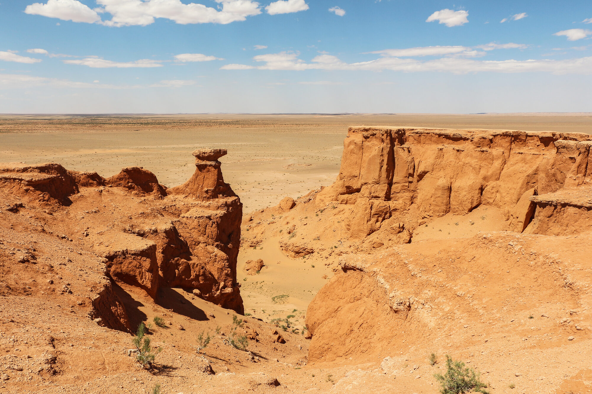
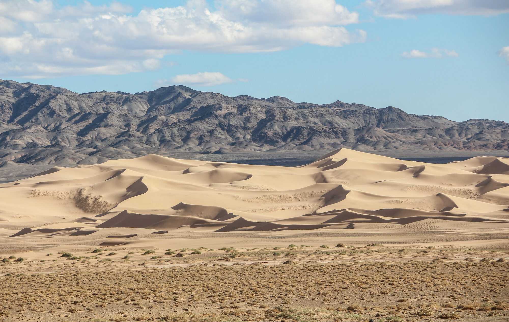
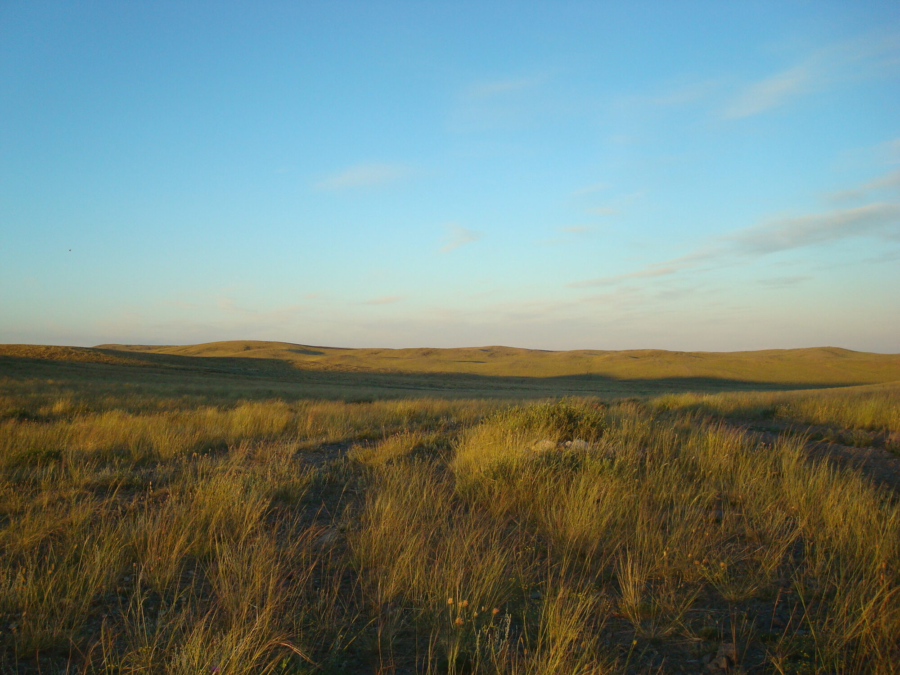
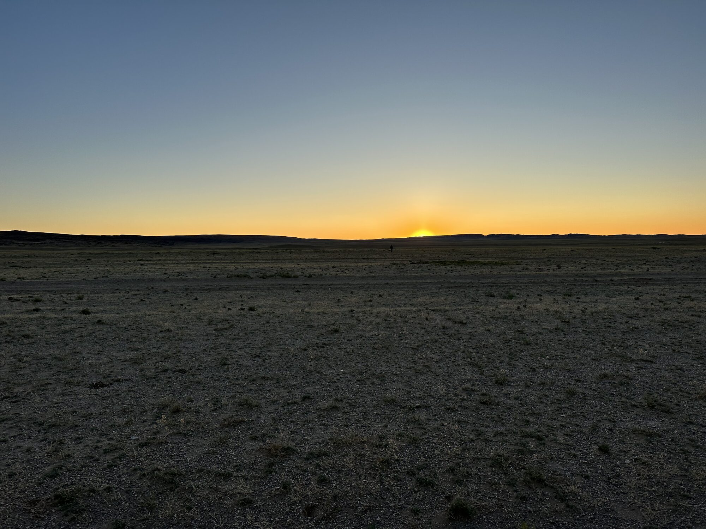
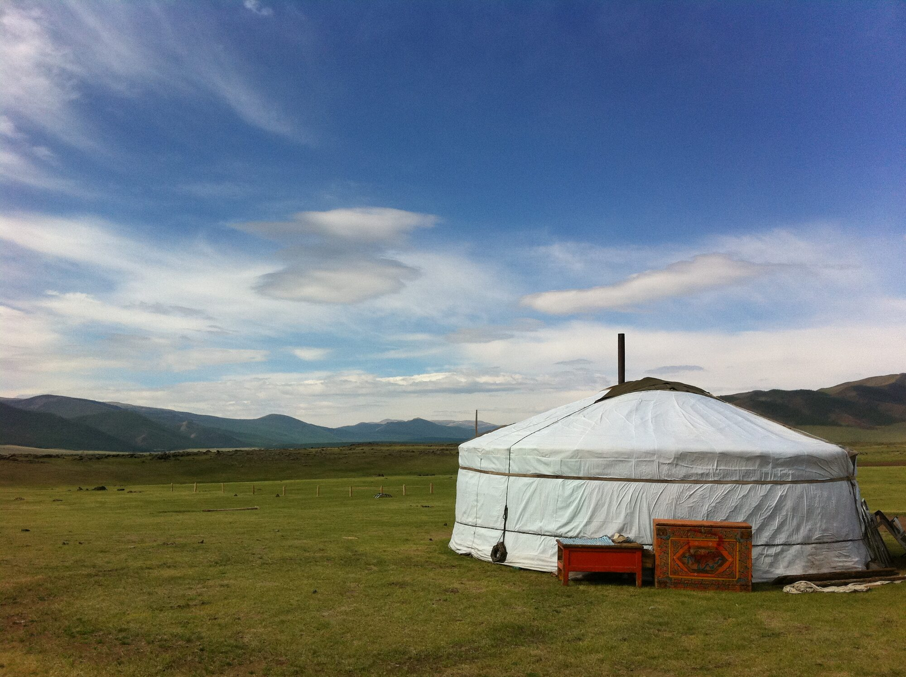
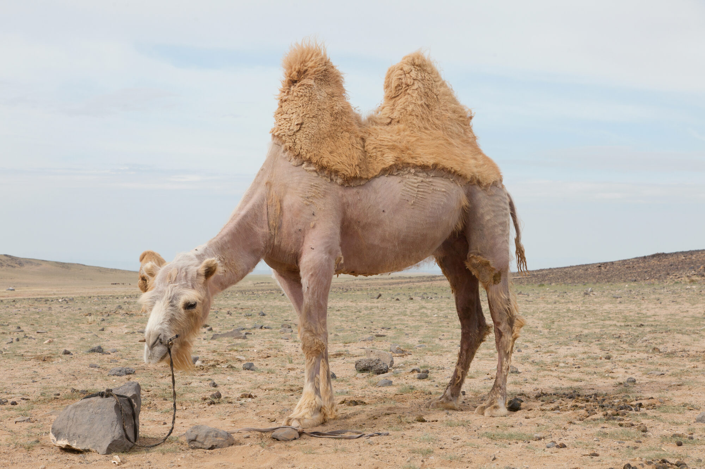

# 여행 사진 예시 갤러리

이 페이지는 코스 5개 명소(차강소브라가·바양작·홍고린엘스·욜링암·바가가즈링 촐로)에서 실제로 어떤 여행(지상) 사진이 나오는지 감을 잡도록 참고·영감용으로 모은 사진·링크 모음입니다.

> **재사용 가능 여부는 아래 절마다 완전히 다릅니다.** 사진을 실제로 가져다 쓰려면(블로그·SNS 등) **각 절의 라이선스 표기를 반드시 확인**하세요.

**정직 캡션 원칙**: 이 페이지의 사진 중 실제로 해당 명소를 담은 지상 사진에는 명소 이름을 명시했고, 특정 명소가 아닌 "일반 몽골/고비" 참고 사진(일몰·게르·낙타)은 별도로 구분했습니다. 어떤 사진도 저자가 직접 촬영한 것이 아니며, 모두 라이선스가 확인된 외부 사진입니다.

---

## ✅ 재사용 가능(임베드) — Wikimedia Commons (CC)

아래 사진은 모두 Wikimedia Commons에서 라이선스를 개별 확인한 뒤 다운로드 → 리사이즈(최대 2000px) → EXIF/GPS 제거 → 재압축해 이 책에 직접 실은 것입니다. 각 사진 아래 캡션에 촬영자·라이선스를 표기했고, 전체 출처는 이 페이지 하단 [이미지 출처](#이미지-출처) 표에 정리했습니다.

- **CC0(퍼블릭 도메인)**: 저작권자가 모든 권리를 포기한 상태 — 저작자 표시 없이도 자유롭게 사용할 수 있지만, 이 책에서는 예의상 촬영자를 표기합니다.
- **CC BY**: 저작자 표시 — 출처만 표기하면 자유롭게 사용 가능합니다.
- **CC BY-SA**: 저작자 표시-동일조건변경허락 — 출처를 표기해야 하고, 이 사진을 활용한 2차 저작물도 같은 라이선스로 공유해야 합니다.

### 차강소브라가 (Tsagaan Suvraga)

*차강소브라가 — 실제 현지 사진. 침식된 붉은/흰 절벽이 협곡처럼 이어지는 지형이 잘 드러난다. 사진: Rob Oo (Flickr) ([CC BY 2.0](https://creativecommons.org/licenses/by/2.0/)).*

### 바양작 (Bayanzag, Flaming Cliffs)

*바양작 — 실제 현지 사진. 붉게 타는 절벽 지형을 지상 시점에서 담았다. 사진: Bernard Gagnon (CC0 / Public Domain).*

### 홍고린엘스 (Khongoryn Els)

*홍고린엘스 — 실제 현지 사진. 거대한 모래언덕의 능선과 스케일이 드러난다. 사진: Bernard Gagnon (CC0 / Public Domain).*

*홍고린엘스, 낙타 — 실제 현지 사진. 사구를 배경으로 한 낙타 무리로 여행 앵글을 보여 준다. 사진: Bernard Gagnon (CC0 / Public Domain).*

### 욜링암 (Yolyn Am)

*욜링암 — 실제 현지 사진. 고르왕사이한 국립공원의 협곡 입구를 주간에 담았다. 사진: Bernard Gagnon (CC0 / Public Domain).*

### 바가가즈링 촐로 (Baga Gazaryn Chuluu)

*바가가즈링 촐로 — 실제 현지 사진. 화강암 기암 지대의 질감과 스케일이 드러난다. 사진: Arabsalam ([CC BY-SA 4.0](https://creativecommons.org/licenses/by-sa/4.0/)).*

### 일반 몽골/고비 (특정 명소 아님)

아래 3장은 특정 코스 명소를 담은 사진이 **아니며**, 고비/몽골 여행에서 만날 수 있는 일반적인 장면(일몰·게르·낙타)을 보여 주는 참고 사진입니다.

*일반 참고 사진 — 5개 명소가 위치한 옴노고비 주(남고비)의 고비 사막 일몰. 특정 명소를 담은 사진은 아니다. 사진: Commons 업로더 (파일 페이지 참조) ([CC BY 4.0](https://creativecommons.org/licenses/by/4.0/)).*

*일반 참고 사진 — 초원 위 게르(사람 없음). 특정 명소를 담은 사진은 아니다. 사진: Popo le Chien (CC0 / Public Domain).*

*일반 참고 사진 — 낙타 농장(사람 없음). 특정 명소를 담은 사진은 아니다. 사진: Alexandr frolov ([CC BY-SA 4.0](https://creativecommons.org/licenses/by-sa/4.0/)).*

---

## ✅ 재사용 가능하나 개별 확인 필요 — Unsplash

- [Unsplash: mongolia-travel 검색](https://unsplash.com/s/photos/mongolia-travel)
- [Unsplash: gobi-desert 검색](https://unsplash.com/s/photos/gobi-desert)

**왜 링크만 제공하는가**: 위 두 검색 결과에는 풍경·게르·동물 사진뿐 아니라 **인물(초상, 전통 복장, 유목민, 말 탄 사람 등)이 등장하는 사진도 섞여 있음을 확인했습니다.** [Unsplash License](https://unsplash.com/license)는 상업·비상업 목적 모두 무료로 사용할 수 있고 별도 허가도 필요 없지만(출처 표기는 권장이나 의무는 아님), **CC0(완전한 퍼블릭 도메인)는 아니며 모델 릴리스(피사체의 초상권 동의)를 보장하지 않습니다.** 어떤 사진이 인물을 포함하는지는 한 장씩 열어봐야 알 수 있으므로, 이 페이지에서는 개별 사진을 다운로드해 재호스팅하지 않고 **검색 페이지 링크만** 제공합니다. 사진을 실제로 쓰고 싶다면 검색 결과에서 인물이 없는 사진을 직접 골라 Unsplash License 조건을 따로 확인하세요.

---

## 👁 감상 전용 (LINK-ONLY) — Instagram·500px·개인 포트폴리오

- [Instagram: @ganulzii_photographer](https://www.instagram.com/ganulzii_photographer/) — 몽골 유목 생활·풍경 전문 계정.
- [Instagram: @mongolian_landscapes](https://www.instagram.com/mongolian_landscapes/) — 몽골 풍경 전문 계정.
- [Daniel Kordan — Mongolia 포트폴리오](https://danielkordan.com/portfolio-item/mongolia-2018/) — 전문 여행사진 작가의 개인 포트폴리오(고비 포함 몽골 촬영 투어). 라이선스 명시가 없는 All-Rights-Reserved 성격의 상업 사이트입니다.
- [500px 검색: mongolia gobi](https://500px.com/search?q=mongolia%20gobi&type=photos) — 500px는 작가 개별 저작권이 기본이며, 독자에게 별도의 재사용권이 주어지지 않는 플랫폼입니다.

**공통 규칙**: 위 4개는 모두 **이미지를 절대 다운로드/재호스팅하지 않고, 링크만 걸어 "감상·영감용"으로 안내**합니다. 저작권은 각 작가/플랫폼에 있습니다.

---

## 이미지 출처

이 페이지에 임베드한 사진은 저자가 촬영한 것이 아니며, 아래와 같이 Wikimedia Commons에서 라이선스가 확인된 무료 이미지입니다. 원본은 리사이즈(최대 2000px)·EXIF/GPS 제거 후 재압축했습니다.

| 파일 | 설명 | 저작자 | 라이선스 | 출처 |
|---|---|---|---|---|
| `images/travel-gallery/tsagaan-suvraga.jpg` | 차강소브라가 협곡 — 실제 현지 사진 | Rob Oo | [CC BY 2.0](https://creativecommons.org/licenses/by/2.0/) | [Wikimedia Commons](https://commons.wikimedia.org/wiki/File:Tsagaan_Suvraga_(20268223089).jpg) |
| `images/travel-gallery/bayanzag.jpg` | 바양작(Flaming Cliffs) — 실제 현지 사진 | Bernard Gagnon | CC0 1.0 (Public Domain) | [Wikimedia Commons](https://commons.wikimedia.org/wiki/File:Bayanzag_10.jpg) |
| `images/travel-gallery/khongoryn-els.jpg` | 홍고린엘스 모래언덕 — 실제 현지 사진 | Bernard Gagnon | CC0 1.0 (Public Domain) | [Wikimedia Commons](https://commons.wikimedia.org/wiki/File:Khongoryn_Els_04.jpg) |
| `images/travel-gallery/khongoryn-els-camels.jpg` | 홍고린엘스, 낙타 — 실제 현지 사진 | Bernard Gagnon | CC0 1.0 (Public Domain) | [Wikimedia Commons](https://commons.wikimedia.org/wiki/File:Camels_at_Khongoryn_Els_01.jpg) |
| `images/travel-gallery/yolyn-am.jpg` | 욜링암 협곡 입구 — 실제 현지 사진 | Bernard Gagnon | CC0 1.0 (Public Domain) | [Wikimedia Commons](https://commons.wikimedia.org/wiki/File:Yolyn_Am_05.jpg) |
| `images/travel-gallery/baga-gazaryn-chuluu.jpg` | 바가가즈링 촐로 화강암 기암 — 실제 현지 사진 | Arabsalam | [CC BY-SA 4.0](https://creativecommons.org/licenses/by-sa/4.0/) | [Wikimedia Commons](https://commons.wikimedia.org/wiki/File:Baga_Gazaryn_Chuluu1.JPG) |
| `images/travel-gallery/gobi-sunset.jpg` | 옴노고비 주 고비 사막 일몰 — 일반 참고(명소 특정 없음) | Commons 업로더(파일 페이지 참조) | [CC BY 4.0](https://creativecommons.org/licenses/by/4.0/) | [Wikimedia Commons](https://commons.wikimedia.org/wiki/File:Sunset_at_Gobi_Desert_in_%C3%96mn%C3%B6govi_Province,_Mongolia.jpg) |
| `images/travel-gallery/ger.jpg` | 초원 위 게르 — 일반 참고(명소 특정 없음, 사람 없음) | Popo le Chien | CC0 1.0 (Public Domain) | [Wikimedia Commons](https://commons.wikimedia.org/wiki/File:Mongolian_yurt_in_steppe.jpg) |
| `images/travel-gallery/camel-farm.jpg` | 낙타 농장 — 일반 참고(명소 특정 없음, 사람 없음) | Alexandr frolov | [CC BY-SA 4.0](https://creativecommons.org/licenses/by-sa/4.0/) | [Wikimedia Commons](https://commons.wikimedia.org/wiki/File:Camel_Farm_in_Mongolia_01.jpg) |

---

## 관련 링크

- [여행 사진 개요](../11-travel/index.md) — 카메라 설정·구도·빛 등 여행 사진 기초.
- [명소별 여행 가이드](../12-travel-sites/overview.md) — 5개 명소 각각의 촬영 포인트·에티켓.
- [여행 실무 정보](mongolia-travel-info.md) — 교통·숙박 등 여행 준비 정보(이 페이지와 중복 없음).
