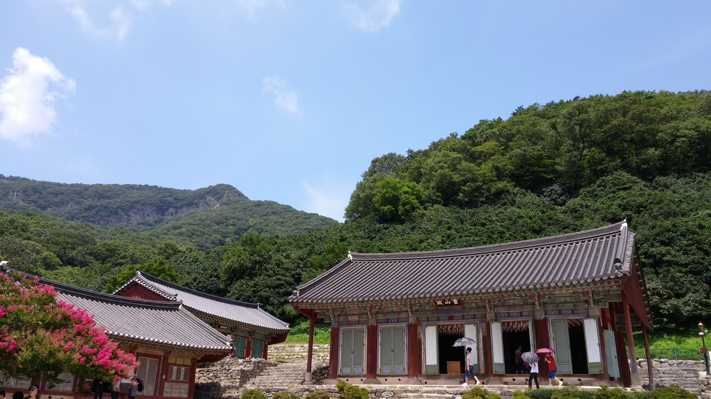
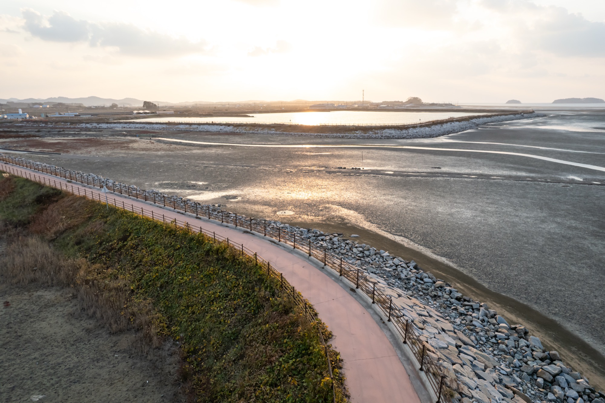

# 국내 촬영 예제 — 선운사와 서해 바닷가

몽골 고비까지 가서 처음 손을 맞추면 늦습니다. **출발 전에 국내에서 같은 종류의 그림을 미리 찍어 보는 것**이 가장 확실한 연습입니다. 이 장은 **고창 선운사(계곡 속 사찰)**와 그 근처 **서해 바닷가(갯벌·일몰)** 두 곳을 예로 들어, **어떤 사진을 찍으면 좋은지 · 어떤 영상을 찍으면 좋은지**를 구체적으로 정리합니다. 두 곳에서 연습하는 주제(패턴·리딩라인·질감·빛)는 그대로 몽골에서 쓰입니다.

여기서 말하는 사진 구도(탑다운·45°·리딩라인·스케일)의 원리는 [항공 구도의 기초](composition.md)에서, 영상 움직임(리빌·오빗·크레인업 등)은 [시네마틱 움직임 샷](video-movements.md)에서 이미 다뤘으니, 이 장은 "그 이론을 이 두 장소에 어떻게 적용하는가"에 집중합니다.

> ⚠️ **국내도 규제·안전이 먼저입니다.** 무게가 250g 이하인 기체라도 **관제권·비행금지구역·고도(150m)·야간·인구밀집지역·육안감시(VLOS)** 규칙은 그대로 적용됩니다. 비행 전 반드시 **관제권·금지구역을 확인**하세요(국토교통부 **드론원스톱 민원포털** 또는 지도형 앱). 특히 아래 두 곳은 **문화재·공원·보호구역**이 얽혀 있어 별도 제한이 있을 수 있습니다 — 이 책은 두 곳의 비행 허용 여부를 단정하지 않습니다(확인 필수).

---

## A. 고창 선운사 — 계곡 속 사찰

*지상에서 본 선운사 대웅전 — 산으로 둘러싸인 계곡 속 사찰의 분위기를 보여 주는 참고 이미지입니다(드론 촬영 아님). 드론으로는 이 사찰을 45° 오블리크 전경·탑다운·계곡 리딩라인으로 담게 됩니다. 사진: Euchan0224 ([CC BY-SA 4.0](https://creativecommons.org/licenses/by-sa/4.0/)), [Wikimedia Commons](https://commons.wikimedia.org/wiki/File:%EC%84%A0%EC%9A%B4%EC%82%AC_%EC%A0%84%EA%B2%BD.jpg).*

선운사는 도솔산(선운산) 자락의 계곡에 안긴 사찰로, **숲·계곡물(도솔천)·기와지붕·산 능선**이 주된 소재입니다. 봄의 동백숲, 9월의 꽃무릇 군락, 11월의 단풍처럼 계절 색이 강한 곳이라 하늘에서 보면 특히 그림이 됩니다.

### 어떤 사진을 찍으면 좋은가

- **45° 오블리크 전경(establishing shot)** — 산으로 둘러싸인 계곡 속에 사찰이 안겨 있는 그림. 이 장소의 "대표 한 장"입니다. 사찰 경내 바로 위가 아니라, **계곡 입구나 능선 쪽에서 비스듬히** 담으면 규제 부담도 적고 깊이감도 삽니다.
- **탑다운/나디르(90° 수직)** — 기와지붕의 배열과 마당·건물 구조가 지도처럼 드러납니다. (경내 상공은 아래 규제 주의를 먼저 확인하고, 가능하면 **경계 밖 숲·계곡**을 탑다운으로.)
- **계곡 리딩라인** — 도솔천 물길이 화면을 관통하는 선이 되게 구성합니다. 물길을 따라가는 시선이 사진에 이야기를 만듭니다.
- **숲의 질감(탑다운)** — 동백숲의 짙은 초록, 단풍의 붉고 노란 색, 9월 꽃무릇의 붉은 군락을 **색·패턴 그 자체**로 담습니다.
- **스케일(크기감)** — 산 능선 위로 높이 떠서 사찰을 작게, 산과 숲을 크게 넣으면 계곡의 규모가 실감 납니다.

<!-- 이미지: src/images/drone-sites/domestic/seonunsa-oblique.jpg — 계곡 속 사찰 45° 전경(저자 직접 촬영 예정) -->
<!-- 이미지: src/images/drone-sites/domestic/seonunsa-foliage.jpg — 단풍/동백숲 질감 탑다운(저자 직접 촬영 예정) -->

### 어떤 영상을 찍으면 좋은가

- **숲 너머 리빌(reveal)** — 나무 위를 낮게 **전진**하다가 사찰이 프레임에 서서히 드러나게. 이 장소에서 가장 극적인 한 컷입니다.
- **크레인 업(상승)** — 계곡·냇가 낮은 높이에서 시작해 **수직으로 떠오르며** 사찰과 뒤의 산 능선을 함께 공개.
- **계곡 팔로우** — 도솔천 물길을 따라 일정한 높이로 **전진**하며 계곡을 훑기.
- **오빗(관심지점 회전)** — 계곡의 큰 나무·바위 등 **전경 소재를 중심**으로 천천히 원을 그리며 배경을 흐르게. (사찰 건물 바로 위를 도는 회전은 규제 주의.)
- **하강 탑다운** — 숲·마당 위로 카메라를 아래로 두고 **천천히 하강**하며 패턴이 커지게.

각 움직임을 부드럽게 만드는 스틱·속도 요령은 [시네마틱 움직임 샷](video-movements.md)을, 촬영값(프레임레이트·셔터·ND)은 [드론 영상 촬영 기초](video-shooting.md)를 참고하세요.

> ⚠️ **선운사 규제 — 확인 필수(미확인).** 선운사 대웅전은 **국가지정문화재(보물)**이고, 사찰 일대는 **선운산 도립공원** 안에 있습니다. **문화재 상공·공원 구역 드론 비행은 허가·제한 대상일 가능성이 높습니다.** 촬영 전에 **사찰(종무소)·공원 관리사무소·드론원스톱**을 통해 반드시 확인하고, 가능하면 **경내·공원 경계 밖**에서 계곡·산 능선을 담는 쪽을 권합니다. 이 책은 이곳의 비행 허용 여부를 단정하지 않습니다.

---

## B. 서해 바닷가 — 갯벌과 일몰

*실제 드론(DJI)으로 위에서 내려다본 고창 갯벌 — 썰물이 남긴 **조수 물길(갈지자 배수로) 패턴**이 그대로 드러납니다. 이 페이지가 권하는 탑다운(나디르) 구도의 좋은 예입니다. 사진: 문화재청(국가유산청), **공공누리 제1유형**(출처표시), [Wikimedia Commons](https://commons.wikimedia.org/wiki/File:Gochang_tidal_flat_01.jpg).*

선운사에서 서쪽으로 나가면 **서해안**입니다. 서해는 **바다 쪽으로 해가 지는** 방향이라 일몰이 강하고, 썰물 때 드러나는 **갯벌의 물길 패턴**은 항공에서만 보이는 특별한 소재입니다.

### 어떤 사진을 찍으면 좋은가

- **탑다운/나디르(90°) — 갯벌 물길 패턴** — 위 사진처럼, 썰물이 남긴 조수로(배수로)가 나뭇가지·핏줄처럼 갈라진 **추상 그래픽**. 이 해안의 대표 소재입니다. 물기가 반사하는 시간(해 낮을 때)이면 선이 더 또렷합니다.
- **해안선 리딩라인** — 밀물·썰물의 경계선, 백사장과 바다가 만나는 선을 화면을 가로지르는 선으로.
- **서해 일몰** — 바다로 지는 해를 넣고, 갯벌 위 사람·경운기·어선을 **작은 실루엣**으로. 서해안의 가장 큰 무기입니다.
- **방파제·등대·어선 라인** — 인공 구조물의 직선/점을 패턴으로.
- **질감·스케일** — 파도가 모래에 닿는 결, 갯벌 위를 걷는 사람을 작게 넣어 광활함을 전달.

<!-- 이미지: src/images/drone-sites/domestic/coast-sunset.jpg — 서해 일몰 실루엣(저자 직접 촬영 예정) -->
<!-- 이미지: src/images/drone-sites/domestic/coast-leadingline.jpg — 해안선 리딩라인(저자 직접 촬영 예정) -->

### 어떤 영상을 찍으면 좋은가

- **해안선 사이드 팔로우** — 파도선과 나란히 **옆으로 이동(트럭)**하며 해안을 훑기. 리듬감이 좋습니다.
- **둑·사구 너머 리빌** — 낮게 전진하다 둑이나 모래언덕을 넘는 순간 **바다가 확 열리게**.
- **물길 위 탑다운 트래킹** — 갯벌 조수로 위를 카메라를 아래로 두고 **천천히 이동**하며 패턴이 흐르게.
- **방파제 등대 오빗** — 등대나 바위를 중심으로 원을 그리며 배경 바다를 흐르게.
- **일몰 풀백(뒤로 물러나기)** — 노을을 향해 **뒤로·위로 물러나며** 넓은 바다와 갯벌을 공개하는 마무리 컷.

> ⚠️ **서해 갯벌 규제·안전 — 확인 필수(미확인).** 고창 갯벌은 **유네스코 세계자연유산**이자 **습지보호지역**, 그리고 수십만 마리 물새가 오가는 **철새 도래지**입니다. **보호구역 비행 제한과 야생동물 교란**에 특히 유의해야 하며, 촬영 전 관할 기관·드론원스톱으로 확인하세요. 해안은 군·공항 관련 **비행금지구역/관제권**이 있을 수 있으니 이 역시 사전 확인이 필수입니다. 또한 바닷바람과 **염분·모래**는 기체에 해로우니, 바람·모래 대응은 [고비 사막 드론 환경 주의](gobi-environment.md)의 원리를 그대로 적용하세요(맨 모래 위 이착륙 금지, 비행 후 청소).

---

## 몽골과 어떻게 이어지나

이 두 곳의 연습은 그대로 고비에서 값어치를 합니다.

- **선운사 계곡 리딩라인** → [욜링암 협곡](../10-drone-sites/yolyn-am.md)의 물길·협곡 라인.
- **갯벌 물길 탑다운 패턴** → [홍고린엘스 사구](../10-drone-sites/khongoryn-els.md)의 바람이 빚은 물결 패턴 탑다운.
- **서해 일몰 골든아워** → 고비의 골든아워 낮은 빛과 긴 그림자.
- **오빗·리빌·크레인업** → 어느 명소에서든 쓰는 공통 영상 문법.

찍은 사진·영상을 다듬는 법은 [드론 사진 후보정](drone-postprocessing.md)과 [CapCut 영상 편집](capcut-index.md)에서 이어집니다.

> 🔰 **초보자는 이렇게.** 욕심내지 말고 **장소마다 딱 두 컷·한 클립**부터 하세요. 선운사에서는 **45° 오블리크 전경 사진 한 장**, 갯벌에서는 **탑다운 물길 사진 한 장**. 영상은 각 장소에서 **'낮게 전진하는 리빌' 하나씩**만 제대로 찍으면 충분합니다. 무엇보다 **비행 전 드론원스톱으로 관제권·금지구역부터 확인**하고, 문화재·보호구역이면 무리하지 말고 경계 밖에서 담으세요.
