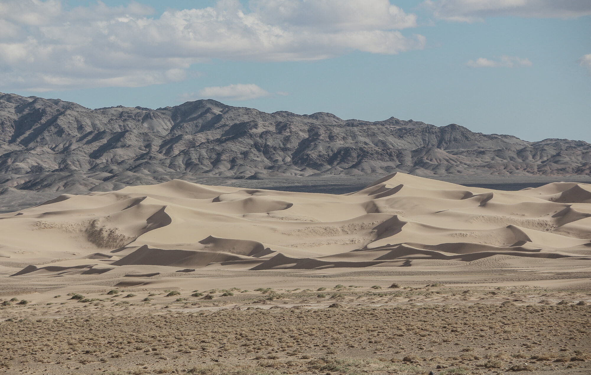
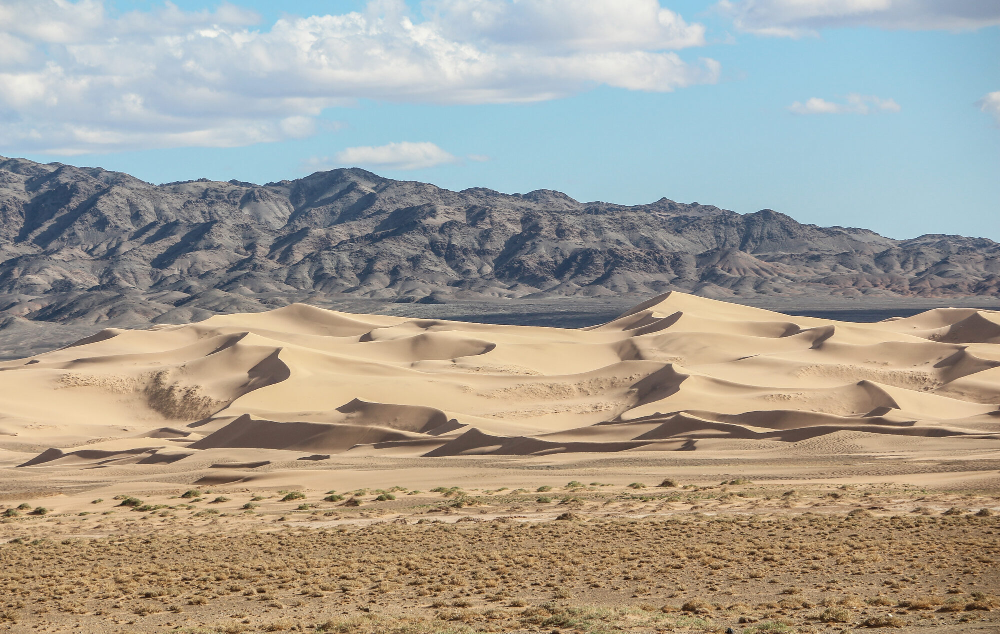
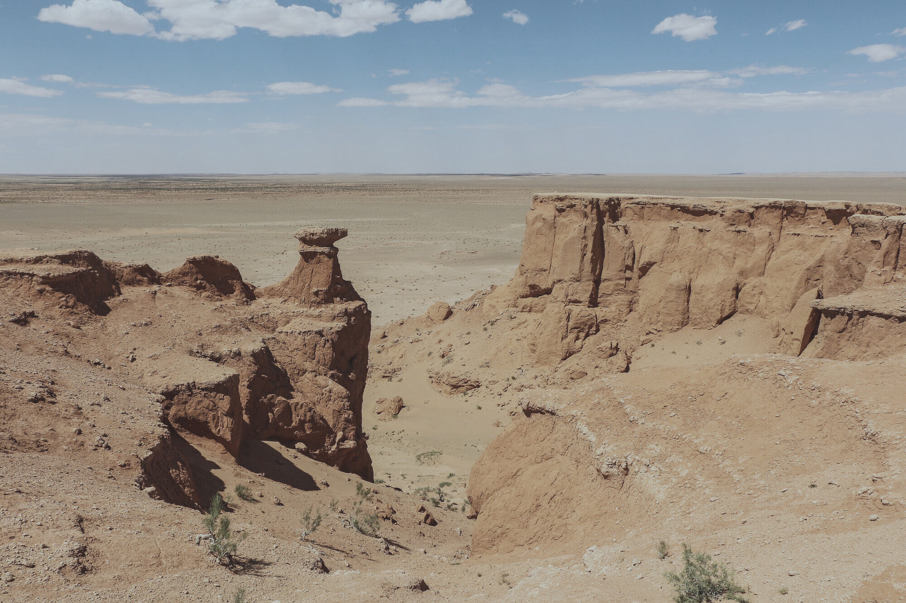
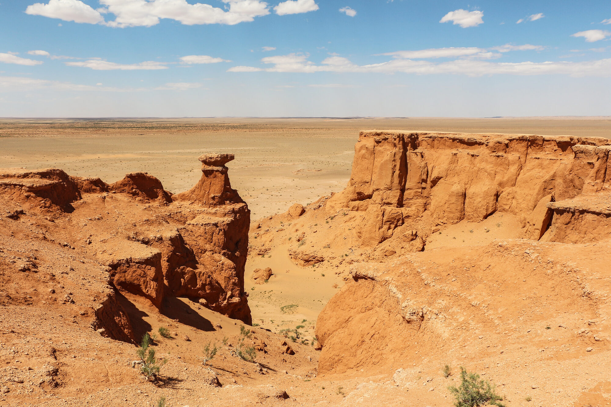

# 몽골 여행 상황별 보정 레시피

앞 장에서 익힌 [필수 보정 순서](develop-order.md)는 어떤 사진에나 통하는 뼈대입니다. 하지만 **같은 17단계라도 장면마다 슬라이더를 미는 방향이 달라집니다.** 한낮의 밝은 사막에서 하이라이트를 눌러야 할 자리에서, 골든아워에는 오히려 따뜻함을 지켜야 합니다. 이 장에서는 몽골 여행에서 자주 마주치는 다섯 가지 장면(대낮 강광 사막·골든아워/황혼·역광 고대비·인물/피부톤·날린 하늘 복원)에서 **어떤 슬라이더를, 어느 방향으로, 왜** 미는지를 정리합니다.

한 가지를 먼저 분명히 해 두겠습니다. 아래에 나오는 방향 표시(−, +, −−, ++)는 **"이쪽으로 미세요"라는 상대 안내일 뿐, 박아 두어야 할 고정값이 아닙니다.** 사진마다 빛과 노출이 다르므로 값은 매번 눈으로 보며 정해야 합니다. 여러분이 이 장에서 가져가야 할 것은 숫자가 아니라 **왜 그 방향인지의 이유(reasoning)**입니다. 이유를 알면 이 다섯 레시피에 없는 상황도 스스로 응용할 수 있습니다.

## (a) 대낮 강광 사막 — 날린 하이라이트·강한 그림자·고대비

정오의 고비 사막은 흰 사구와 검은 그림자가 한 프레임에 함께 담깁니다. 명암 차(동적범위)가 거대해서, 그대로 두면 하늘·모래는 하얗게 날아가고 그늘은 새까맣게 막힙니다. **목표는 이 거대한 명암 범위를 출력 가능한 톤으로 압축하는 것**입니다.

- **하이라이트(Highlights) −−** — 날아갈 뻔한 하늘과 모래의 디테일을 되살립니다.
- **섀도우(Shadows) +** — 막힌 그늘을 열어 질감을 꺼냅니다.
- **화이트(Whites) − 약간**, **블랙(Blacks)은 유지** — 화이트를 살짝 내려 밝은 끝을 진정시키되, 블랙까지 내리면 그림자가 뭉개지니 그대로 둡니다.
- **대비(Contrast) − 약간** — 이미 대비가 강한 장면이라 조금 낮춰 줍니다.
- **디헤이즈(Dehaze) + 소·명료도(Clarity) + 소** — 하이라이트를 복원하면 정오 특유의 뿌옇고 밋밋한 느낌이 남는데, 아주 조금씩만 더해 존재감을 되찾습니다. (많이 넣으면 헤일로가 생기니 주의 — 아래 과보정 박스 참조.)
- **생동감(Vibrance) +, 채도(Saturation)는 중립** — 색을 살리되 모래가 형광 오렌지로 튀지 않게 채도는 건드리지 않습니다.
- **화이트밸런스 색온도(Temp) − 종종** — 정오 빛은 중립~약간 따뜻한데, 모래가 지나치게 주황으로 물들면 색온도를 살짝 차갑게 당깁니다.
- **선택 — 상단 직선 그러데이션(Linear Gradient)으로 노출(Exposure) −** — 정오의 하늘은 언제나 가장 밝으므로, 프레임 위쪽에만 노출을 낮추는 마스크를 걸면 하늘만 따로 잡을 수 있습니다.

아래는 이 방향을 눈으로 확인하는 예시입니다. 왼쪽(before)이 밋밋하게 눌린 상태, 오른쪽(after)이 톤과 색을 살린 상태입니다.

| Before (인위적 플랫) | After |
|---|---|
|  |  |

> **이 before/after에 대한 정직한 안내.**
> 1. 이 사진은 슬라이더를 **어느 방향으로 미는지 시연**하려고 쓴 CC0 예시입니다.
> 2. 여기서 "before"는 실제 RAW 파일이 아니라, **미현상 플랫 캡처의 인상을 모사하려고 원본을 인위적으로 밋밋하게(대비·채도를 낮춰) 만든 파생본**입니다. 진짜 현상 전 원본이 아닙니다.
> 3. 저자의 **실제 몽골 RAW before/after는 촬영 트립(2026-08-13) 이후 이 자리에 교체**될 예정입니다.
> 4. 크레딧: 촬영 Bernard Gagnon · CC0 · Wikimedia Commons.

**촬영으로 예방하기.** 이런 극단적 명암 차는 편집으로 메우기보다 촬영에서 줄이는 편이 낫습니다. 노출을 정확히 잡는 법은 [카메라 설정](../1-shooting/camera-settings.md)과 [Av 모드·Auto ISO·최소 셔터속도](../1-shooting/av-mode-auto-iso.md)에서, 편집을 염두에 둔 촬영법(하이라이트 보호·브라케팅 등)은 [촬영 시 고려사항](shoot-for-edit.md)에서 다룹니다.

## (b) 골든아워 / 황혼 — 따뜻함이 곧 주제

해가 낮게 깔린 골든아워와 황혼에서는 접근이 정반대입니다. 대낮에서는 중립적인 색을 목표로 했지만, **여기서는 따뜻한 색 자체가 사진의 주제**입니다. 화이트밸런스를 "정확한 중립"으로 돌리면 오히려 그 순간의 매력을 지워 버립니다.

- **화이트밸런스 따뜻함 유지(중화 금지)** — 색온도(Temp)를 절제해서 만지고, 황금빛을 지킵니다. 자동 화이트밸런스가 이 따뜻함을 없애려 들면 되돌리세요.
- **섀도우(Shadows) +** — 낮게 깔린 빛에서 전경이 검게 죽지 않도록 그림자를 들어 줍니다.
- **하이라이트(Highlights) −** — 태양 주변의 은은한 글로우(빛 번짐)를 살리려면 하이라이트를 눌러 붙잡습니다. 화이트는 부드럽게만.
- **색보정(Color Grading)** — 하이라이트에 따뜻한 색, 섀도우에 살짝 차가운 색을 넣으면 깊이가 생기는 고전적인 골든아워 무드가 됩니다.
- **HSL 오렌지/레드의 광도(Luminance)·채도(Saturation) 소폭 ↑** — 노을의 붉고 주황한 색만 겨냥해 살짝 끌어올립니다.
- **디헤이즈(Dehaze) + 아주 소** — 뿌연 기운만 살짝 걷습니다.
- **섀도우를 들면 노이즈가 드러남 → Denoise 고려** — 황혼은 빛이 약해 그림자에 노이즈가 많습니다. 그림자를 많이 올렸다면 노이즈 제거를 고려하세요. 자세한 사용은 [국소 보정 — 마스킹·디테일](masking-and-detail.md)(Phase 18)에서 다룹니다.

| Before (인위적 플랫) | After |
|---|---|
|  |  |

> **이 before/after에 대한 정직한 안내.**
> 1. 이 사진은 슬라이더를 **어느 방향으로 미는지 시연**하려고 쓴 CC0 예시입니다.
> 2. 여기서 "before"는 실제 RAW 파일이 아니라, **미현상 플랫 캡처의 인상을 모사하려고 원본을 인위적으로 밋밋하게(따뜻함을 빼고 채도를 낮춰) 만든 파생본**입니다. 진짜 현상 전 원본이 아닙니다.
> 3. 저자의 **실제 몽골 RAW before/after는 촬영 트립(2026-08-13) 이후 이 자리에 교체**될 예정입니다.
> 4. 크레딧: 촬영 Bernard Gagnon · CC0 · Wikimedia Commons.

## (c) 역광 / 고대비 — 실루엣 위험

해가 피사체 뒤에 있으면 피사체는 어둡게, 하늘과 림(윤곽 빛)은 밝게 갈립니다. 자칫 피사체가 검은 실루엣으로 뭉개지기 쉽습니다.

- **전역으로 구제하기** — 섀도우(Shadows) **++** 또는 블랙(Blacks) **+**로 어두운 피사체를 살리고, 하이라이트(Highlights) **−−**로 밝은 림과 하늘을 진정시킵니다.
- **더 나은 방법 — 국소로 리프트** — 전체 그림자를 올리면 프레임 전체가 탁해집니다. 대신 마스크 **Select Subject(피사체 선택)**로 피사체만 고른 뒤 **노출(Exposure) +**를 주면, 배경은 그대로 두고 피사체만 밝힐 수 있습니다. **왜 국소가 나은가:** 국소 리프트는 프레임 전체를 흐리게 만들지 않기 때문입니다. (Select Subject의 실제 조작은 [국소 보정 — 마스킹·디테일](masking-and-detail.md)(Phase 18)에서 다룹니다 — 여기서는 도구 이름만 기억하세요.)
- **명료도(Clarity)·디헤이즈(Dehaze)는 낮게** — 과하면 밝은 하늘과 어두운 피사체의 경계에 헤일로가 생깁니다. 역광에서 생기는 옅은 베일 플레어(뿌연 빛)는 디헤이즈 + 소로 조금 줄일 수 있습니다.
- **의도를 먼저 선택하세요** — 이 장면은 두 갈래입니다. **① 실루엣을 유지**(블랙을 눌러 컬러풀한 하늘을 살림)할 것인가, **② 피사체를 드러낼**(그림자를 들어 얼굴·형태를 보임) 것인가. 정답은 없습니다. 어떤 사진을 원하는지 **선택**한 뒤 방향을 정하세요.

**촬영으로 예방하기.** 역광은 노출 결정이 특히 까다롭습니다. 측광과 노출 보정은 [카메라 설정](../1-shooting/camera-settings.md), 자동 노출을 다루는 법은 [Av 모드·Auto ISO·최소 셔터속도](../1-shooting/av-mode-auto-iso.md)를 참고하세요.

## (d) 인물 / 피부톤 — 유목민·현장 스냅

인물 사진에서 가장 중요한 기준은 **피부색**입니다. 사람 눈은 피부색이 조금만 틀어져도 바로 어색함을 느끼기 때문입니다.

- **화이트밸런스 살짝 따뜻하게** — 기분 좋은 피부톤을 위해 약간 따뜻하게 두되, 색조(Tint)에서 녹색·마젠타 캐스트(색 물듦)가 끼지 않았는지 점검합니다.
- **채도가 아니라 생동감(Vibrance)** — 색을 살릴 때는 반드시 **생동감**을 씁니다. 채도(Saturation)를 올리면 피부가 오렌지빛으로 부자연스러워집니다. **왜:** 생동감은 이미 진한 피부색을 덜 건드려 보호하기 때문입니다.
- **HSL 오렌지의 광도(Luminance) + 소** — 피부를 살짝 밝게 합니다. 너무 붉으면 오렌지의 채도(Saturation)를 − 로 눌러 줍니다.
- **마스크 Select People(인물 선택)로 국소 손질** — 피부에서 텍스처(Texture)·명료도(Clarity)를 소폭 낮추고, 역광 유목민이라면 노출(Exposure) +로 얼굴을 밝힙니다. **왜:** 명료도는 피부 질감을 강조해 얼굴을 거칠고 나이 들어 보이게 만듭니다. (Select People의 실제 조작은 [국소 보정 — 마스킹·디테일](masking-and-detail.md)(Phase 18)에서 다룹니다.)
- **피부에 명료도(Clarity)는 낮게 또는 음수로** — 양수 명료도는 얼굴을 늙고 거칠게 만듭니다. 피부에는 오히려 살짝 음수가 어울릴 때가 많습니다.

## (e) 살짝 날린 하늘 복원

밝은 하늘이 하얗게 날아가기 시작한 사진입니다. RAW로 찍었다면 어느 정도는 되살릴 수 있지만, **완전히 날아간 부분은 편집으로도 돌아오지 않습니다.**

- **먼저 클리핑을 확인** — 히스토그램을 보거나, 하이라이트·화이트 슬라이더를 **Alt(윈도우) / Option(맥)을 누른 채 드래그**하면 화면에 **디테일이 잘려 나간 지점**이 색점으로 표시됩니다. 어디가, 얼마나 날아갔는지 눈으로 확인하세요.
- **하이라이트(Highlights) −−, 화이트(Whites) −** — 날아갈 뻔한 밝은 끝을 눌러 되살립니다.
- **RAW는 채널당 약 1스톱까지 복원 가능, JPEG은 불가** — 이것이 RAW로 찍는 이득입니다. 같은 사진이라도 RAW라면 하늘이 돌아오고 JPEG이라면 돌아오지 않습니다.
- **완전히 클리핑된 하늘(순백·데이터 없음)은 복구 불가** — 데이터가 아예 없으면 슬라이더로도 못 되살립니다. 이때는 마스크 **Select Sky(하늘 선택)**로 하늘만 고른 뒤 노출(Exposure)·하이라이트(Highlights)를 낮추고, 색온도(Temp)·색조(Tint)나 채도(Saturation)로 **파란 톤을 시늉**하거나 — 아니면 그대로 받아들입니다. (Select Sky의 실제 조작은 [국소 보정 — 마스킹·디테일](masking-and-detail.md)(Phase 18)에서 다룹니다.)
- **정직하게** — 날아간 것은 사라진 것입니다. 마스킹은 남은 것에 톤을 입힐 뿐, 없는 디테일을 만들어 내지는 못합니다.

**촬영으로 예방하기.** 날린 하늘은 애초에 촬영에서 막는 것이 최선입니다. **브라케팅(같은 장면을 노출을 달리해 여러 장 찍기) + HDR 병합**, **ETTR(노출을 오른쪽으로 — 하이라이트가 날지 않는 선에서 최대한 밝게 찍어 그림자 노이즈를 줄이는 기법)**, 또는 **그라디언트 ND 필터**로 하늘을 미리 잡을 수 있습니다. 자세한 촬영 대비는 [촬영 시 고려사항](shoot-for-edit.md)과 [카메라 설정](../1-shooting/camera-settings.md)을 참고하세요.

## 과보정 경고 — "덜 한 것이 낫다"

레시피대로 슬라이더를 밀다 보면 어느새 **과보정(過補正, 슬라이더를 필요 이상으로 밀어 사진이 부자연스러워지는 것)**에 빠지기 쉽습니다. 아래는 여행 사진에서 가장 흔한 과보정 증상들입니다. 하나라도 보이면 값을 되돌리세요.

> **⚠️ 과보정(P3) 경고 — 대표 증상.**
> - **명료도(Clarity)·텍스처(Texture)·디헤이즈(Dehaze) 과다** — 밝고 어두운 경계에 밝은 테두리(**헤일로**)가 생기고, 질감이 거칠어져 HDR 그런지(지저분하게 과장된) 느낌이 납니다.
> - **채도(Saturation)·생동감(Vibrance) 과다** — 하늘이 형광빛으로 뜨고, 피부와 모래가 오렌지로 물듭니다.
> - **블랙(Blacks) 과다** — 어두운 부분의 디테일이 통째로 사라지는 **크러시드 블랙**(뭉개진 검정)이 됩니다.
> - **디헤이즈로 하늘 과다** — 하늘에 밴딩(색 띠)이 생기고 부자연스러운 청록색이 돕니다.
>
> **예방하는 법.**
> - 슬라이더를 넣었으면 **한 발 물러서세요** — 마음에 든 값의 **절반**만 남기는 습관이 안전합니다.
> - **100% 배율 ↔ 축소 뷰**를 오가며 확인하세요. 축소해서는 멀쩡해 보여도 100%에서 헤일로·노이즈가 드러납니다.
> - **before/after 토글**(단축키 `\`)로 원본과 비교하세요. 조금씩 만지다 보면 눈이 과장에 익숙해지므로, 원본과 번갈아 봐야 균형을 잡습니다.
> - 원칙은 하나입니다 — **"덜 한 것이 낫다."**

> 🔰 **초보자는 이렇게.** 레시피의 방향 표시(−, +)는 "이쪽으로 미세요"라는 안내일 뿐이니 숫자로 외우지 마세요. 슬라이더를 밀었으면 마음에 든 값의 **절반**만 남기고, before/after 토글(단축키 `` ` ``)로 원본과 번갈아 보며 균형을 잡으세요. 원칙은 하나입니다 — "덜 한 것이 낫다."

## 이어서 — 국소 보정과 예시 출처

여기까지가 몽골 여행의 대표 다섯 장면을 다루는 상황별 레시피입니다. 이 장에서 도구 이름만 짧게 언급한 **국소 보정(마스킹)과 디테일·노이즈**는 다음 파트 [국소 보정 — 마스킹·디테일](masking-and-detail.md)(Phase 18)에서 본격적으로 다룹니다. 이 장에 실린 예시 사진들의 출처·라이선스 상세는 [크레딧](credits.md)에 정리되어 있습니다.
