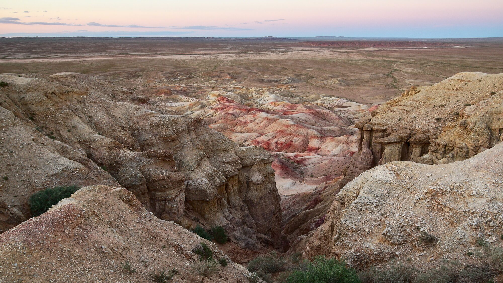

# 차강소브라가 항공 촬영 (Tsagaan Suvarga)

이곳의 항공 주제는 한 문장으로 요약됩니다 — **겹겹 층리(퇴적층이 켜켜이 드러난 무늬)와 낙차(높이 차이)를 위에서·비스듬히 드러내기.** 절벽은 동향의 거의 수직면으로, 높이 30~60m·길이 400m에 걸쳐 층리가 뚜렷하게 드러나 있습니다.

GPS·접근은 [고비 촬영 일반 원리](../04-mongolia/overview.md)의 GPS 표를 참고하세요(좌표는 이 페이지에 다시 옮겨 적지 않습니다). 공통 구도·비행 이론은 이미 [항공 구도의 기초](../09-drone/composition.md)·[비행 기초와 배터리·RTH 관리](../09-drone/flight-and-battery.md)에서 다뤘으니 여기서는 전제로 삼고, 이 지형에 어떻게 적용하는지만 다룹니다.

*실제 차강소브라가 — 켜켜이 쌓인 층리와 아래로 떨어지는 낙차가 드러난 절벽(황혼, 지상 촬영). 드론으로는 이 층리와 낙차를 위에서·비스듬히 담게 됩니다. 사진: Rob Oo ([CC BY 2.0](https://creativecommons.org/licenses/by/2.0/)), [Wikimedia Commons](https://commons.wikimedia.org/wiki/File:Tsagaan_Suvraga_(20268223089).jpg).*

## 항공 구도·피사체

- **탑다운/나디르(90° 수직 하강 시점)**: 절벽 상단에서 곧장 아래를 내려다보면 층리의 결과 침식 패턴이 그림자 없는 순수한 평면 그래픽으로 드러납니다. 정오처럼 그림자가 거의 없는 시간대가 오히려 이 패턴 컷에 유리합니다.
- **45° 오블리크(비스듬한 시점)**: 30~60m의 낙차와 수직 절벽면을 비스듬히 걸어 깊이와 입체감을 살립니다. 이 장소에서는 대부분의 컷에서 먼저 시도해볼 기본 각도입니다.
- **리딩라인(시선 유도선)**: 400m에 걸쳐 이어지는 절벽선·능선을 화면을 가로지르는 선으로 구도에 넣으세요.
- **스케일(크기감)**: 절벽 아래에 사람이나 차량의 실루엣을 작게 넣으면 30~60m 높이가 비교 기준을 얻어 훨씬 실감 나게 전달됩니다.
- **빛**: 골든아워의 낮은 태양이 절벽면을 스치듯 비추면 층리·침식의 질감과 낙차가 만드는 음영이 뚜렷하게 살아납니다. 반대로 정오처럼 그림자가 거의 없는 시간대는 탑다운 패턴 컷에 유리합니다. 항공 빛 읽기의 원리는 [항공 구도의 기초](../09-drone/composition.md)를 참고하세요(여기서는 다시 설명하지 않습니다).

<!-- 이미지: src/images/drone-sites/tsagaan-suvarga-layers.jpg — 탑다운 층리 패턴 -->
<!-- 이미지: src/images/drone-sites/tsagaan-suvarga-oblique.jpg — 45° 절벽 낙차 -->

## 이 지형 특화 위험·주의

- **밝은 흰 절벽의 하이라이트 클리핑**: 흰 절벽면은 과노출되면 층리 디테일(애초에 이 각도를 찍는 이유)이 통째로 날아가기 쉽습니다. 보수적으로 노출을 잡고 히스토그램·제브라(하이라이트 경고 줄무늬)로 확인하며 DNG(RAW)로 촬영하세요. 구체적인 방법은 [카메라 설정](../09-drone/dji-mini5pro-settings.md)을 따르시고, 여기서는 다시 설명하지 않습니다.
- **절벽 낙차로 인한 고도 감각 상실**: 절벽 위에서 아래로 하강하면 실제 대지고도(절벽 아래 기준 고도)가 급격히 커져 고도 감각을 잃기 쉽습니다. 절벽면 근접 비행은 여유(마진)를 크게 두세요 — 옴니비전(전방위)+LiDAR 장애물 회피 기능이 있어도 과신하지 마세요. 이착륙은 절벽 상단의 단단한 지면에서만 하세요.
- **RTH(자동 귀환) 고도**: RTH 고도를 절벽 상단(및 주변 최고 지형)보다 확실히 높게 설정하지 않으면 귀환 도중 절벽에 부딪힐 수 있습니다. 설정 방법과 원리는 [비행 기초와 배터리·RTH 관리](../09-drone/flight-and-battery.md)를 참고하세요.
- **취약 지형 보호**: 침식되기 쉬운 절벽이므로 저공에서 반복 비행하거나 절벽 가장자리 가까이 착륙해 지형을 훼손하지 않도록 주의하세요. 국립공원은 아니지만 관리·보호구역일 가능성이 있으니, 현지에서 드론 가능 여부를 먼저 확인하는 태도를 권합니다(구체적인 비행 경로를 미리 게시하지는 않습니다).

바람·모래·저온 등 고비 사막 공통 환경 대응은 [고비 사막 드론 환경 주의](../09-drone/gobi-environment.md)에서 이미 다뤘으니 여기서는 다시 설명하지 않습니다.
