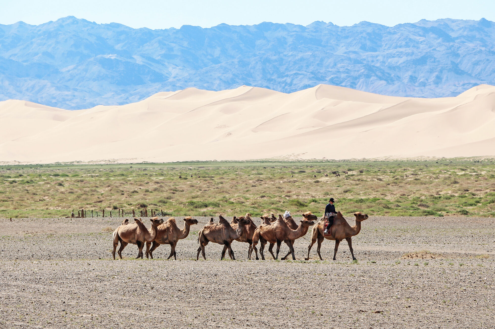

# 여행 사진 개요

여행에서 돌아와 가장 오래 들여다보게 되는 사진은, 의외로 완벽하게 세팅한 한 장이 아닙니다. 사구 능선을 넘어오던 낙타 행렬, 게르 문틈으로 스며들던 오후 빛, 사막 한가운데서 마주친 사람의 웃음 — 그 순간에 반응해 눌러 둔 셔터입니다. 그런 사진은 다시 찍을 수 없습니다. 준비된 사람만 붙잡습니다.

*실제 현지 사진 — 홍고린엘스의 거대한 사구를 배경으로 한 낙타 무리. 이런 '여행의 한 장면'이 1부가 담으려는 사진입니다. 사진: Bernard Gagnon (CC0 / Public Domain).*

몽골 고비는 은하수가 뜨는 밤에만, 혹은 드론이 뜨는 순간에만 아름다운 곳이 아닙니다. 눈을 뜨고 있는 하루 종일이 사진이고, 이 '여행 사진'이야말로 몽골에서 당신이 가장 자주, 가장 많이 찍게 될 사진입니다. 1부는 그 낮의 시간을 **Canon R7 같은 미러리스 카메라**로 놓치지 않고 담는 법을 다룹니다.

은하수 사진과 드론 사진은 **특정 순간, 특정 장소**를 위해 준비하고 떠나는 촬영입니다. 반면 여행 사진은 다릅니다. 카메라를 목에 걸고 하루 종일 이동하면서, 예정에 없던 장면을 그때그때 붙잡는 사진입니다. 정해진 셔터속도도, 정해진 구도도 없습니다. 대신 빛이 계속 바뀌고, 사람이 계속 스쳐 지나가고, 풍경이 창밖으로 계속 흐릅니다. 이 '계속 바뀌는 것'에 반응하는 감각이 여행 사진의 핵심입니다.

그리고 이 감각은 은하수나 드론보다 훨씬 자주 쓰입니다. 몽골에 머무는 며칠 동안 은하수는 날씨가 맞는 몇 밤에만, 드론은 규제가 허락하는 곳에서만 띄울 수 있지만, 여행 사진은 눈을 뜨고 있는 모든 시간에 찍을 수 있습니다.

## 이 파트가 왜 책의 1부인가

여행자가 가장 먼저, 그리고 가장 자주 카메라를 드는 순간은 언제나 지상의 여행 사진입니다. 그래서 이 책은 여행 사진을 1부에 두고, 같은 1부 안에서 여행 사진 보정으로 이어간 뒤, 드론 사진(2부)으로 시점을 하늘로 넓히고, 천체사진(3부, 은하수)으로 밤까지 확장하는 순서로 구성했습니다. 셋은 서로 다른 장비·시간대·기법을 다루지만, 결국 같은 몽골 여행을 서로 다른 각도에서 담는 하나의 이야기입니다.

## 이 파트가 다루는 것

이 파트는 **지상 관점**에서, **주간부터 황혼(골든아워~블루아워)까지**의 시간대를 다룹니다. 해가 뜬 뒤부터 노을이 완전히 가라앉기 직전까지 — 여행 일정 대부분이 여기에 해당합니다. 크게 세 덩어리입니다.

- **촬영** — Canon R7과 렌즈를 여행에 맞게 세팅하고(Av/Auto ISO·상황별·커스텀 모드), 구도와 빛, 풍경과 사람을 담는 법.
- **코스 명소별 가이드** — 실제 고비 코스의 명소 5곳에서 무엇을·언제·어떻게 찍을지.
- **여행 사진 보정 (Lightroom Classic)** — 찍은 사진을 후보정으로 더 낫게 만드는 전 과정. 별도의 앱 없이 같은 1부 안에서 이어집니다.

## 다루지 않는 것과 그 이유

- **야간 은하수 촬영.** 같은 고비의 명소라도 별이 뜬 뒤의 촬영은 [3부 · 천체사진](../astro-overview.md)에 완결된 내용으로 정리돼 있습니다. 중복해 다시 설명하지 않고, 필요하면 그쪽으로 안내합니다.
- **항공 촬영과 드론 영상.** 드론은 전혀 다른 장비와 시점을 씁니다. 드론 사진·영상은 [2부 · 드론 사진·영상](../09-drone/index.md)에서 다룹니다.
- **영상 촬영.** 1부는 정지 사진 워크플로에 집중합니다. 영상은 드론 파트(CapCut 편집 포함)에서 다룹니다.

## 이 파트 읽는 순서

**촬영**
1. [Canon R7 카메라 설정 · 렌즈 선택](camera-settings.md) — R7을 여행에 맞게 세팅하고, 보유·추천 렌즈를 언제 쓸지 정합니다.
2. [Av 모드 · Auto ISO · 최소 셔터속도 완전 정리](av-mode-auto-iso.md) — 주간 촬영의 기본 노출 모드를 손에 익힙니다.
3. [출발 전 R7 세팅 — 메뉴 · 버튼 · 커스텀 모드](setup-and-custom-modes.md) — 현장에서 다이얼만 돌려 대응하도록 미리 세팅합니다.
4. [상황별 카메라 세팅 (시간대·날씨)](situational-settings.md) — 아침·낮·저녁, 맑음·흐림·특수 장면별 값을 현장 치트로 정리합니다.
5. [구도와 빛 · 타이밍](composition-and-light.md) — 여행 중 마주치는 장면을 구도와 빛으로 정리합니다.
6. [풍경과 현장 · 사람](landscape-and-street.md) — 풍경과 사람을 존중 있게 담는 법을 익힙니다.

**명소별 적용**

7. [명소별 여행 사진 가이드](../12-travel-sites/overview.md) — 실제 몽골 코스의 명소별로 배운 것을 적용합니다.

**보정**

8. [여행 사진 보정 개요](../13-editing/index.md) — Lightroom Classic으로 찍은 사진을 완성하는 전 과정(개념·현상 순서·상황별 레시피·마스킹·촬영 연동)으로 이어집니다.

준비되셨다면 [여행 사진 촬영](shooting.md) 섹션부터 시작하세요.
