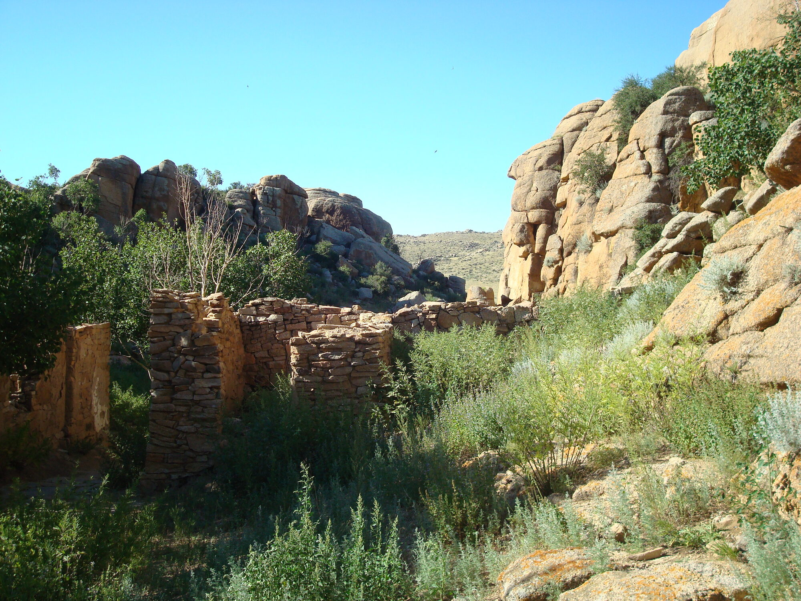

# 바가가즈링 촐로 항공 촬영 (Baga Gazriin Chuluu)

바가가즈링 촐로는 화강암 바위지대로, 아치·기암(奇巖, 기이한 형상의 바위) 등 다양한 바위 지형이 모여 있습니다. 고비 코스 4곳 중 가장 북쪽에 위치합니다. 이곳의 항공 주제는 **"화강암 기암·아치의 입체와 군락 패턴"**입니다. GPS·접근은 [고비 촬영 일반 원리](../../3-astro/4-sites/index.md)의 GPS 표를 참고하세요(좌표는 여기서 다시 옮겨 적지 않습니다). 아래 내용은 [항공 구도의 기초](../1-photo/composition.md)와 [비행 기초와 배터리·RTH 관리](../1-photo/flight-and-battery.md)에서 다룬 공통 원리를 이 지형에 어떻게 적용하는지를 다루므로, 먼저 그 페이지들을 읽고 오는 것을 권합니다.

*실제 바가가즈링 촐로 — 화강암 기암 군락과 옛 사원 터·나무(주간, 지상 촬영). 드론으로는 이 기암·아치의 입체와 군락 패턴을 위에서·비스듬히 담게 됩니다. 사진: Arabsalam ([CC BY-SA 4.0](https://creativecommons.org/licenses/by-sa/4.0/)), [Wikimedia Commons](https://commons.wikimedia.org/wiki/File:Baga_Gazaryn_Chuluu13.JPG).*

> 📋 **촬영 카드 — 바가가즈링 촐로** *(난이도·시간은 주관적 가이드)*
> - **조종 난도**: ★★★☆☆ — 기암 사이 충돌·화강암 GPS 다중경로(신호 반사)·최북단 새벽 저온
> - **추천 시간**: 골든아워(화강암 결·기암 그림자). 최북단이라 **새벽 저온·배터리 보온** 주의
> - **바람·주의**: 바위 사이 좁은 공간 통과 금지·넉넉한 마진, 단단하고 트인 지면에서 이착륙, 강한 GPS 락 확인
> - **촬영 순서**: ① 45° 기암 입체 → ② 군락 탑다운 → ③ 바위 능선 리딩라인 리빌 → 30% 남으면 귀환
> - **베스트 컷**: ★★★★★ 45° 기암 입체 · ★★★★☆ 화강암 군락 탑다운
> - **위치(대략)**: [Google 지도](https://www.google.com/maps/search/?api=1&query=Baga+Gazriin+Chuluu) — 정밀 착륙점 아님, 현지 재확인

## 항공 구도·피사체

- **45° 오블리크(비스듬한 시점)**: 아치·기암의 입체감과 그림자를 살리는 기본 구도입니다. 바위 하나하나를 조형물처럼 담아보세요.
- **탑다운/나디르(90°, 수직 하강 시점)**: 화강암 바위 군락이 흩어진 패턴을 순수한 평면 그래픽으로 담을 수 있습니다.
- **리딩라인(시선 유도선)**: 바위 능선이나 바위가 늘어선 줄을 화면을 가로지르는 시선 유도선으로 활용하세요.
- **스케일(크기감)**: 기암 옆에 사람 실루엣을 작게 넣으면 바위의 실제 크기감이 훨씬 잘 전달됩니다.
- **빛**: 골든아워(해 뜨고 진 직후 태양이 낮은 시간대)의 낮은 태양광이 화강암 표면의 결과 균열 질감, 기암의 그림자를 가장 잘 살립니다. 상세 원리는 [항공 구도의 기초](../1-photo/composition.md)를 참고하세요.

<!-- 이미지: src/images/drone-sites/baga-gazriin-arch.jpg — 45° 화강암 기암 입체 -->

## 이 지형 특화 위험·주의

- **기암·아치 사이 근접 비행 충돌**: 바위 사이 좁은 공간을 통과하거나 바짝 붙어 비행하면 충돌 위험이 큽니다. 옴니비전(전방위 시각 센서)과 LiDAR(레이저 기반 거리 측정 센서) 장애물 회피 기능이 있더라도 과신하지 말고, 항상 넉넉한 마진을 두고 비행하세요.
- **화강암 GPS 다중경로(신호 반사)·컴퍼스 교란**: 큰 바위 군락은 GPS 신호를 반사(다중경로)하거나 자기장을 교란해 GPS·컴퍼스가 불안정해질 수 있습니다. 강한 GPS 락(고정)을 확인한 뒤에 이륙하고, 바위에 바짝 붙은 저공 호버는 피하세요. 이착륙은 단단하고 트인 지면에서 하고, 모래가 섞인 지면은 피하세요.
- **최북단 = 새벽 저온**: 4곳 중 가장 북쪽이라 새벽·아침 촬영 시 다른 명소보다 기온이 낮을 수 있습니다. 저온이 배터리 용량을 떨어뜨리는 원리를 이해하고, 예비 배터리를 보온하며 차가운 배터리로는 이륙하지 않는 등 구체적인 대응은 [고비 사막 드론 환경 주의](../1-photo/gobi-environment.md)와 [야외 준비와 현장 워크플로](../../3-astro/3-practice/field-prep-and-hazards.md)에서 이미 다뤘으니 그대로 따르세요.
- **국립공원 밖이나 현지 확인 권장**: 바가가즈링 촐로는 국립공원 경계 밖이지만 관리·보호구역일 수 있으므로, 드론 비행 가능 여부를 현지에서 먼저 확인하는 태도를 권합니다. 이 책은 허용·금지를 단정하지 않습니다 — 자세한 배경은 [명소별 드론 촬영 가이드](index.md)의 규제 절을 참고하세요.

- 이 명소의 한 편 영상 계획 → [바가가즈링 촐로 드론+지상 통합 영상 스토리보드](../6-storyboards/baga-gazriin-chuluu.md).

> 🔰 **초보자는 이렇게.** 이곳에선 45° 오블리크로 기암·아치의 입체와 그림자를 살린 딱 한 컷에 집중하세요. 바위 사이 좁은 공간은 통과하지 말고 넉넉한 마진을 두며, 이착륙은 단단하고 트인 지면에서 하세요.
