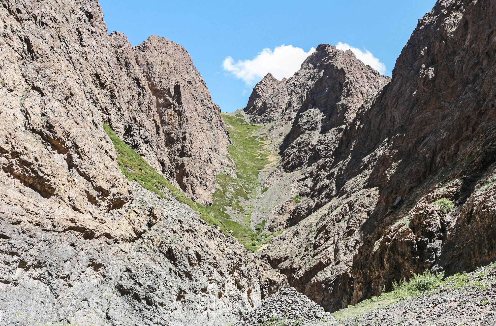

# 욜링암 항공 촬영 (Yolyn Am)

욜링암은 고비 구르왕사이한 국립공원 내 Zuun Saikhanii Nuruu(동쪽 미인) 산맥에 자리한 슬롯 협곡(폭이 매우 좁은 협곡)입니다. 벽 높이는 최대 200m, 길이는 약 8km이며, 가장 좁은 구간은 두 사람이 겨우 지나갈 정도입니다. 이곳의 항공 주제는 **협곡의 깊이와 산맥 능선을, 협곡 입구/트인 구간에서 안전하게 담는 것**입니다. GPS·접근은 [고비 촬영 일반 원리](../../3-astro/4-sites/index.md)를 참고하세요. 공통 구도·비행 이론은 [항공 구도의 기초](../1-photo/composition.md)와 [비행 기초와 배터리·RTH 관리](../1-photo/flight-and-battery.md)에서 이미 다뤘으므로, 여기서는 그 이론을 이 지형에 어떻게 적용하는지만 다룹니다.

*실제 욜링암(Yolyn Am) — 최대 200m 높이의 협곡벽과 뒤로 이어지는 산맥(주간, 지상 촬영). 드론으로는 이 깊이와 능선을 협곡 입구·트인 구간에서 안전하게 담게 됩니다. 사진: Bernard Gagnon (CC0 / 퍼블릭 도메인), [Wikimedia Commons](https://commons.wikimedia.org/wiki/File:Yolyn_Am_05.jpg).*

## 항공 구도·피사체

- **협곡 축 리딩라인(시선 유도선)**: 협곡이 뻗은 축을 따라 벽과 바닥이 이루는 선으로 시선을 유도합니다.
- **45° 오블리크(비스듬한 시점)**: 협곡의 깊이(최대 200m 벽)와 뒤로 이어지는 산맥 실루엣을 한 프레임에 담습니다.
- **스케일(크기감)**: 좁은 슬롯 안에 사람 실루엣을 넣으면 협곡 벽의 규모감이 전달됩니다. 다만 안전상 저공 근접 촬영은 자제하세요 — 아래 위험 항목을 참고하세요.
- **탑다운(90°, 수직 하강 시점)**: 협곡 바닥의 패턴을 담는 데 쓸 수 있지만, 협곡 안쪽 저공 비행은 신호·충돌 위험이 크므로 **입구/트인 구간 위주**로 촬영하기를 권합니다.
- **빛**: 좁고 깊은 협곡은 직사광이 짧은 시간만 들어오므로, 협곡 벽에 빛이 걸리는 시간대를 노려보세요. 빛 읽는 원리는 [항공 구도의 기초](../1-photo/composition.md)를 참고하세요.

<!-- 이미지: src/images/drone-sites/yolyn-am-canyon.jpg — 협곡 입구 45° 깊이 + 산맥 -->

## 이 지형 특화 위험·주의

욜링암은 협곡벽이 좁게 마주 선 지형이라, 충돌과 신호 저하가 가장 큰 위험입니다.

- **협곡벽 근접 충돌**: 최대 200m 벽이 좁게 마주하고 있어 충돌 여지가 큽니다. 옴니비전+LiDAR 장애물 회피 기능이 있어도 과신하지 말고, 벽에서 마진을 크게 두세요. 협곡 안쪽 깊은 곳으로 진입하는 것을 자제하고 입구/트인 구간에서 촬영하세요.
- **GPS/컴퍼스 저하·신호 반사**: 가파른 협곡벽 근처에서는 GPS·컴퍼스 성능이 떨어지고 신호가 반사·차폐될 수 있습니다. **강한 GPS 락(고정)을 확인한 뒤에만 이륙**하고, 위성 수가 부족하면 이륙하지 마세요.
- **RTH(자동 귀환) 고도 = 협곡벽보다 높게**: RTH 고도를 협곡벽(최대 200m)보다 낮게 설정하면 자동 귀환 중 드론이 벽에 부딪힐 수 있습니다. RTH 고도를 벽보다 확실히 높게 설정하세요. RTH 메커니즘과 구체적인 수치는 [비행 기초와 배터리·RTH 관리](../1-photo/flight-and-battery.md)를 참고하세요.
- **VLOS(육안 직접 시야) 상실**: 좁고 굽은 협곡에서는 드론을 눈에서 놓치기 쉽습니다. 시야가 막히는 협곡 안쪽으로 무리하게 밀어붙이지 마세요.

바람·모래·저온 등 고비 사막 공통 환경 대응은 [고비 사막 드론 환경 주의](../1-photo/gobi-environment.md)를 참고하세요.

## 국립공원 규정 — 미확인

> 욜링암은 **고비 구르왕사이한 국립공원 내** 협곡으로 드론 비행에 별도 허가·제한이 있을 수 있으나, **확인된 규정을 찾지 못했습니다(미확인)**. 몽골 항공청(CAAM)의 일반 드론 규정과는 별개로, **공원 입구 관리소 또는 가이드/투어사를 통해 현지에서 반드시 재확인**하세요. 이 책은 국립공원 내 드론 비행의 허용·금지를 단정하지 않습니다.

> 🔰 **초보자는 이렇게.** 이곳에선 협곡 안쪽으로 들어가지 말고, 입구·트인 구간에서 45° 오블리크로 협곡 깊이와 산맥을 담은 딱 한 컷을 노리세요. 강한 GPS 락을 확인한 뒤에만 이륙하고, 드론을 눈에서 놓치지 마세요.
