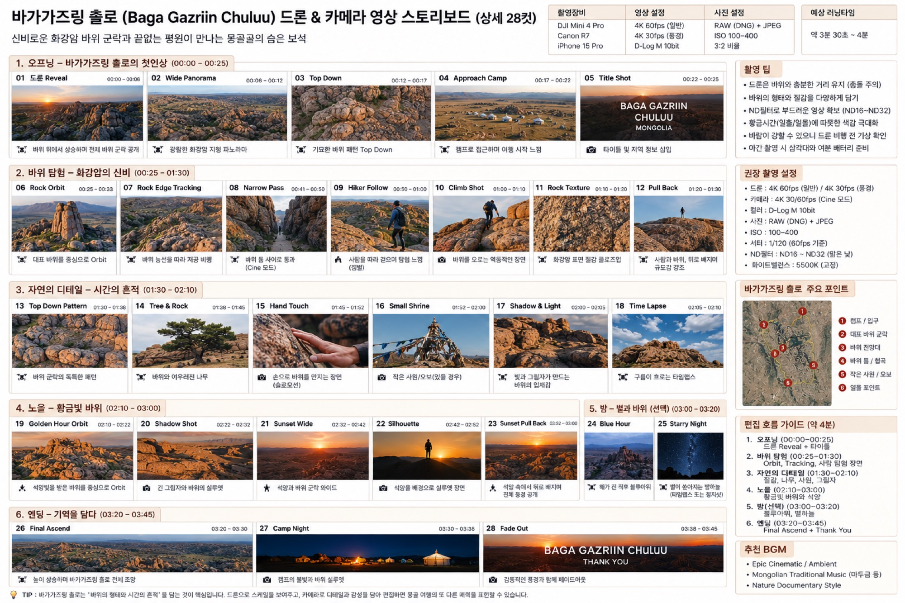

# 바가가즈링 촐로 드론+지상 통합 스토리보드

바가가즈링 촐로(화강암 기암 지대)를 드론·Canon R7·짐벌(또는 폰) **세 카메라로 통합**해 담는 **28컷·약 3분 30초~4분** 영상 한 편의 계획입니다. 아래 샷 리스트·촬영 설정·동선·편집 흐름·BGM은 저자가 넘겨준 스토리보드 원본 이미지를 그대로 전사한 것입니다.

*콘셉트/기획 스토리보드이며 완성 영상 예시가 아닙니다. 저자의 실제 촬영본·완성 영상은 트립(2026-08-13) 이후 교체됩니다.*

## 샷 리스트

카메라 표기는 원본 스토리보드의 드론/카메라 아이콘 구분을 그대로 따르되, 지상 촬영 컷은 모두 **지상(R7)**로 통일해 표기합니다 — 짐벌(RS 3 Mini)·폰(iPhone 15 Pro)은 참고만이며 책이 실제로 채택했는지는 미확인입니다([장비 대조표](index.md#장비-대조표)).

**1. 오프닝 — 바가가즈링 촐로의 첫인상 (00:00–00:25)**

| 컷 | 장면 | 시간 | 카메라 | 내용 |
|----|------|------|--------|------|
| 01 | 드론 Reveal | 00:00–00:06 | 드론 | 바위 위에서 상승하며 전체 바위 군락 공개 |
| 02 | Wide Panorama | 00:06–00:12 | 드론 | 광활한 화강암 지형 파노라마 |
| 03 | Top Down | 00:12–00:17 | 드론 | 기묘한 바위 패턴 Top Down |
| 04 | Approach Camp | 00:17–00:22 | 드론 | 캠프로 접근하며 여행 시작 느낌 |
| 05 | Title Shot | 00:22–00:25 | 지상(R7) | 타이틀·지역 정보 삽입 |

**2. 바위 탐험 — 화강암의 신비 (00:25–01:30)**

| 컷 | 장면 | 시간 | 카메라 | 내용 |
|----|------|------|--------|------|
| 06 | Rock Orbit | 00:25–00:33 | 드론 | 대표 바위를 중심으로 Orbit |
| 07 | Rock Edge Tracking | 00:33–00:41 | 드론 | 바위 능선을 따라 저공 비행(Cine 모드) |
| 08 | Narrow Pass | 00:41–00:50 | 지상(R7) | 바위 틈 사이로 통과 |
| 09 | Hiker Follow | 00:50–01:00 | 지상(R7) | 사람을 따라 걸으며 탐험 느낌 |
| 10 | Climb Shot | 01:00–01:10 | 지상(R7) | 바위를 오르는 역동적인 장면 |
| 11 | Rock Texture | 01:10–01:20 | 지상(R7) | 화강암 표면 질감 클로즈업 |
| 12 | Pull Back | 01:20–01:30 | 드론 | 사람과 바위, 뒤로 빠지며 규모감 강조 |

**3. 자연의 디테일 — 시간의 흔적 (01:30–02:10)**

| 컷 | 장면 | 시간 | 카메라 | 내용 |
|----|------|------|--------|------|
| 13 | Top Down Pattern | 01:30–01:38 | 드론 | 바위 군락의 독특한 패턴 |
| 14 | Tree & Rock | 01:38–01:45 | 드론 | 바위와 어우러진 나무 |
| 15 | Hand Touch | 01:45–01:52 | 지상(R7) | 손으로 바위를 만지는 장면(슬로모션) |
| 16 | Small Shrine | 01:52–02:00 | 드론 | 작은 사원/오보(있을 경우) |
| 17 | Shadow & Light | 02:00–02:05 | 드론 | 빛과 그림자가 만드는 바위의 입체감 |
| 18 | Time Lapse | 02:05–02:10 | 드론 | 구름이 흐르는 타임랩스 |

**4. 노을 — 황금빛 바위 (02:10–03:00)**

| 컷 | 장면 | 시간 | 카메라 | 내용 |
|----|------|------|--------|------|
| 19 | Golden Hour Orbit | 02:10–02:22 | 드론 | 석양빛을 받은 바위를 중심으로 Orbit |
| 20 | Shadow Shot | 02:22–02:32 | 지상(R7) | 긴 그림자와 바위의 실루엣 |
| 21 | Sunset Wide | 02:32–02:42 | 드론 | 석양과 바위 군락 와이드 |
| 22 | Silhouette | 02:42–02:52 | 지상(R7) | 석양을 배경으로 실루엣 장면 |
| 23 | Sunset Pull Back | 02:52–03:00 | 드론 | 석양 속에서 뒤로 빠지며 전체 풍경 공개 |

**5. 밤 — 별과 바위 (선택, 03:00–03:20)**

| 컷 | 장면 | 시간 | 카메라 | 내용 |
|----|------|------|--------|------|
| 24 | Blue Hour | 03:00–03:20 구간 | 드론 | 해가 진 직후 블루아워 |
| 25 | Starry Night | 03:00–03:20 구간 | 지상(R7) | 별이 쏟아지는 밤하늘(타임랩스 또는 정지샷) |

이 원본 스토리보드는 두 컷의 세부 시간 경계를 따로 표기하지 않고 "밤(선택)" 구간 전체(03:00–03:20)로 묶어 두었습니다 — 있는 그대로 전사합니다. 이 밤 파트의 실제 촬영 절차(암순응·구도·초점·타임랩스 세팅)는 여기서 다시 설명하지 않고 3부 [현장 촬영 워크플로](../../3-astro/2-fundamentals/field-workflow.md)·[은하수 찾기와 타이밍](../../3-astro/2-fundamentals/finding-the-milkyway.md)로 승계합니다.

**6. 엔딩 — 기억을 담다 (03:20–03:45)**

| 컷 | 장면 | 시간 | 카메라 | 내용 |
|----|------|------|--------|------|
| 26 | Final Ascend | 03:20–03:30 | 드론 | 높이 상승하며 바가가즈링 촐로 전체 조망 |
| 27 | Camp Night | 03:30–03:38 | 지상(R7) | 캠프의 불빛과 바위 실루엣 |
| 28 | Fade Out | 03:38–03:45 | 지상(R7) | "BAGA GAZRIIN CHULUU · THANK YOU" 페이드아웃 |

## 촬영 설정

**드론 — 스토리보드(Mini 4 Pro) 기재값, Mini 5 Pro 재확인 필요(단정 금지):**

- 영상: 4K 60fps(일반) / 4K 30fps(풍경), D-Log M 10bit
- ISO 100–400, 셔터 1/120(60fps 기준)
- ND필터 ND16~ND32(맑은 낮)
- 화이트밸런스 5500K(고정)

**지상(R7, 책 기준 일치) — 스토리보드 기재값:**

- 영상: 4K 30/60fps(Cine 모드)
- 사진: RAW(DNG) + JPEG, 3:2 비율
- ISO 100–400

짐벌(RS 3 Mini)·폰(iPhone 15 Pro)은 원본 스토리보드 상단 장비 목록에 함께 적혀 있으나 책이 채택하지 않았으므로 참고만/미확인입니다 — [장비 대조표](index.md#장비-대조표)를 따릅니다.

**촬영 팁(원본 전사):**

- 드론은 바위와 충분한 거리 유지(충돌 주의)
- 바위의 형태와 질감을 다양하게 담기
- ND필터로 부드러운 영상 확보(ND16~ND32)
- 황금시간(일출/일몰)에 따뜻한 색감 극대화
- 바람이 강할 수 있으니 드론 비행 전 기상 확인
- 야간 촬영 시 삼각대와 여분 배터리 준비

## 세 카메라 운용 / 동선

원본 스토리보드의 "주요 포인트" 지도는 다음 6개 지점을 순서대로 훑는 동선을 제시합니다.

1. 캠프/입구
2. 대표 바위 군락
3. 바위 전망대
4. 바위 틈/협곡
5. 작은 사원/오보
6. 일몰 포인트

드론은 이 동선을 따라 오프닝 리빌·오빗·탑다운 등 조망·규모감 컷을 담당하고, 지상(R7)은 바위 틈 통과·인물 트래킹·질감 클로즈업·손 터치 등 밀착 컷을 담당합니다. 이 두 카메라를 하루 안에서 언제·어떤 순서로 오가며 실제로 운용할지의 지휘 계통은 이 페이지에서 다루지 않고, 4부 [하루 현장 운용 — 세 카메라 오케스트레이션](../../4-workflow/field-day.md)으로 이어집니다.

## 편집 흐름

원본 스토리보드의 편집 흐름 가이드(약 4분)를 그대로 전사합니다. 컷 편집·색보정·음악 동기화 등 편집 기법 자체는 [CapCut 영상 편집](../4-capcut/index.md)·[예시 편집 — 고비 드론 스토리보드](../4-capcut/capcut-storyboard.md)로 승계하며 여기서 다시 설명하지 않습니다.

1. **오프닝(00:00–00:25)** — 드론 Reveal + 타이틀
2. **바위 탐험(00:25–01:30)** — Orbit, Tracking, 사람 탐험 장면
3. **자연의 디테일(01:30–02:10)** — 질감, 나무, 사람, 그림자
4. **노을(02:10–03:00)** — 황금빛 바위와 석양
5. **밤(선택, 03:00–03:20)** — 블루아워, 별하늘
6. **엔딩(03:20–03:45)** — Final Ascend + Thank You

원본 하단 총평: "바가가즈링 촐로는 '바위의 형태와 시간의 흔적'을 담는 것이 핵심입니다. 드론으로 스케일을 보여주고, 카메라로 디테일과 감성을 담아 편집하면 몽골 여행의 또 다른 매력을 표현할 수 있습니다."

## BGM

- Epic Cinematic / Ambient
- Mongolian Traditional Music(마두금 등)
- Nature Documentary Style

## 정직성 안내

이 페이지(및 향후 채워질 스토리보드 이미지)는 **콘셉트/기획 이미지이며 완성 영상 예시가 아닙니다.** 저자의 실제 촬영본·완성 영상은 트립(2026-08-13) 이후 교체됩니다. 장비 표기는 스토리보드 원본 기준 DJI Mini 4 Pro·RS 3 Mini·iPhone 15 Pro 초안이며, 짐벌·폰은 책 미채택(참고만/미확인), 드론은 Mini 5 Pro로의 재확인이 필요합니다 — 상위 [장비 대조표](index.md#장비-대조표)를 따릅니다.

## 관련 페이지

촬영법·편집법은 이 페이지에서 다시 설명하지 않습니다.

- 촬영: [드론 영상 촬영](../3-video/index.md)
- 편집: [CapCut 영상 편집](../4-capcut/index.md)
- 명소 참고: [바가가즈링 촐로 드론 촬영](../2-sites/baga-gazriin-chuluu.md)
- 그룹 개요·정직성 관례: [명소별 영상 스토리보드](index.md)
- 하루 현장 운용: [하루 현장 운용 — 세 카메라 오케스트레이션](../../4-workflow/field-day.md)
