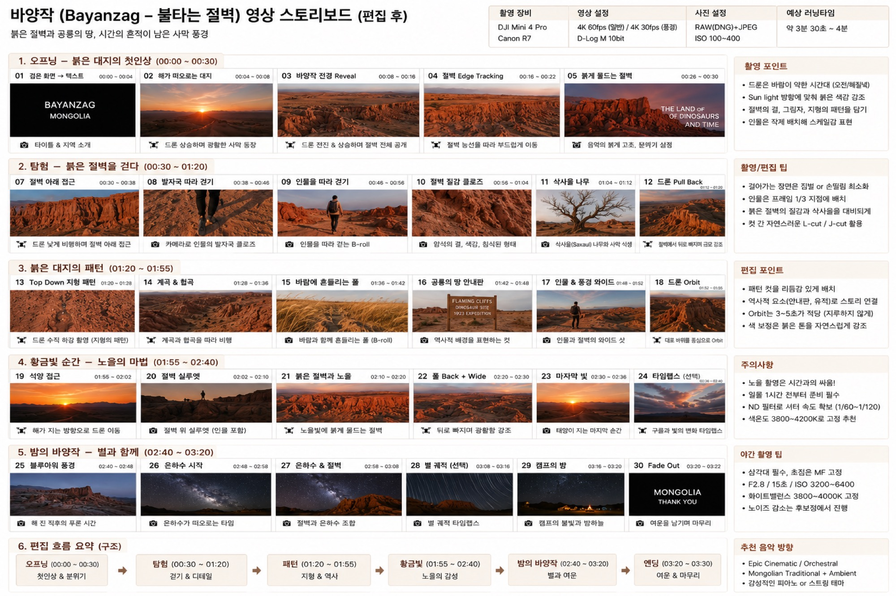

# 바양작 드론+지상 통합 스토리보드

바양작(불타는 절벽)을 드론·Canon R7·짐벌(또는 폰) **세 카메라로 통합**해 담는 원본 스토리보드 기재 **약 30컷·약 3분 30초~4분**(개별 번호로 세면 29컷 — 원본에 컷 06 번호가 결번이며, 있는 그대로 전사합니다) 영상 한 편의 계획입니다. 아래 샷 리스트·촬영 설정·동선·편집 흐름·BGM은 저자가 넘겨준 스토리보드 원본 이미지를 그대로 전사한 것입니다.

*콘셉트/기획 스토리보드이며 완성 영상 예시가 아닙니다. 저자의 실제 촬영본·완성 영상은 트립(2026-08-13) 이후 교체됩니다.*

## 샷 리스트

카메라 표기는 원본 스토리보드의 드론/카메라 아이콘 구분을 그대로 따르되, 지상 촬영 컷은 모두 **지상(R7)**로 통일해 표기합니다 — 짐벌(RS 3 Mini)·폰(iPhone 15 Pro)은 참고만이며 책이 실제로 채택했는지는 미확인입니다([장비 대조표](index.md#장비-대조표)).

**1. 오프닝 — 붉은 대지의 첫인상 (00:00–00:30)**

| 컷 | 장면 | 시간 | 카메라 | 내용 |
|----|------|------|--------|------|
| 01 | 검은 화면 → 텍스트 | 00:00–00:04 | 지상(R7) | "BAYANZAG · MONGOLIA" 타이틀·지역 소개 |
| 02 | 해가 떠오르는 대지 | 00:04–00:08 | 드론 | 드론 상승하며 광활한 사막 등장 |
| 03 | 바양작 전경 Reveal | 00:08–00:16 | 드론 | 드론 전진·상승하며 절벽 전체 공개 |
| 04 | 절벽 Edge Tracking | 00:16–00:22 | 드론 | 절벽 능선을 따라 부드럽게 이동 |
| 05 | 붉게 물드는 절벽 | 00:26–00:30 | 지상(R7) | "THE LAND OF DINOSAURS AND TIME" — 음악 고조, 분위기 심화 |

**2. 탐험 — 붉은 절벽을 걷다 (00:30–01:20)**

| 컷 | 장면 | 시간 | 카메라 | 내용 |
|----|------|------|--------|------|
| 07 | 절벽 아래 접근 | 00:30–00:38 | 드론 | 드론 낮게 비행하며 절벽 아래 접근 |
| 08 | 발자국 따라 걷기 | 00:38–00:46 | 지상(R7) | 인물의 발자국 클로즈업 |
| 09 | 인물을 따라 걷기 | 00:46–00:56 | 지상(R7) | 인물을 따라 걷는 B-roll |
| 10 | 절벽 질감 클로즈 | 00:56–01:04 | 지상(R7) | 암석의 결·색감·침식된 형태 |
| 11 | 삭사울 나무 | 01:04–01:12 | 지상(R7) | 삭사울(Saxaul) 나무와 사막 식생 |
| 12 | 드론 Pull Back | 01:12–01:20 | 드론 | 절벽에서 위로 빠지며 규모 강조 |

**3. 붉은 대지의 패턴 (01:20–01:55)**

| 컷 | 장면 | 시간 | 카메라 | 내용 |
|----|------|------|--------|------|
| 13 | Top Down 지형 패턴 | 01:20–01:28 | 드론 | 드론 수직 하강 촬영(지형의 패턴) |
| 14 | 계곡 & 협곡 | 01:28–01:36 | 드론 | 계곡과 협곡을 따라 비행 |
| 15 | 바람에 흔들리는 풀 | 01:36–01:42 | 지상(R7) | 바람과 함께 흔들리는 풀(B-roll) |
| 16 | 공룡의 땅 안내판 | 01:42–01:48 | 지상(R7) | "FLAMING CLIFFS DINOSAUR SITE · 1923 EXPEDITION" — 역사적 배경 |
| 17 | 인물 & 풍경 와이드 | 01:48–01:52 | 지상(R7) | 인물과 절벽의 와이드 샷 |
| 18 | 드론 Orbit | 01:52–01:55 | 드론 | 대표 바위를 중심으로 Orbit |

**4. 황금빛 순간 — 노을의 마법 (01:55–02:40)**

| 컷 | 장면 | 시간 | 카메라 | 내용 |
|----|------|------|--------|------|
| 19 | 석양 접근 | 01:55–02:02 | 드론 | 해가 지는 방향으로 드론 이동 |
| 20 | 절벽 실루엣 | 02:02–02:10 | 지상(R7) | 절벽 위 실루엣(인물 포함) |
| 21 | 붉은 절벽과 노을 | 02:10–02:20 | 드론 | 노을빛에 붉게 물드는 절벽 |
| 22 | 풀 Back + Wide | 02:20–02:30 | 드론 | 뒤로 빠지며 광활함 강조 |
| 23 | 마지막 빛 | 02:30–02:36 | 지상(R7) | 태양이 지는 마지막 순간 |
| 24 | 타임랩스(선택) | 02:36–02:40 | 지상(R7) | 구름과 빛의 변화 타임랩스 |

**5. 밤의 바양작 — 별과 함께 (02:40–03:20)**

| 컷 | 장면 | 시간 | 카메라 | 내용 |
|----|------|------|--------|------|
| 25 | 블루아워 풍경 | 02:40–02:48 | 드론 | 해 진 직후의 푸른 시간 |
| 26 | 은하수 시작 | 02:48–02:58 | 지상(R7) | 은하수가 떠오르는 타이밍 |
| 27 | 은하수 & 절벽 | 02:58–03:08 | 지상(R7) | 절벽과 은하수 조합 |
| 28 | 별 궤적(선택) | 03:08–03:16 | 지상(R7) | 별 궤적 타임랩스 |
| 29 | 캠프의 밤 | 03:16–03:20 | 지상(R7) | 캠프의 불빛과 밤하늘 |
| 30 | Fade Out | 03:20–03:22 | 지상(R7) | "MONGOLIA · THANK YOU" 여운을 남기며 마무리 |

**밤 파트(은하수·별 궤적)의 촬영법은 여기서 다시 설명하지 않습니다.** 원본 스토리보드는 이 구간의 참고 설정값(F2.8 / 15초 / ISO 3200~6400, 화이트밸런스 3800~4000K 고정, 삼각대 필수·초점 MF 고정)을 함께 적어 두었지만, 실제 암순응·구도·초점·본촬영 절차는 3부 [현장 촬영 워크플로](../../3-astro/2-fundamentals/field-workflow.md)로, 코어 뜨는 시각·타이밍 판단은 [은하수 찾기와 타이밍](../../3-astro/2-fundamentals/finding-the-milkyway.md)으로 승계합니다.

## 촬영 설정

**드론 — 스토리보드(Mini 4 Pro) 기재값, Mini 5 Pro 재확인 필요(단정 금지):**

- 영상: 4K 60fps(일반) / 4K 30fps(풍경), D-Log M 10bit

**지상(R7, 책 기준 일치) — 스토리보드 기재값:**

- 사진: RAW(DNG) + JPEG, ISO 100–400
- 낮 파트: ND필터로 셔터 속도 확보(1/60~1/120), 색온도 3800~4200K 고정 추천
- 밤 파트(참고, 3부 승계 절차로 실행): F2.8 / 15초 / ISO 3200~6400, 화이트밸런스 3800~4000K 고정, 노이즈 감소는 후보정에서 진행

짐벌(RS 3 Mini)·폰(iPhone 15 Pro)은 책이 채택하지 않았으므로 참고만/미확인입니다 — [장비 대조표](index.md#장비-대조표)를 따릅니다. 원본 스토리보드는 "걸어가는 장면은 짐벌 or 손떨림 최소화"라고 적어 두었는데, 이는 짐벌 참고 워크플로일 뿐 책이 실제로 짐벌을 채택했다는 뜻은 아닙니다.

**촬영/편집 팁(원본 전사):**

- 걸어가는 장면은 짐벌 or 손떨림 최소화
- 인물은 프레임 1/3 지점에 배치
- 붉은 절벽의 질감과 삭사울을 대비되게
- 컷 간 자연스러운 L-cut / J-cut 활용

**주의사항(원본 전사):**

- 노을 촬영은 시간과의 싸움 — 일몰 1시간 전부터 준비 필수
- ND 필터로 셔터 속도 확보(1/60~1/120)
- 색온도 3800~4200K로 고정 추천

## 세 카메라 운용 / 동선

드론은 오프닝 리빌·절벽 엣지 트래킹·탑다운 지형 패턴·오빗 등 조망·규모감 컷을, 지상(R7)은 발자국·인물 트래킹·절벽 질감 클로즈업·안내판·실루엣 등 밀착·서사 컷을 담당합니다. 낮 동안 드론과 지상이 절벽을 오가며 촬영하다가, 노을이 끝나고 어두워지면 드론을 완전히 접고 지상(R7)만으로 은하수·별 궤적 파트로 전환하는 흐름입니다. 이 두 카메라(그리고 낮·밤 전환)를 하루 안에서 언제·어떤 순서로 운용할지의 실전 지휘 계통은 이 페이지에서 다루지 않고, 4부 [하루 현장 운용 — 세 카메라 오케스트레이션](../../4-workflow/field-day.md)으로 이어집니다.

## 편집 흐름

원본 스토리보드의 "편집 흐름 요약(구조)"를 그대로 전사합니다. 컷 편집·색보정·음악 동기화 등 편집 기법 자체는 [CapCut 영상 편집](../4-capcut/index.md)·[예시 편집 — 고비 드론 스토리보드](../4-capcut/capcut-storyboard.md)로 승계하며 여기서 다시 설명하지 않습니다.

1. **오프닝(00:00–00:30)** — 첫인상 & 분위기
2. **탐험(00:30–01:20)** — 걷기 & 디테일
3. **패턴(01:20–01:55)** — 지형 & 역사
4. **황금빛(01:55–02:40)** — 노을의 감성
5. **밤의 바양작(02:40–03:20)** — 별과 여운
6. **엔딩(03:20–03:30)** — 여운 & 마무리

원본 편집 포인트: 패턴 컷을 리듬감 있게 배치, 역사적 요소(안내판·유적)로 스토리 연결, Orbit은 3~5초가 적당(지루하지 않게), 색 보정은 붉은 톤을 자연스럽게 강조.

## BGM

- Epic Cinematic / Orchestral
- Mongolian Traditional + Ambient
- 감성적인 피아노 or 스트링 테마

## 정직성 안내

이 페이지(및 향후 채워질 스토리보드 이미지)는 **콘셉트/기획 이미지이며 완성 영상 예시가 아닙니다.** 저자의 실제 촬영본·완성 영상은 트립(2026-08-13) 이후 교체됩니다. 장비 표기는 스토리보드 원본 기준 DJI Mini 4 Pro·RS 3 Mini·iPhone 15 Pro 초안이며, 짐벌·폰은 책 미채택(참고만/미확인), 드론은 Mini 5 Pro로의 재확인이 필요합니다 — 상위 [장비 대조표](index.md#장비-대조표)를 따릅니다.

## 관련 페이지

촬영법·편집법은 이 페이지에서 다시 설명하지 않습니다.

- 촬영: [드론 영상 촬영](../3-video/index.md)
- 편집: [CapCut 영상 편집](../4-capcut/index.md)
- 명소 참고: [바양작 드론 촬영](../2-sites/bayanzag.md)
- 그룹 개요·정직성 관례: [명소별 영상 스토리보드](index.md)
- 하루 현장 운용: [하루 현장 운용 — 세 카메라 오케스트레이션](../../4-workflow/field-day.md)
- 밤 파트(은하수) 촬영법: [현장 촬영 워크플로](../../3-astro/2-fundamentals/field-workflow.md), [은하수 찾기와 타이밍](../../3-astro/2-fundamentals/finding-the-milkyway.md)
