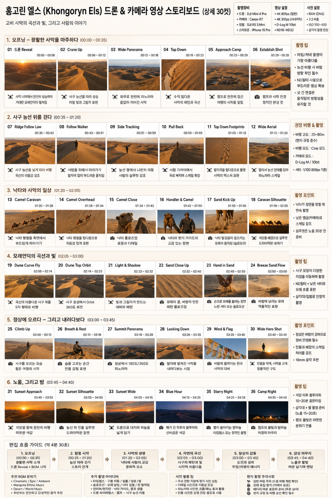

# 홍고린엘스 드론+지상 통합 스토리보드

홍고린엘스(모래언덕)에서 드론·Canon R7·짐벌(또는 폰) **세 카메라를 통합**해 한 편을 완성하는 계획입니다. 저자가 넘겨준 스토리보드 원본은 총 **36컷·약 4분 30초** 분량으로, 오프닝 → 능선 워크 → 낙타와의 일상 → 모래언덕의 곡선과 빛 → 정상 등정 → 노을·밤까지 6개 구간으로 하루의 흐름을 따라갑니다. 아래 샷 리스트·설정·동선·편집·BGM은 이 원본을 그대로 옮긴 것입니다.

*이 이미지는 촬영 전 만든 **콘셉트/기획 스토리보드**이며, 완성 영상이나 실제 촬영본이 아닙니다. 저자의 실제 촬영본은 트립(2026-08-13) 이후 교체됩니다.*

## 샷 리스트

각 컷 앞의 카메라 표기는 원본 스토리보드의 아이콘을 그대로 옮긴 것입니다. **드론**은 항공(비행) 컷, **카메라**는 Canon R7 지상 컷을 뜻합니다.

### 1. 오프닝 — 광활한 사막을 마주하다 (00:00~00:35)

| 컷 | 시간 | 카메라 | 내용 |
|---|---|---|---|
| 01 드론 Reveal | 00:00~00:06 | 드론 | 사막 너머에서 천천히 상승하며 거대한 모래언덕이 펼쳐짐 |
| 02 Crane Up | 00:06~00:12 | 드론 | 사구 능선을 따라 상승, 아침 빛과 그림자 표현 |
| 03 Wide Panorama | 00:12~00:18 | 드론 | 좌우로 천천히 파노라마, 끝없이 이어진 사막 |
| 04 Top Down | 00:18~00:23 | 드론 | 수직 탑다운, 사막의 패턴과 곡선 |
| 05 Approach Camp | 00:23~00:29 | 드론 | 캠프로 천천히 접근, 여행의 시작을 알림 |
| 06 Establish Shot | 00:29~00:35 | 카메라(R7) | 캠프와 사막 전경, 정착의 완성 컷 |

### 2. 사구 능선 위를 걷다 (00:35~01:20)

| 컷 | 시간 | 카메라 | 내용 |
|---|---|---|---|
| 07 Ridge Follow Low | 00:35~00:43 | 드론 | 사구 능선을 낮게 따라 비행, 곡선의 리듬감 강조 |
| 08 Follow Walker | 00:43~00:51 | 드론 | 사람을 뒤에서 따라가기, 발자국 없이 부드러운 움직임 |
| 09 Side Tracking | 00:51~00:59 | 드론 | 능선 옆에서 나란히 이동, 사람의 실루엣 강조 |
| 10 Pull Back | 00:59~01:05 | 드론 | 사람 가까이에서 뒤로 빠지며 스케일 확장 |
| 11 Top Down Footprints | 01:05~01:12 | 드론 | 발자국을 탑다운으로 촬영, 사막의 텍스처 표현 |
| 12 Wide Aerial | 01:12~01:20 | 드론 | 멀리서 능선 전체를 담아 파노라마 스케일 |

### 3. 낙타와 사막의 일상 (01:20~02:05)

| 컷 | 시간 | 카메라 | 내용 |
|---|---|---|---|
| 13 Camel Caravan | 01:20~01:28 | 드론 | 낙타 행렬을 측면에서 부드럽게 따라가기 |
| 14 Camel Overhead | 01:28~01:34 | 드론 | 낙타 행렬을 탑다운으로 리듬감 있게 표현 |
| 15 Camel Close | 01:34~01:42 | 카메라(R7) | 낙타 클로즈업, 표정과 디테일 |
| 16 Handler & Camel | 01:42~01:50 | 카메라(R7) | 낙타와 현지 가이드의 교감 있는 장면 |
| 17 Sand Kick Up | 01:50~01:56 | 카메라(R7) | 낙타 발걸음이 일으키는 모래의 움직임(슬로모션) |
| 18 Caravan Silhouette | 01:56~02:05 | 드론 | 석양을 배경으로 실루엣, 드라마틱한 분위기 |

### 4. 모래언덕의 곡선과 빛 (02:05~03:00)

| 컷 | 시간 | 카메라 | 내용 |
|---|---|---|---|
| 19 Dune Curve Fly | 02:05~02:14 | 드론 | 곡선이 아름다운 사구 위를 S자 형태로 비행 |
| 20 Dune Top Orbit | 02:14~02:23 | 드론 | 사구 정상에서 Orbit 360도 회전 |
| 21 Light & Shadow | 02:23~02:32 | 드론 | 빛과 그림자가 만드는 대비와 패턴 |
| 22 Sand Close Up | 02:32~02:40 | 카메라(R7) | 모래의 결, 바람이 만든 패턴 클로즈업 |
| 23 Hand in Sand | 02:40~02:50 | 카메라(R7) | 손으로 모래를 흘리는 장면, 느린 셔터로 슬로모션 |
| 24 Breeze Sand Flow | 02:50~03:00 | 카메라(R7) | 바람에 날리는 모래, 역동적인 표현 |

### 5. 정상에 오르다 — 그리고 내려다보다 (03:00~03:45)

| 컷 | 시간 | 카메라 | 내용 |
|---|---|---|---|
| 25 Climb Up | 03:00~03:10 | 카메라(R7) | 사구를 오르는 모습, 힘든 여정의 시작 |
| 26 Breath & Rest | 03:10~03:18 | 카메라(R7) | 숨을 고르는 순간, 인물 감정 표현 |
| 27 Summit Panorama | 03:18~03:28 | 카메라(R7) | 정상에서 180도/360도 파노라마 |
| 28 Looking Down | 03:28~03:35 | 카메라(R7) | 발아래 펼쳐진 사막을 내려다보는 시점 |
| 29 Wind & Flag | 03:35~03:40 | 카메라(R7) | 바람에 펄럭이는 천과 사막의 대비 |
| 30 Wide Hero Shot | 03:40~03:45 | 드론 | 인물을 작게, 사막을 크게 — 영웅적인 구도 |

### 6. 노을, 그리고 밤 (03:45~04:40)

| 컷 | 시간 | 카메라 | 내용 |
|---|---|---|---|
| 31 Sunset Approach | 03:45~03:55 | 드론 | 석양을 향해 천천히 비행, 따뜻한 색감 |
| 32 Sunset Silhouette | 03:55~04:05 | 카메라(R7) | 능선 위 인물 실루엣, 드라마틱한 장면 |
| 33 Sunset Wide | 04:05~04:15 | 드론 | 드론으로 대지와 하늘을 넓게 담기 |
| 34 Blue Hour | 04:15~04:25 | 카메라(R7) | 해가 진 직후의 블루아워, 신비로운 색감 |
| 35 Starry Night | 04:25~04:35 | 카메라(R7) | 별이 쏟아지는 밤하늘, 타임랩스 또는 정지 촬영 |
| 36 Camp Night | 04:35~04:40 | 카메라(R7) | 캠프의 불빛과 밤하늘이 어우러진 여정의 마무리 |

## 촬영 설정

원본 스토리보드에 기재된 설정값을 그대로 옮깁니다. 드론 수치는 **DJI Mini 4 Pro 기준 초안**이므로 이 책이 채택한 **DJI Mini 5 Pro로 재확인이 필요**하며, 단정하지 않습니다. 지상 카메라는 이 책 기준과 **일치하는 Canon R7**로 표기합니다 — 자세한 대조는 [장비 대조표](index.md#장비-대조표)를 참고하세요.

- **드론(Mini 4 Pro 기재값 · Mini 5 Pro 재확인 필요)**: 4K 60fps(일반 구간) / 4K 30fps(시네매틱 구간), D-Log M 10bit, ND16~ND32, 비행 고도 20~80m(현지 규정 준수), 비행 모드 Cine, 셔터 1/120(60fps 기준)
- **지상 카메라(Canon R7, 책 일치)**: RAW(DNG), 3:2 비율, ISO 100~400, 삼각대 활용 권장
- **짐벌(DJI RS 3 Mini)·폰(iPhone 15 Pro)**: 원본에 함께 적힌 보조 장비지만 이 책은 채택하지 않았습니다 — **참고만/미확인**. 실제로는 지상 클로즈업·슬로모션 컷(15·17·22·23·24번 등)에서 짐벌 안정화가 함께 쓰였을 가능성이 있습니다.

**현장 팁(원본 전사)**: 아침·저녁 촬영이 가장 아름다움 · 능선 비행 시 사람 방향 확인 필수 · ND필터 사용으로 부드러운 영상 확보 · 샷 간 연결은 움직임의 방향성을 유지할 것 · 정상은 바람이 강하므로 장비 안정화 필수 · 16mm 광각 추천(정상 파노라마) · 석양 이후 블루아워 10~20분이 골든타임 · 삼각대로 별 촬영 준비(노출 15~20초).

## 세 카메라 운용 / 동선

하루는 아침 드론 Reveal(01~06) → 능선 워크(07~12, 드론 중심) → 낙타 상호작용(13~18, 드론+지상 교차) → 모래언덕 디테일(19~24, 드론 곡선 비행+지상 매크로) → 정상 등정(25~30, 지상 인물+드론 히어로샷) → 노을·밤(31~36, 드론 와이드+지상 야간)의 순서로 이어집니다. 세 카메라는 이 순서를 따라 번갈아 등장하되, 인물·디테일이 필요한 순간에는 지상 R7이, 스케일·패턴이 필요한 순간에는 드론이 앞장섭니다.

이 세 카메라를 **하루 안에서 언제·어떤 우선순위로 오가며 운용하는 실전 지휘 계통**은 4부 [하루 현장 운용 — 세 카메라 오케스트레이션](../../4-workflow/field-day.md#세-카메라-오케스트레이션)으로 이어집니다.

## 편집 흐름

원본 스토리보드의 편집 흐름 가이드(약 4분 30초)입니다.

| 구간 | 시간 | 분위기 | 편집 포인트 |
|---|---|---|---|
| 1. 오프닝 | 00:00~00:35 | 광활한 사막 소개 | 드론 Reveal + BGM 시작 |
| 2. 탐험 시작 | 00:35~01:20 | 능선 따라 걷기 | 스토리 전개 |
| 3. 사막의 생명 | 01:20~02:05 | 낙타와 사람의 교감 | 문화적 요소 |
| 4. 자연의 곡선 | 02:05~03:00 | 사구의 패턴과 빛 | 시각적 아름다움 |
| 5. 정상의 감동 | 03:00~03:45 | 도전과 성취 | 우정/여정의 메시지 |
| 6. 감성 마무리 | 03:45~04:40 | 노을과 밤빛 | 여운 남기며 엔딩 |

세부 컷·트랜지션·색보정 조작법은 이 페이지에서 다시 설명하지 않고 [CapCut 영상 편집](../4-capcut/index.md)으로 승계합니다. 여러 촬영지 컷을 하나의 흐름으로 엮는 실제 편집 시나리오 예시는 [예시 편집 — 고비 드론 스토리보드](../4-capcut/capcut-storyboard.md)를 참고하세요.

**원본에 함께 적힌 추가 아이디어(전사)**: 타임랩스(구름 이동/일출/일몰) · 슬로모션(모래 날림/낙타 걸음/천 휘날림) · 인터뷰·현지인(낙타 가이드, 캠프 생활) · 드론 하이퍼랩스(캠프~사구 능선 이동). 정지 사진 활용 팁: 주요 전환 지점에 정지 사진 삽입 · 디테일 사진으로 리듬감 표현 · 파노라마 사진은 크롭/패닝 효과 활용 · 인물 사진은 감정 전달 용도로 사용.

## BGM

원본에 적힌 음악 방향입니다.

- Cinematic / Epic / Ambient
- Mongolia Ethnic Music
- Desert / World Music
- 후반부(정상·노을·밤)는 잔잔하고 감성적인 음악 추천

## 정직성 안내

이 페이지(및 향후 채워질 스토리보드 이미지)는 **콘셉트/기획 이미지이며 완성 영상 예시가 아닙니다.** 저자의 실제 촬영본·완성 영상은 트립(2026-08-13) 이후 교체됩니다. 장비 표기는 스토리보드 원본 기준 DJI Mini 4 Pro·RS 3 Mini·iPhone 15 Pro 초안이며, 짐벌·폰은 책 미채택(참고만/미확인), 드론은 Mini 5 Pro로의 재확인이 필요합니다 — 상위 [장비 대조표](index.md#장비-대조표)를 따릅니다.

현지 촬영 주의사항(원본 전사): 강한 바람 주의(드론 비행 제한 확인) · 모래 유입 방지(카메라 보호) · 배터리 여분 충분히 준비(주간 날씨) · 현지 규정 및 비행 승인 확인 필수. 국립공원 내 드론 비행 규정은 [홍고린엘스 항공 촬영](../2-sites/khongoryn-els.md)의 "국립공원 규정 — 미확인" 절을 함께 참고하세요.

## 관련 페이지

촬영법·편집법은 이 페이지에서 다시 설명하지 않습니다.

- 촬영: [드론 영상 촬영](../3-video/index.md)
- 편집: [CapCut 영상 편집](../4-capcut/index.md) · 예시: [고비 드론 스토리보드](../4-capcut/capcut-storyboard.md)
- 명소 참고: [홍고린엘스 드론 촬영](../2-sites/khongoryn-els.md)
- 하루 현장 운용: [4부 · 세 카메라 오케스트레이션](../../4-workflow/field-day.md#세-카메라-오케스트레이션)
- 그룹 개요·정직성 관례: [명소별 영상 스토리보드](index.md)
