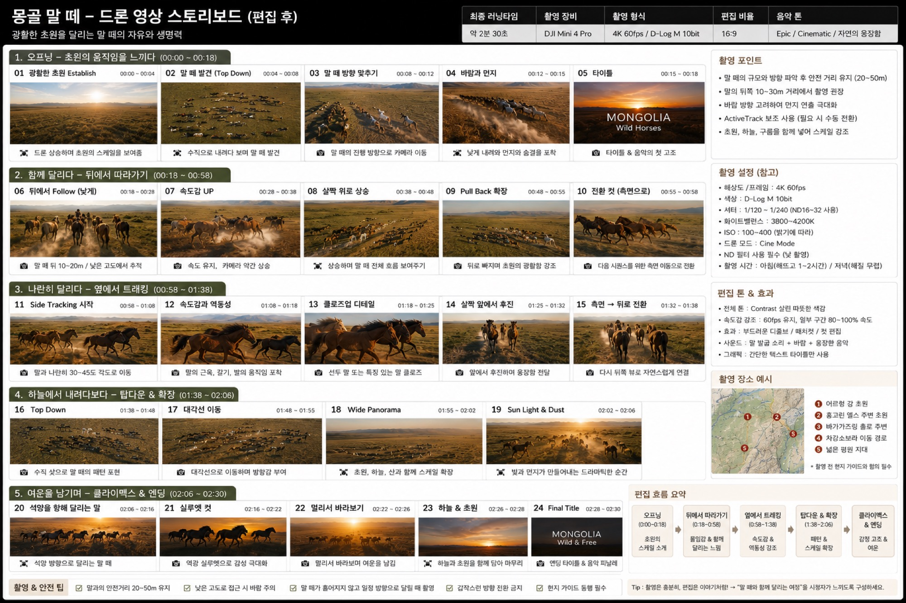

# 몽고 말떼 드론 영상 스토리보드

특정 명소가 아니라 "말떼"라는 주제를 드론으로 쫓는 **24컷·약 2분 30초** 영상 한 편의 계획입니다. **드론 전용** 영상이며, 주제형(고정 명소가 아니라 이동하는 피사체 중심)이라는 점에서 다른 다섯 편과 다릅니다. 촬영 장비는 DJI Mini 4 Pro(스토리보드 원본 기재), 촬영 형식은 4K 60fps / D-Log M 10bit, 편집 비율 16:9, 음악 톤은 Epic / Cinematic / 자연의 웅장함입니다.

*콘셉트/기획 이미지이며 완성 영상이 아닙니다. 저자의 실제 촬영본은 트립(2026-08-13) 이후 교체됩니다. 장비는 스토리보드 기재(Mini 4 Pro) 값이며 Mini 5 Pro 재확인이 필요합니다.*

## 샷 리스트

### 1. 오프닝 — 초원의 움직임을 느끼다 (00:00~00:18)

| 컷 | 샷 | 시간 | 드론 무브 / 내용 |
|----|----|----|-----------------|
| 01 | 광활한 초원 Establish | 00:00~00:04 | 드론 상승하며 초원의 스케일을 보여줌 |
| 02 | 말떼 발견(Top Down) | 00:04~00:08 | 수직으로 내려다보며 말떼 발견 |
| 03 | 말떼 방향 맞추기 | 00:08~00:12 | 말떼의 진행 방향으로 카메라 이동 |
| 04 | 바람과 먼지 | 00:12~00:15 | 낮게 내려와 먼지와 숨결을 포착 |
| 05 | 타이틀 | 00:15~00:18 | 타이틀 & 음악의 첫 고조 |

### 2. 함께 달리다 — 뒤에서 따라가기 (00:18~00:58)

| 컷 | 샷 | 시간 | 드론 무브 / 내용 |
|----|----|----|-----------------|
| 06 | 뒤에서 Follow(낮게) | 00:18~00:28 | 말떼 뒤 10~20m / 낮은 고도에서 추적 |
| 07 | 속도감 UP | 00:28~00:38 | 속도 유지, 카메라 약간 상승 |
| 08 | 살짝 위로 상승 | 00:38~00:48 | 상승하며 말떼 전체 흐름 보여주기 |
| 09 | Pull Back 확장 | 00:48~00:55 | 뒤로 빠지며 초원의 광활함 강조 |
| 10 | 전환 컷(측면으로) | 00:55~00:58 | 다음 시퀀스를 위한 측면 이동으로 전환 |

### 3. 나란히 달리다 — 옆에서 트래킹 (00:58~01:38)

| 컷 | 샷 | 시간 | 드론 무브 / 내용 |
|----|----|----|-----------------|
| 11 | Side Tracking 시작 | 00:58~01:08 | 말과 나란히 30~45도 각도로 이동 |
| 12 | 속도감과 역동성 | 01:08~01:18 | 말의 근육, 갈기, 발의 움직임 포착 |
| 13 | 클로즈업 디테일 | 01:18~01:25 | 선두 말 또는 특징 있는 말 클로즈업 |
| 14 | 살짝 앞에서 후진 | 01:25~01:32 | 앞에서 후진하며 웅장함 전달 |
| 15 | 측면 → 뒤로 전환 | 01:32~01:38 | 다시 뒤쪽 뷰로 자연스럽게 전환 |

### 4. 하늘에서 내려다보다 — 탑다운 & 확장 (01:38~02:06)

| 컷 | 샷 | 시간 | 드론 무브 / 내용 |
|----|----|----|-----------------|
| 16 | Top Down | 01:38~01:48 | 수직 샷으로 말떼의 패턴 포착 |
| 17 | 대각선 이동 | 01:48~01:55 | 대각선으로 이동하며 방향감 부여 |
| 18 | Wide Panorama | 01:55~02:02 | 초원, 하늘, 산과 함께 스케일 확장 |
| 19 | Sun Light & Dust | 02:02~02:06 | 빛과 먼지가 만들어내는 드라마틱한 순간 |

### 5. 여운을 남기며 — 클라이맥스 & 엔딩 (02:06~02:30)

| 컷 | 샷 | 시간 | 드론 무브 / 내용 |
|----|----|----|-----------------|
| 20 | 석양을 향해 달리는 말 | 02:06~02:16 | 석양 방향으로 달리는 말떼 |
| 21 | 실루엣 컷 | 02:16~02:22 | 역광 실루엣으로 감성 극대화 |
| 22 | 멀리서 바라보기 | 02:22~02:26 | 멀리서 바라보며 여운을 남김 |
| 23 | 하늘 & 초원 | 02:26~02:28 | 하늘과 초원을 함께 담아 마무리 |
| 24 | Final Title | 02:28~02:30 | 엔딩 타이틀 & 음악 피날레 |

## 촬영 설정

스토리보드(Mini 4 Pro) 기재값(참고)입니다. **Mini 5 Pro는 재확인 필요**하며 아래 수치를 단정 변환하지 않습니다. 방침은 상위 [장비 대조표](index.md#장비-대조표)를 따릅니다.

- 해상도/프레임: 4K 60fps
- 색상: D-Log M 10bit
- 셔터: 1/120~1/240(ND16~32 사용)
- 화이트밸런스: 3800~4200K
- ISO: 100~400(밝기에 따라)
- 드론 모드: Cine Mode
- ND 필터 사용 필수(낮 촬영)
- 촬영 시간: 아침(해뜨고 1~2시간) / 저녁(해질 무렵)
- 최종 러닝타임: 약 2분 30초

**촬영 포인트(원본 기재)**

- 말떼의 규모와 방향 파악 후 안전 거리 유지(20~50m)
- 말의 뒤쪽 10~30m 거리에서 촬영 권장
- 바람 방향 고려하여 먼지 연출 극대화
- ActiveTrack 보조 사용(필요 시 수동 전환)
- 초원, 하늘, 구름을 함께 넣어 스케일 강조

**촬영 & 안전 팁**

- 말과의 안전거리 20~50m 유지
- 낮은 고도로 접근 시 바람 주의
- 말떼가 흩어지지 않고 일정 방향으로 달릴 때 촬영
- 갑작스런 방향 전환 금지
- 현지 가이드 동행 필수

## 동선 / 촬영 순서

원본 "촬영 장소 예시" 기준 후보지: **1 어르헝 강 초원 · 2 홍고린 엘스 주변 초원 · 3 바가가즈링 촐로 주변 · 4 차강소브라 이동 경로 · 5 넓은 평원 지대**. 말떼는 정해진 명소가 아니라 이동하는 대상이므로, 촬영 전 현지 가이드와 위치 협의가 필수입니다.

편집 흐름과 대응하는 촬영 순서 요약: **오프닝(00:00~00:18, 초원의 스케일 소개) → 뒤에서 따라가기(00:18~00:58, 몰입감 & 함께 달리는 느낌) → 옆에서 트래킹(00:58~01:38, 속도감 & 역동성 강조) → 탑다운 & 확장(01:38~02:06, 패턴 & 스케일 확장) → 클라이맥스 & 엔딩(감정 고조 & 여운)**.

## 편집 흐름

세부 편집 조작법은 [CapCut 영상 편집](../4-capcut/index.md)(+ 예시 [고비 드론 스토리보드](../4-capcut/capcut-storyboard.md))으로 승계하며, 여기서는 원본에 적힌 편집 톤과 포인트만 정리합니다.

- 전체 톤: Contrast 살린 따뜻한 색감
- 속도감 강조: 60fps 유지, 일부 구간 80~100% 속도
- 효과: 부드러운 디졸브 / 매치컷 / 컷 편집
- 사운드: 말 발굽 소리 + 바람 + 웅장한 음악
- 그래픽: 간단한 텍스트 타이틀만 사용
- Tip(원본 기재): 촬영은 충분히, 편집은 이야기처럼! → "말떼와 함께 달리는 여정"을 시청자가 느끼도록 구성하세요.

## BGM

- Epic / Cinematic / 자연의 웅장함

## 정직성 안내

이 페이지(및 향후 채워질 스토리보드 이미지)는 **콘셉트/기획 이미지이며 완성 영상 예시가 아닙니다.** 저자의 실제 촬영본·완성 영상은 트립(2026-08-13) 이후 교체됩니다. 장비 표기는 스토리보드 원본 기준 DJI Mini 4 Pro 초안이며, 책 기준 Mini 5 Pro로의 fps·ND·비행고도 재확인은 상위 [장비 대조표](index.md#장비-대조표)를 따릅니다.

## 관련 페이지

촬영법·편집법은 이 페이지에서 다시 설명하지 않습니다.

- 촬영: [드론 영상 촬영](../3-video/index.md)
- 편집: [CapCut 영상 편집](../4-capcut/index.md)
- 그룹 개요·정직성 관례: [명소별 영상 스토리보드](index.md)
