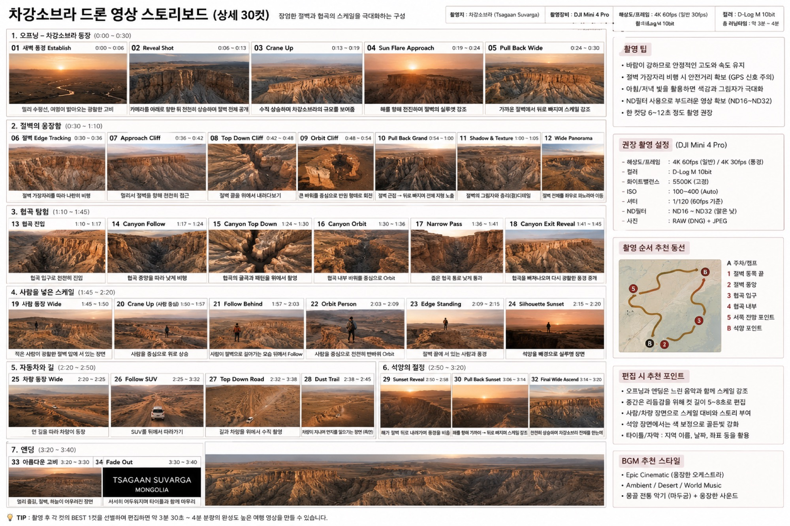

# 차강소브라가 드론 영상 스토리보드

차강소브라(하얀 절벽)의 겹겹 층리와 협곡을 드론만으로 담는 **34컷(오프닝~엔딩 7개 구간)·약 3분 30초~4분** 영상 한 편의 계획입니다. **드론 전용** 영상으로, 지상 카메라 컷은 포함하지 않습니다. 촬영지는 차강소브라(Tsagaan Suvarga), 촬영 장비는 DJI Mini 4 Pro(스토리보드 원본 기재)입니다.

*콘셉트/기획 이미지이며 완성 영상이 아닙니다. 저자의 실제 촬영본은 트립(2026-08-13) 이후 교체됩니다. 장비는 스토리보드 기재(Mini 4 Pro) 값이며 Mini 5 Pro 재확인이 필요합니다.*

## 샷 리스트

### 1. 오프닝 — 차강소브라 등장 (0:00~0:30)

| 컷 | 샷 | 시간 | 드론 무브 / 내용 |
|----|----|----|-----------------|
| 01 | 새벽 풍경 Establish | 0:00~0:06 | 멀리 수평선, 여명이 밝아오는 광활한 고비 |
| 02 | Reveal Shot | 0:06~0:13 | 카메라를 아래로 향한 뒤 천천히 상승하며 절벽 전체 공개 |
| 03 | Crane Up | 0:13~0:19 | 수직 상승하며 차강소브라의 규모를 보여줌 |
| 04 | Sun Flare Approach | 0:19~0:24 | 해를 향해 전진하며 절벽의 실루엣 강조 |
| 05 | Pull Back Wide | 0:24~0:30 | 가까운 절벽에서 뒤로 빠지며 스케일 강조 |

### 2. 절벽의 웅장함 (0:30~1:10)

| 컷 | 샷 | 시간 | 드론 무브 / 내용 |
|----|----|----|-----------------|
| 06 | 절벽 Edge Tracking | 0:30~0:36 | 절벽 가장자리를 따라 나란히 비행 |
| 07 | Approach Cliff | 0:36~0:42 | 멀리서 절벽을 향해 천천히 접근 |
| 08 | Top Down Cliff | 0:42~0:48 | 절벽 끝을 위에서 내려다보기 |
| 09 | Orbit Cliff | 0:48~0:54 | 큰 바위를 중심으로 반원 형태로 회전 |
| 10 | Pull Back Grand | 0:54~1:00 | 절벽 근접 → 위로 빠지며 전체 지형 노출 |
| 11 | Shadow & Texture | 1:00~1:05 | 절벽의 그림자와 층리(켜) 디테일 |
| 12 | Wide Panorama | 1:05~1:10 | 절벽 전체를 좌우로 파노라마 이동 |

### 3. 협곡 탐험 (1:10~1:45)

| 컷 | 샷 | 시간 | 드론 무브 / 내용 |
|----|----|----|-----------------|
| 13 | 협곡 진입 | 1:10~1:17 | 협곡 입구로 천천히 진입 |
| 14 | Canyon Follow | 1:17~1:24 | 협곡 중앙을 따라 낮게 비행 |
| 15 | Canyon Top Down | 1:24~1:30 | 협곡의 굴곡과 패턴을 위에서 촬영 |
| 16 | Canyon Orbit | 1:30~1:36 | 협곡 내부 바위를 중심으로 Orbit |
| 17 | Narrow Pass | 1:36~1:41 | 좁은 협곡 통로로 낮게 통과 |
| 18 | Canyon Exit Reveal | 1:41~1:45 | 협곡을 벗어나오며 다시 광활한 풍경 공개 |

### 4. 사람을 넣은 스케일 (1:45~2:20)

| 컷 | 샷 | 시간 | 드론 무브 / 내용 |
|----|----|----|-----------------|
| 19 | 사람 등장 Wide | 1:45~1:50 | 작은 사람이 광활한 절벽 앞에 서 있는 장면 |
| 20 | Crane Up (사람 중심) | 1:50~1:57 | 사람을 중심으로 위로 상승 |
| 21 | Follow Behind | 1:57~2:03 | 사람이 절벽으로 걸어가는 모습 위에서 Follow |
| 22 | Orbit Person | 2:03~2:09 | 사람을 중심으로 천천히 반바퀴 Orbit |
| 23 | Edge Standing | 2:09~2:15 | 절벽 끝에 서 있는 사람과 풍경 |
| 24 | Silhouette Sunset | 2:15~2:20 | 석양을 배경으로 실루엣 장면 |

### 5. 자동차와 길 (2:20~2:50)

| 컷 | 샷 | 시간 | 드론 무브 / 내용 |
|----|----|----|-----------------|
| 25 | 차량 등장 Wide | 2:20~2:25 | 먼 길을 따라 차량이 등장 |
| 26 | Follow SUV | 2:25~2:32 | SUV를 뒤에서 따라가기 |
| 27 | Top Down Road | 2:32~2:38 | 길과 차량을 위에서 수직 촬영 |
| 28 | Dust Trail | 2:38~2:45 | 차량이 지나며 먼지를 일으키는 장면(측면) |

### 6. 석양의 절정 (2:50~3:20)

| 컷 | 샷 | 시간 | 드론 무브 / 내용 |
|----|----|----|-----------------|
| 29 | Sunset Reveal | 2:50~2:58 | 해가 절벽 뒤로 내려가며 풍경을 비춤 |
| 30 | Pull Back Sunset | 3:06~3:14 | 해를 향해 가까이 → 뒤로 빠지며 스케일 강조 |
| 32 | Final Wide Ascend | 3:14~3:20 | 천천히 상승하며 차강소브라 전체를 담아냄 |

원본 스토리보드에 표시된 컷 번호 그대로이며(29·30·32), 컷 31은 원본에 등장하지 않습니다.

### 7. 엔딩 (3:20~3:40)

| 컷 | 샷 | 시간 | 드론 무브 / 내용 |
|----|----|----|-----------------|
| 33 | 아름다운 고비 | 3:20~3:30 | 멀리 능선, 절벽, 하늘이 어우러진 장면 |
| 34 | Fade Out | 3:30~3:40 | "TSAGAAN SUVARGA / MONGOLIA" 타이틀, 서서히 어두워지며 타이틀과 함께 마무리 |

## 촬영 설정

스토리보드(Mini 4 Pro) 기재값입니다. **Mini 5 Pro는 재확인 필요**하며 아래 수치를 단정 변환하지 않습니다. 방침은 상위 [장비 대조표](index.md#장비-대조표)를 따릅니다.

- 해상도/프레임: 4K 60fps(일반) / 4K 30fps(풍경)
- 컬러: D-Log M 10bit
- 화이트밸런스: 5500K(고정)
- ISO: 100~400(Auto)
- 셔터: 1/120(60fps 기준)
- ND필터: ND16~ND32(맑은 낮)
- 사진: RAW(DNG) + JPEG
- 총 러닝타임: 약 3분~4분(TIP 기준 약 3분 30초~4분)

**촬영 팁(원본 기재)**

- 바람이 강하므로 안정적인 고도와 속도 유지
- 절벽 가장자리 비행 시 안전거리 확보(GPS 신호 주의)
- 아침/저녁 빛을 활용하면 색감과 그림자가 극대화
- ND필터 사용으로 부드러운 영상 확보(ND16~ND32)
- 한 컷당 6~12초 정도 촬영 권장

## 동선 / 촬영 순서

원본 동선맵 기준 추천 순서: **A 주차/캠프 → 1 절벽 동쪽 끝 → 2 절벽 중앙 → 3 협곡 입구 → 4 협곡 내부 → 5 서쪽 전망 포인트 → B 석양 포인트**.

## 편집 흐름

세부 편집 조작법은 [CapCut 영상 편집](../4-capcut/index.md)(+ 예시 [고비 드론 스토리보드](../4-capcut/capcut-storyboard.md))으로 승계하며, 여기서는 원본에 적힌 편집 포인트만 정리합니다.

- 오프닝과 엔딩은 느린 음악과 함께 스케일 강조
- 중간은 리듬감을 위해 컷 길이 5~8초로 편집
- 사람/차량 장면으로 스케일 대비와 스토리 부여
- 석양 장면에서는 색 보정으로 골든빛 강화
- 타이틀/자막: 지역 이름, 날짜, 좌표 등을 활용

## BGM

- Epic Cinematic(웅장한 오케스트라)
- Ambient / Desert / World Music
- 몽골 전통 악기(마두금) + 웅장한 사운드

## 정직성 안내

이 페이지(및 향후 채워질 스토리보드 이미지)는 **콘셉트/기획 이미지이며 완성 영상 예시가 아닙니다.** 저자의 실제 촬영본·완성 영상은 트립(2026-08-13) 이후 교체됩니다. 장비 표기는 스토리보드 원본 기준 DJI Mini 4 Pro 초안이며, 책 기준 Mini 5 Pro로의 fps·ND·비행고도 재확인은 상위 [장비 대조표](index.md#장비-대조표)를 따릅니다.

## 관련 페이지

촬영법·편집법은 이 페이지에서 다시 설명하지 않습니다.

- 촬영: [드론 영상 촬영](../3-video/index.md)
- 편집: [CapCut 영상 편집](../4-capcut/index.md)
- 명소 참고: [차강소브라가 드론 촬영](../2-sites/tsagaan-suvarga.md)
- 그룹 개요·정직성 관례: [명소별 영상 스토리보드](index.md)
