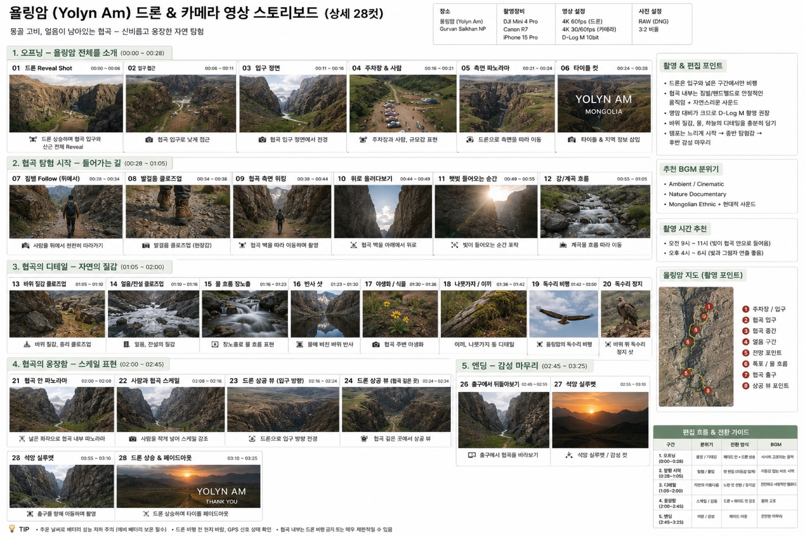

# 욜링암 드론+지상 통합 스토리보드

욜링암(협곡)에서 드론·Canon R7·짐벌(또는 폰) **세 카메라를 통합**해 한 편을 완성하는 계획입니다. 저자가 넘겨준 스토리보드 원본은 총 **28컷·약 3분 25초** 분량으로, 협곡 전체 소개 → 협곡 탐험 시작 → 협곡의 디테일 → 협곡의 웅장함(스케일 표현) → 감성 마무리까지 5개 구간으로 이어집니다. 아래 샷 리스트·설정·동선·편집·BGM은 이 원본을 그대로 옮긴 것입니다.

*이 이미지는 촬영 전 만든 **콘셉트/기획 스토리보드**이며, 완성 영상이나 실제 촬영본이 아닙니다. 저자의 실제 촬영본은 트립(2026-08-13) 이후 교체됩니다.*

## 샷 리스트

각 컷 앞의 카메라 표기는 원본 스토리보드의 아이콘과 설명을 근거로 표기했습니다. 원본은 **"드론은 입구와 넓은 구간에서만 비행, 협곡 내부는 짐벌/핸드헬드로 안정적인 움직임"**이라고 명시하고 있어, 협곡 안쪽 구간(2·3구간)은 지상 카메라·짐벌 중심입니다.

### 1. 오프닝 — 욜링암 전체를 소개 (00:00~00:28)

| 컷 | 시간 | 카메라 | 내용 |
|---|---|---|---|
| 01 드론 Reveal Shot | 00:00~00:06 | 드론 | 상승하며 협곡 입구와 산군 전체 Reveal |
| 02 입구 접근 | 00:06~00:11 | 카메라(R7) | 협곡 입구로 낮게 접근 |
| 03 입구 정면 | 00:11~00:16 | 카메라(R7) | 협곡 입구 정면에서 전경 |
| 04 주차장 & 사람 | 00:16~00:21 | 드론 | 주차장과 사람, 규모감 표현 |
| 05 측면 파노라마 | 00:21~00:24 | 드론 | 드론으로 측면을 따라 이동 |
| 06 타이틀 컷 | 00:24~00:28 | 카메라(R7) | 타이틀 & 지역 정보 삽입 |

### 2. 협곡 탐험 시작 — 들어가는 길 (00:28~01:05)

협곡 안쪽 구간 — 원본 지침대로 드론 대신 짐벌·핸드헬드가 중심입니다.

| 컷 | 시간 | 카메라 | 내용 |
|---|---|---|---|
| 07 짐벌 Follow(뒤에서) | 00:28~00:34 | 짐벌(참고) | 사람을 뒤에서 천천히 따라가기 |
| 08 발걸음 클로즈업 | 00:34~00:38 | 카메라(R7) | 발걸음 클로즈업(현장감) |
| 09 협곡 측면 워킹 | 00:38~00:44 | 짐벌(참고)/카메라(R7) | 협곡 벽을 따라 이동하며 촬영 |
| 10 위로 올려다보기 | 00:44~00:49 | 카메라(R7) | 협곡 벽을 아래에서 위로 |
| 11 햇빛 들어오는 순간 | 00:49~00:55 | 카메라(R7) | 빛이 들어오는 순간 포착 |
| 12 강/계곡 흐름 | 00:55~01:05 | 짐벌(참고) | 계곡물 흐름을 따라 이동 |

### 3. 협곡의 디테일 — 자연의 질감 (01:05~02:00)

| 컷 | 시간 | 카메라 | 내용 |
|---|---|---|---|
| 13 바위 질감 클로즈업 | 01:05~01:10 | 카메라(R7, 매크로) | 바위 질감, 층리 클로즈업 |
| 14 얼음/잔설 클로즈업 | 01:10~01:16 | 카메라(R7, 매크로) | 얼음, 잔설의 질감 |
| 15 물 흐름 장노출 | 01:16~01:23 | 카메라(R7, 삼각대 장노출) | 장노출로 물 흐름 표현 |
| 16 반사 샷 | 01:23~01:30 | 카메라(R7) | 물에 비친 바위 반사 |
| 17 야생화/식물 | 01:30~01:36 | 카메라(R7) | 협곡 주변 야생화 |
| 18 나뭇가지/이끼 디테일 | 01:36~01:42 | 카메라(R7) | 이끼, 나뭇가지 등 디테일 |
| 19 독수리 비행 | 01:42~01:50 | 드론(미확인) | 욜링암의 독수리 비행 |
| 20 독수리 정지 샷 | 01:50~02:00 | 드론(미확인) | 바위 위 독수리 정지 샷 |

19·20번은 원본에 드론 아이콘으로 표시되어 있으나, 이 구간은 협곡 내부에 해당해 실제 비행 가능 여부는 **현지에서 반드시 재확인**해야 합니다(아래 "협곡 내부 드론 비행 제한" 참고).

### 4. 협곡의 웅장함 — 스케일 표현 (02:00~02:45)

| 컷 | 시간 | 카메라 | 내용 |
|---|---|---|---|
| 21 협곡 안 파노라마 | 02:00~02:08 | 카메라(R7, 광각) | 넓은 화각으로 협곡 내부 파노라마 |
| 22 사람과 협곡 스케일 | 02:08~02:16 | 카메라(R7) | 사람을 작게 넣어 스케일 강조 |
| 23 드론 상공 뷰(입구 방향) | 02:16~02:24 | 드론 | 드론으로 입구 방향 전경 |
| 24 드론 상공 뷰(협곡 깊은 곳) | 02:24~02:34 | 드론(미확인) | 드론으로 협곡 깊은 곳에서 상공 뷰 |

### 5. 엔딩 — 감성 마무리 (02:45~03:25)

| 컷 | 시간 | 카메라 | 내용 |
|---|---|---|---|
| 25 출구에서 뒤돌아보기 | 02:45~02:55 | 카메라(R7)/짐벌(참고) | 출구를 향해 이동하며 협곡을 뒤돌아보기 |
| 26 석양 실루엣 | 02:55~03:10 | 카메라(R7) | 협곡을 배경으로 석양 실루엣, 드라마틱한 장면 |
| 27 드론 상승 & 페이드아웃 | 03:10~03:25 | 드론 | 드론 상승하며 타이틀 페이드아웃 |

원본에는 25~27번 구간의 컷 번호·시간이 일부 중복 표기(28번 중복, 시간 오탈자)되어 있어, 내용과 순서를 기준으로 정리했습니다.

## 촬영 설정

원본 스토리보드에 기재된 설정값을 그대로 옮깁니다. 드론 수치는 **DJI Mini 4 Pro 기준 초안**이므로 이 책이 채택한 **DJI Mini 5 Pro로 재확인이 필요**하며, 단정하지 않습니다. 지상 카메라는 이 책 기준과 **일치하는 Canon R7**로 표기합니다 — 자세한 대조는 [장비 대조표](index.md#장비-대조표)를 참고하세요.

- **드론(Mini 4 Pro 기재값 · Mini 5 Pro 재확인 필요)**: 4K 60fps
- **지상 카메라(Canon R7, 책 일치)**: 4K 30/60fps, D-Log M 10bit, RAW(DNG), 3:2 비율
- **짐벌(DJI RS 3 Mini로 추정)·폰(iPhone 15 Pro)**: 이 페이지 상단 장비란에는 폰만 명시돼 있으나, 07·09·12·25번 컷은 "짐벌 Follow"·이동 촬영을 명시하고 있어 짐벌 사용을 전제로 합니다. 이 책은 짐벌·폰 모두 채택하지 않았습니다 — **참고만/미확인**. [장비 대조표](index.md#장비-대조표)를 따릅니다.

**현장 팁(원본 전사)**: 영상 대비가 크므로 D-Log M 촬영 권장 · 바위 질감·물·하늘의 디테일을 충분히 담기 · 템포는 느리게 시작 → 중반 탐험감 → 후반 감성 마무리 · 추운 날씨로 배터리 성능 저하 주의(예비 배터리 보온 필수) · 드론 비행 전 현지 바람·GPS 신호 상태 확인.

**촬영 시간 추천(원본 전사)**: 오전 9시~11시(빛이 협곡 안으로 들어옴) · 오후 4시~6시(빛과 그림자 연출 좋음).

**협곡 내부 드론 비행 제한(원본 전사)**: "협곡 내부는 드론 비행 금지 또는 매우 제한적일 수 있음." 위 샷 리스트의 19·20·24번처럼 협곡 내부에서 드론을 쓰는 컷은 이 책에서 **미확인**으로 표기했습니다 — 현지 규정을 반드시 재확인하세요.

## 세 카메라 운용 / 동선

원본에 실린 "욜링암 지도(촬영 포인트)"는 ① 주차장/입구 → ② 협곡 입구 → ③ 협곡 중간 → ④ 얼음 구간 → ⑤ 전망 포인트 → ⑥ 폭포/물 흐름 → ⑦ 협곡 출구 → ⑧ 상공 뷰 포인트 순으로 이어지는 동선을 보여줍니다. 하루는 입구 밖에서 드론 Reveal(01~06) → 협곡 진입 후 짐벌·핸드헬드로 전환(07~12) → 협곡 안쪽에서 지상 카메라 중심 디테일 촬영(13~20) → 협곡 웅장함을 담는 파노라마·상공 뷰(21~24) → 출구로 나오며 감성 마무리(25~27) 순서로 진행됩니다. 핵심은 **협곡 입구를 기준으로 드론(밖)과 지상 카메라·짐벌(안)이 역할을 바꾼다는 점**입니다.

이 세 카메라를 **하루 안에서 언제·어떤 우선순위로 오가며 운용하는 실전 지휘 계통**은 4부 [하루 현장 운용 — 세 카메라 오케스트레이션](../../4-workflow/field-day.md#세-카메라-오케스트레이션)으로 이어집니다.

## 편집 흐름

원본 스토리보드의 편집 흐름 & 전환 가이드(약 3분 25초)입니다.

| 구간 | 시간 | 분위기 | 전환 방식 | BGM |
|---|---|---|---|---|
| 1. 오프닝 | 00:00~00:28 | 웅장/기대감 | 페이드인 + 드론 상승 | 서서히 고조되는 음악 |
| 2. 탐험 시작 | 00:28~01:05 | 탐험/몰입 | 컷 편집(리듬감 있게) | 리듬감 있는 비트 사운드 |
| 3. 디테일 | 01:05~02:00 | 자연의 아름다움 | 느린 컷 전환, 정지감 | 잔잔하고 서정적인 멜로디 |
| 4. 웅장함 | 02:00~02:45 | 스케일/감동 | 드론+와이드 컷 강조 | 음악 고조 |
| 5. 엔딩 | 02:45~03:25 | 여운/감성 | 페이드 아웃 | 잔잔한 마무리 |

세부 컷·트랜지션·색보정 조작법은 이 페이지에서 다시 설명하지 않고 [CapCut 영상 편집](../4-capcut/index.md)으로 승계합니다. 여러 촬영지 컷을 하나의 흐름으로 엮는 실제 편집 시나리오 예시는 [예시 편집 — 고비 드론 스토리보드](../4-capcut/capcut-storyboard.md)를 참고하세요.

## BGM

원본에 적힌 음악 방향입니다.

- Ambient / Cinematic
- Nature Documentary
- Mongolian Ethnic + 현대적 사운드

## 정직성 안내

이 페이지(및 향후 채워질 스토리보드 이미지)는 **콘셉트/기획 이미지이며 완성 영상 예시가 아닙니다.** 저자의 실제 촬영본·완성 영상은 트립(2026-08-13) 이후 교체됩니다. 장비 표기는 스토리보드 원본 기준 DJI Mini 4 Pro·RS 3 Mini·iPhone 15 Pro 초안이며, 짐벌·폰은 책 미채택(참고만/미확인), 드론은 Mini 5 Pro로의 재확인이 필요합니다 — 상위 [장비 대조표](index.md#장비-대조표)를 따릅니다.

협곡 내부 드론 비행은 원본 스토리보드 자체가 "금지 또는 매우 제한적일 수 있음"이라 밝히고 있어, 19·20·24번 컷은 **미확인**으로 별도 표기했습니다.

## 관련 페이지

촬영법·편집법은 이 페이지에서 다시 설명하지 않습니다.

- 촬영: [드론 영상 촬영](../3-video/index.md)
- 편집: [CapCut 영상 편집](../4-capcut/index.md) · 예시: [고비 드론 스토리보드](../4-capcut/capcut-storyboard.md)
- 명소 참고: [욜링암 드론 촬영](../2-sites/yolyn-am.md)
- 하루 현장 운용: [4부 · 세 카메라 오케스트레이션](../../4-workflow/field-day.md#세-카메라-오케스트레이션)
- 그룹 개요·정직성 관례: [명소별 영상 스토리보드](index.md)
