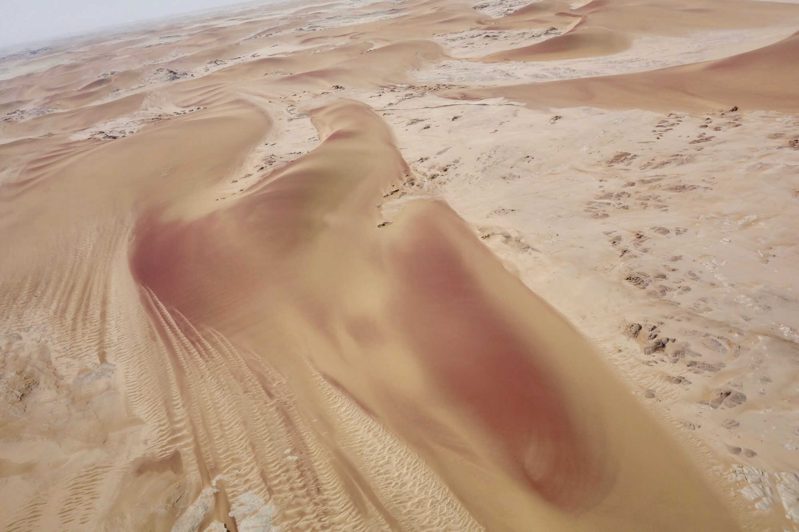
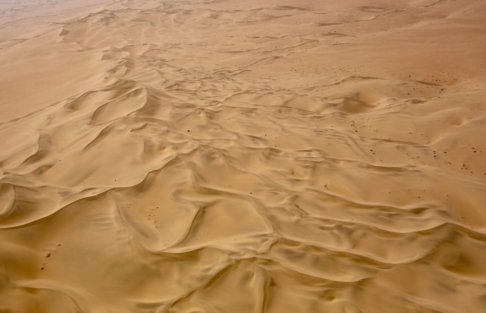
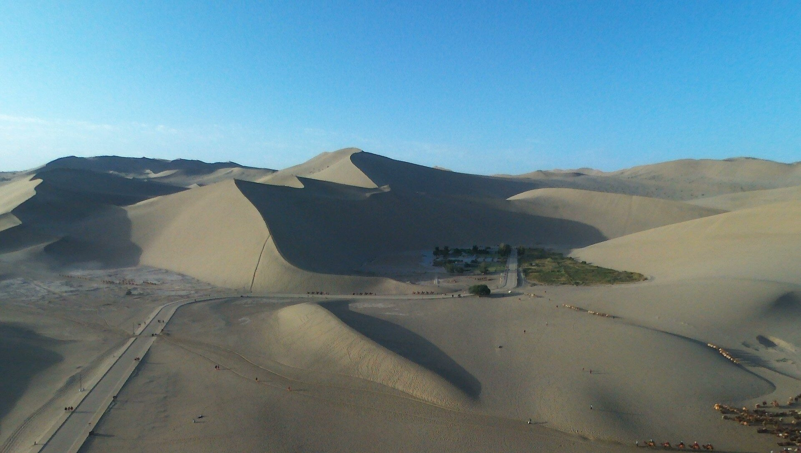
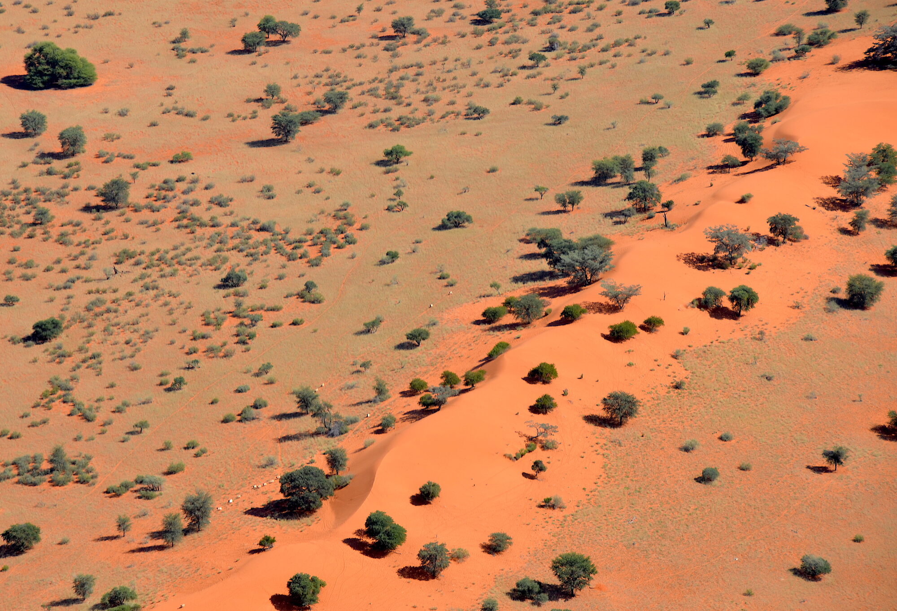

# 드론 사진·영상 개요

땅에 두 발을 딛고는 결코 볼 수 없는 장면이 있습니다. 드론은 그 장면을 **사진과 영상**으로 바꿔 줍니다.

처음 드론을 사구 위로 띄워 화면을 내려다보는 순간, 대부분의 사람이 같은 말을 합니다 — *"이게 방금 그 장소가 맞나?"* 조금 전까지 두 발로 서 있던 그 모래언덕이, 위에서 보면 바람이 새긴 거대한 물결무늬가 되어 지도처럼 펼쳐집니다.

*예시 이미지 — 공중에서 내려다본 사막. 별처럼 뻗은 사구 능선과 긴 그림자는 지상에서는 결코 한 프레임에 담기지 않는 장면입니다. (나미브 사막, 몽골 고비는 아닙니다.) 사진: Sonse ([CC BY 2.0](https://creativecommons.org/licenses/by/2.0/)).*

같은 고비 사막을 찍어도, 지상 카메라와 드론은 서로 **다른 이야기**를 합니다. 지상 카메라가 "내가 그 자리에 서 있었다"는 느낌을 담는다면, 드론은 "이 땅이 어떤 형태이고 얼마나 광활한가"라는 사실 그 자체를 담습니다. DJI Mini 5 Pro 같은 손바닥만 한 드론 한 대면, 헬리콥터도 경비행기도 없이 그 시점을 손에 넣을 수 있습니다.

이 파트는 그 드론으로 몽골 고비의 지형을 **사진으로 담고(주간·황혼), 영상으로 담아, CapCut으로 편집해 완성하는 법**을 처음부터 끝까지 안내합니다.

## 드론 사진은 무엇이 다를까요

드론 사진의 매력은 대부분 **"시점"** 하나에서 나옵니다. 카메라를 몇십 미터 위로 들어 올리는 것만으로, 같은 장소가 완전히 다른 사진이 됩니다.

**① 위에서만 드러나는 패턴과 질감.** 지상에서 사구는 그저 "모래 언덕"이지만, 위에서 내려다보면 바람이 새긴 물결무늬가 지도처럼 펼쳐집니다. 차강소브라가의 절벽은 정면에서 보면 벽 한 면이지만, 위에서 보면 층층이 쌓인 줄무늬 전체가 한눈에 들어옵니다. 드론 사진은 종종 **추상화에 가까운 패턴**이 됩니다 — 그리고 그 패턴은 오직 공중에서만 보입니다.

*예시 이미지 — 지평선까지 이어지는 사구 능선의 물결무늬. 이 "패턴"은 위에서 내려다볼 때만 드러납니다. (나미브 사막.) 사진: Sonse ([CC BY 2.0](https://creativecommons.org/licenses/by/2.0/)).*

**② 스케일을 그대로 전합니다.** 광활함은 사진으로 옮기기 가장 어려운 감각입니다. 지상에서는 아무리 넓은 사막도 지평선 한 줄로 납작해지지만, 드론은 거대한 사구 아래 놓인 길이나 차를 함께 담아 "이게 이만큼 크다"를 한 장으로 보여 줍니다.

*실제 소형 드론(Parrot Bebop)으로 촬영한 사진 — 거대한 사구, 그 아래로 이어지는 길과 시설이 사구의 스케일을 짐작하게 합니다. 곡선을 그리는 길은 시선을 사구 정상으로 이끄는 리딩라인이 됩니다. (중국 둔황, 몽골 고비와 같은 중앙아시아 사막 지대입니다.) 사진: w0zny ([CC BY-SA 3.0](https://creativecommons.org/licenses/by-sa/3.0/)).*

**③ 빛과 색이 지형의 형태를 조각합니다.** 해가 낮게 깔린 아침·저녁, 위에서 내려다본 사구와 절벽은 긴 그림자로 능선과 굴곡이 도드라집니다. 붉은 모래, 흰 절벽, 초록 관목이 만드는 색의 대비도 공중에서 더 선명하게 읽힙니다.

*예시 이미지 — 붉은 모래 위를 사선으로 가로지르는 마른 물길이 자연스러운 리딩라인을 만듭니다. 색과 선은 위에서 볼 때 더 또렷해집니다. (칼라하리/나미브.) 사진: Olga Ernst & Hp.Baumeler ([CC BY-SA 4.0](https://creativecommons.org/licenses/by-sa/4.0/)).*

**④ 사람이 닿기 어려운 곳을 담습니다.** 오를 수 없는 절벽 위, 발이 빠지는 사구 한가운데, 건너기 어려운 협곡 — 드론은 이런 곳의 시점을 위험 없이 가져옵니다.

> **한마디로,** 드론 사진의 매력은 *"거기 있었다"가 아니라 "그곳이 이렇게 생겼다"* 를 보여 주는 데 있습니다. 이 파트가 안내하는 [항공 구도](1-photo/composition.md)는 결국 이 네 가지 — 패턴·스케일·빛·접근성 — 를 어떻게 한 장에 담느냐의 이야기입니다.

## 사진을 넘어 — 영상

같은 시점이라도, **영상은 사진이 멈춰 세운 것을 다시 움직이게** 합니다. 능선 뒤에서 사구가 서서히 드러나고(리빌), 붉은 절벽을 한 바퀴 돌고(오빗), 낙타 카라반 위를 미끄러지듯 지나가는 장면 — 스케일과 흐름을 몸으로 느끼게 하는 것은 영상이라야 살아납니다.

이 파트는 드론 영상을 **어떻게 찍고(프레임레이트·ND·움직임 샷)**, **어떻게 편집하는지(CapCut로 컷·속도·색보정·음악·내보내기)**, 그리고 대표 고비 클립으로 **한 편을 완성하는 예제**까지 담았습니다. 사진만 찍을 계획이라면 영상 챕터는 건너뛰어도 좋습니다 — 필요할 때 돌아오면 됩니다.

## 이 파트가 다루는 것

- **드론 사진 (주간·황혼)** — 조작·카메라 설정·항공 구도·비행/환경·후보정.
- **드론 영상 촬영** — DJI Mini 5 Pro 영상 설정과 시네마틱 움직임 샷.
- **CapCut 영상 편집** — 가져오기부터 내보내기까지의 편집 워크플로 + 상세 예제.

촬영 시간대는 **주간과 황혼(골든아워·블루아워)** 으로 한정합니다. 야간 비행은 규제·하드웨어 양쪽으로 맞지 않아 다루지 않습니다.

> 📝 이 파트의 예시 사진·영상 시나리오는 대부분 무료 라이선스 예시이거나 대표 시나리오이며, 실제 몽골 현지 항공 촬영본과 화면 캡처는 **트립(8/13) 이후 저자의 실제 촬영본**으로 채워집니다.

## 띄우기 전에 — 규제부터 확인하세요

몽골에서 드론을 띄우기 전에 **비행 규제를 반드시 확인해야 합니다.** 핵심 규칙(주간 비행·VLOS·고도 상한·공항 이격 등), 250g 무게 등급의 함정, 확인된 사실과 미확인 항목의 구분, 원출처 링크까지 [몽골 드론 비행 규제·허가](5-references/mongolia-regulations.md) 한 페이지에 정리했습니다. 규제는 사진이든 영상이든 똑같이 적용됩니다.

## 이 파트 읽는 순서

**드론 사진**
1. [DJI Mini 5 Pro 기본 조작](1-photo/dji-mini5pro-basics.md) — 조종기, 사전 점검, 이착륙, 에티켓
2. [DJI Mini 5 Pro 카메라 설정](1-photo/dji-mini5pro-settings.md) — RAW, 노출, ND 필터, 히스토그램
3. [항공 구도의 기초](1-photo/composition.md) — 위에서 내려다보는 구도의 원리(패턴·45°·리딩라인·스케일)
4. [비행 기초와 배터리·RTH 관리](1-photo/flight-and-battery.md) — 비행 동작과 배터리 운용
5. [고비 사막 드론 환경 주의](1-photo/gobi-environment.md) — 바람·모래·저온 대응
6. [드론 사진 후보정](drone-postprocessing.md) — 찍은 사진 완성하기

**드론 영상 촬영**

7. [드론 영상 촬영](3-video/index.md) — 영상 설정(프레임레이트·180도 셔터·ND·컬러 프로파일)과 시네마틱 움직임 샷.

**CapCut 영상 편집**

8. [CapCut 영상 편집](4-capcut/index.md) — 편집 워크플로(컷·속도·색보정·음악·내보내기)와 대표 고비 클립 예제.

준비되셨다면 [DJI Mini 5 Pro 기본 조작](1-photo/dji-mini5pro-basics.md)부터 시작하세요.

> 🔰 **초보자는 이렇게.** 순서대로 딱 셋만 하세요. 먼저 [몽골 드론 비행 규제](5-references/mongolia-regulations.md)를 읽어 어디서·언제 띄울 수 있는지 확인하고, 다음 [기본 조작](1-photo/dji-mini5pro-basics.md)으로 점검·이착륙을 익힌 뒤, 첫 비행은 넓고 장애물 없는 곳에서 낮고 천천히 VLOS 안에서 해 보세요. 나머지 설정·구도·영상 챕터는 이 셋에 익숙해진 뒤에 순서대로 넘어가면 됩니다.

## 이미지 출처

이 페이지의 사진은 저자가 촬영한 것이 아니며, 라이선스가 확인된 무료 이미지입니다. 몽골 고비 현지 사진이 아니라, **드론(공중)에서 내려다본 사막의 시점과 매력**을 보여 주기 위한 예시·참고 이미지입니다(`real-drone-dunhuang.jpg`만 실제 소형 드론으로 촬영된 사진이고, 나머지는 공중에서 내려다본 사막 사진입니다). 몽골 현지 항공 사진·영상은 저자의 실제 촬영본으로 추후 채워집니다.

| 파일 | 설명 | 저작자 | 라이선스 | 출처 |
|---|---|---|---|---|
| `images/drone/aerial-hero.jpg` | 공중에서 내려다본 사구 능선·그림자 (나미브 사막) | Sonse | [CC BY 2.0](https://creativecommons.org/licenses/by/2.0/) | [Wikimedia Commons](https://commons.wikimedia.org/wiki/File:Namib_Diamond_Area_Dunes_(37731002772).jpg) |
| `images/drone/dune-pattern.jpg` | 위에서 본 사구 물결무늬 패턴 (나미브 스켈레톤 코스트) | Sonse | [CC BY 2.0](https://creativecommons.org/licenses/by/2.0/) | [Wikimedia Commons](https://commons.wikimedia.org/wiki/File:Dune_Formation_Namib_Skeleton_Coast_(37504515070).jpg) |
| `images/drone/real-drone-dunhuang.jpg` | 실제 드론(Parrot Bebop)으로 촬영한 사막 사구 (중국 둔황) | w0zny | [CC BY-SA 3.0](https://creativecommons.org/licenses/by-sa/3.0/) | [Wikimedia Commons](https://commons.wikimedia.org/wiki/File:Dunhuang,_China_Bebop_Drone_2015-09-17T082530%2B0000_8FF38B.jpg) |
| `images/drone/red-sand.jpg` | 붉은 모래를 가로지르는 물길 리딩라인 (칼라하리/나미브) | Olga Ernst & Hp.Baumeler | [CC BY-SA 4.0](https://creativecommons.org/licenses/by-sa/4.0/) | [Wikimedia Commons](https://commons.wikimedia.org/wiki/File:Sand_dune_in_the_Kalahari_Desert_(Namibia).jpg) |

원본은 리사이즈(최대 2000px)·EXIF 제거 후 재압축했습니다. 위 사진은 몽골 고비에서 촬영된 것이 아니며(둔황은 고비와 이어진 중앙아시아 사막대의 일부입니다), 드론·항공 시점의 시각적 특징을 보여 주기 위한 예시입니다. 실제 몽골 명소의 항공 촬영 가이드는 [명소별 드론 촬영 가이드](2-sites/index.md)에서 다룹니다.
