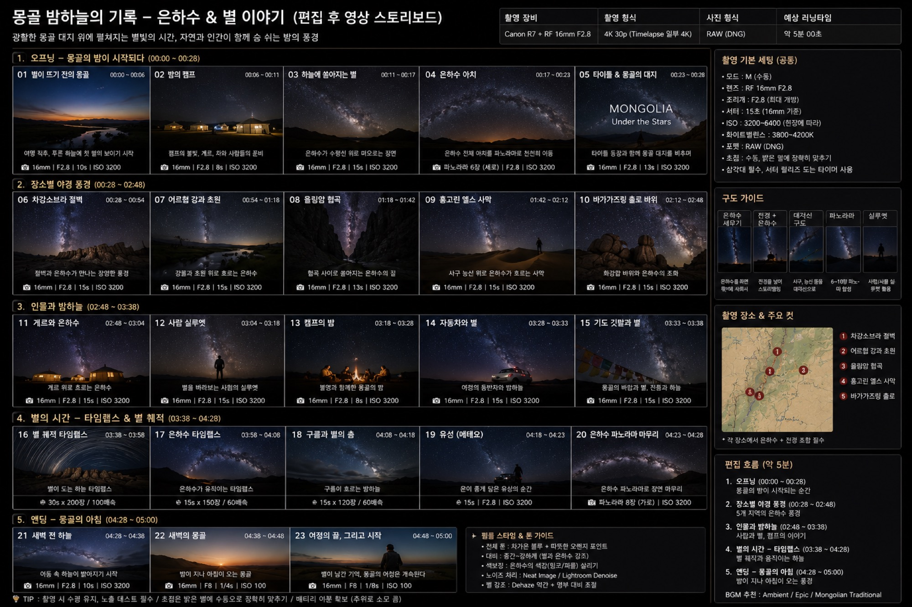

# 밤하늘 타임랩스

일정 간격으로 찍은 사진 시퀀스를 이어 붙여, 밤하늘과 은하수가 움직이는 영상으로 만드는 기법입니다.

> 📎 **예시:** [타임랩스(Time-lapse, 밤하늘 포함) — 예시](https://en.wikipedia.org/wiki/Time-lapse_photography) *(외부 링크 · 임베드 아님)*

## 기본 절차

1. **[인터벌 타이머](../1-gear/accessories.md)로 부드러운 재생을 위한 간격을 설정합니다.** 예: 20~30초 간격으로 1~2시간 촬영.
2. **M모드와 수동 화이트밸런스로 전체 프레임을 고정합니다.** 자동 모드로 찍으면 프레임마다 밝기가 튀어 영상에서 **플리커(깜빡임)**가 생깁니다. 이 책이 [밤 노출](../2-fundamentals/night-exposure.md)에서 M모드·수동 화이트밸런스를 강조한 원칙은 타임랩스에서도 그대로 적용됩니다.
3. **모든 프레임에 동일한 RAW 현상을 일괄 적용합니다.** [RAW 현상 기본](../5-postprocessing/raw-develop.md)에서 정한 설정을 darktable/Lightroom의 설정 복사·동기화 기능으로 전체 프레임에 배치 적용하세요.
4. **영상으로 조립합니다.** Lightroom의 슬라이드쇼 내보내기, 또는 무료 도구 ffmpeg(이미지 시퀀스 → 영상)를 사용합니다.
5. **정교한 디플리커가 필요하면 LRTimelapse(유료, Lightroom 연동)**를 고려하세요.

<!-- 이미지: timelapse-sequence.png / 목적: 일정 간격 정지 프레임 여러 장이 이어져 영상이 되는 흐름 다이어그램 -->

## 배터리 · 저장공간

스타트레일과 마찬가지로 장시간 연속 촬영이므로 파워뱅크와 여유 저장공간을 미리 확인하세요.

> 🔰 **초보자는 이렇게.** 인터벌 타이머로 20~30초 간격, M모드·수동 화이트밸런스로 1~2시간 찍으세요. RAW 현상은 한 프레임에 정한 설정을 나머지 전체에 그대로 복사·동기화해 일괄 적용합니다. 영상 조립은 무료 ffmpeg 하나면 됩니다.

## 은하수 타임랩스 영상 스토리보드 (촬영·편집 계획)

몽골 밤하늘의 은하수와 별을 담아 한 편으로 엮는 영상의 계획입니다. 장비는 **Canon R7 + RF16mm F2.8**(책 기준과 그대로 일치), 형식은 **4K 30p(일부 4K 타임랩스), RAW(DNG) 스틸 병행**, 총 **23컷 · 예상 러닝타임 약 5분 00초**입니다. 이 섹션은 **촬영 계획서이자 편집 설계도이며, 완성 영상이 아닙니다.**

*콘셉트/기획 이미지이며 완성 영상이 아닙니다. 저자의 실제 촬영본·완성 영상은 트립(2026-08-13) 이후 교체됩니다. 설정값은 스토리보드 원본 기재값입니다.*

> 판독 메모: 원본 이미지의 컷 제목·타임코드·촬영 설정 수치는 선명해 그대로 옮겼습니다. 일부 컷의 부연 설명 문구는 원본 폰트가 흐려 정확한 판독이 어려운 부분이 있어, 문맥상 가장 가까운 표현으로 옮기고 아래 각주로 표시했습니다.

### 샷 리스트

**1. 오프닝 — 몽골의 밤이 시작되다 (00:00~00:28)**

| 컷 | 샷 | 시간 | 내용 | 설정 |
|----|----|----|------|------|
| 01 | 별이 뜨기 전의 몽골 | 00:00~00:06 | 여명 직후, 푸른 하늘에 첫 별이 보이기 시작 | 16mm F2.8 · 10s · ISO 3200 |
| 02 | 밤의 캠프 | 00:06~00:11 | 캠프의 불빛, 게르, 차와 사람들의 준비 | 16mm F2.8 · 8s · ISO 3200 |
| 03 | 하늘에 쏟아지는 별 | 00:11~00:17 | 은하수가 수평선 위로 떠오르는 장면 | 16mm F2.8 · 15s · ISO 3200 |
| 04 | 은하수 아치 | 00:17~00:23 | 은하수 전체 아치를 파노라마로 천천히 이동 | 파노라마 6장(세로) · F2.8 · ISO 3200 |
| 05 | 타이틀 & 몽골의 대지 | 00:23~00:28 | 타이틀 등장과 함께 몽골 대지를 비추며 | 16mm F2.8 · 13s · ISO 3200 |

**2. 장소별 야경 풍경 (00:28~02:48)**

| 컷 | 샷 | 시간 | 내용 | 설정 |
|----|----|----|------|------|
| 06 | 차강소브라 절벽 | 00:28~00:54 | 절벽과 은하수가 만나는 장엄한 풍경 | 16mm F2.8 · 15s · ISO 3200 |
| 07 | 어르헝 강과 초원 | 00:54~01:18 | 강물과 초원 위로 흐르는 은하수 | 16mm F2.8 · 15s · ISO 3200 |
| 08 | 욜링암 협곡 | 01:18~01:42 | 협곡 사이로 쏟아지는 은하수[^1] | 16mm F2.8 · 13s · ISO 3200 |
| 09 | 홍고린 엘스 사막 | 01:42~02:12 | 사구 능선 위로 은하수가 흐르는 사막 | 16mm F2.8 · 15s · ISO 3200 |
| 10 | 바가가즈링 촐로 바위 | 02:12~02:48 | 화강암 바위와 은하수의 조화 | 16mm F2.8 · 15s · ISO 3200 |

**3. 인물과 밤하늘 (02:48~03:38)**

| 컷 | 샷 | 시간 | 내용 | 설정 |
|----|----|----|------|------|
| 11 | 게르와 은하수 | 02:48~03:04 | 게르 위로 흐르는 은하수 | 16mm F2.8 · 15s · ISO 3200 |
| 12 | 사람 실루엣 | 03:04~03:18 | 별을 바라보는 사람의 실루엣 | 16mm F2.8 · 15s · ISO 3200 |
| 13 | 캠프의 밤 | 03:18~03:28 | 별빛과 함께한 몽골의 밤 | 16mm F2.8 · 8s · ISO 3200 |
| 14 | 자동차와 별 | 03:28~03:33 | 여정의 동반자와 밤하늘 | 16mm F2.8 · 15s · ISO 3200 |
| 15 | 기도 깃발과 별 | 03:33~03:38 | 몽골의 바람과 별, 기도 깃발과 밤하늘[^2] | 16mm F2.8 · 15s · ISO 3200 |

**4. 별의 시간 — 타임랩스 & 별 궤적 (03:38~04:28)**

| 컷 | 샷 | 시간 | 내용 | 설정 |
|----|----|----|------|------|
| 16 | 별 궤적 타임랩스 | 03:38~03:58 | 별이 도는 하늘 타임랩스 | 30s × 200장 / 100배속 |
| 17 | 은하수 타임랩스 | 03:58~04:08 | 은하수가 움직이는 타임랩스 | 15s × 150장 / 60배속 |
| 18 | 구름과 별의 춤 | 04:08~04:18 | 구름이 흐르는 밤하늘 | 15s × 120장 / 60배속 |
| 19 | 유성(메테오) | 04:18~04:23 | 유성이 떨어지는 순간[^3] | 15s · F2.8 · ISO 3200 |
| 20 | 은하수 파노라마 마무리 | 04:23~04:28 | 은하수 파노라마로 장면 마무리 | 파노라마 8장(가로) · ISO 3200 |

**5. 엔딩 — 몽골의 아침 (04:28~05:00)**

| 컷 | 샷 | 시간 | 내용 | 설정 |
|----|----|----|------|------|
| 21 | 새벽 전 하늘 | 04:28~04:38 | 어둠 속 하늘이 밝아지기 시작 | 16mm F2.8 · 10s · ISO 3200 |
| 22 | 새벽의 몽골 | 04:38~04:48 | 밤이 지나 아침이 오는 몽골 | 16mm F8 · 1/4s · ISO 100 |
| 23 | 여정의 끝, 그리고 시작 | 04:48~05:00 | 별이 남긴 기억, 몽골의 여정은 계속된다 | 16mm F8 · 1/8s · ISO 100 |

[^1]: 원본 컷 08 설명 문구는 "협곡 사이로 쏟아지는 은하수"까지는 선명하고, 이어지는 한 글자는 폰트가 흐려 정확한 판독이 어려워 생략했습니다.
[^2]: 원본 컷 15 설명 문구 후반부는 폰트가 흐려 "기도 깃발과 밤하늘" 취지로 옮겼습니다(컷 제목·이미지의 타르초/룽따 참고).
[^3]: 원본 컷 19 설명 문구는 폰트가 흐려 정확한 문장 판독이 어려워, 컷 제목("유성/메테오")과 이미지(차 옆에 선 인물과 별똥별)에 기반해 옮겼습니다.

### 촬영 설정

아래는 **스토리보드 원본 기재값**입니다(공통 세팅란 기준, 컷별 셔터는 위 표 참고). Canon R7 + RF16mm F2.8은 책 기준과 이미 일치하므로 별도 재확인 표기가 필요 없습니다.

- 모드: M(수동)
- 렌즈: RF16mm F2.8
- 조리개: F2.8(최대 개방)
- 셔터: 15초(16mm 기준 — 컷별로 8~15초, 새벽 엔딩 컷은 1/4~1/8초)
- ISO: 3200~6400(현장에 따라, 새벽 엔딩 컷은 ISO 100)
- 화이트밸런스: 3800~4200K
- 포맷: RAW(DNG)
- 초점: 수동, 밝은 별에 정확히 맞추기
- 삼각대 필수, 셔터 릴리즈 또는 타이머 사용
- 총 23컷 / 예상 러닝타임 약 5분 00초

### 구도 가이드

원본 스토리보드가 제시하는 다섯 가지 구도 접근입니다.

| 구도 | 요령 |
|------|------|
| 은하수 세우기 | 은하수를 세로 프레임에 세워서 담기 |
| 전경 + 은하수 | 전경을 넣어 스토리텔링 |
| 대칭 구도 | 사구·능선 등 대칭선을 활용 |
| 파노라마 | 6~10장 파노라마 합성 |
| 실루엣 | 사람/사물 실루엣 활용 |

### 촬영 장소 & 주요 컷

원본 동선맵이 표시한 다섯 지점입니다(각 장소에서 은하수 + 전경 조합 촬영).

1. 차강소브라 절벽
2. 어르헝 강과 초원
3. 욜링암 협곡
4. 홍고린 엘스 사막
5. 바가가즈링 촐로

### 편집 흐름 (약 5분)

원본에 적힌 편집 포인트만 정리합니다. 스태킹·디플리커·색보정 등 **조작법은 여기서 다시 설명하지 않습니다** — 아래 "관련 페이지"로 링크 승계합니다.

1. 오프닝(00:00~00:28) — 몽골의 밤이 시작되는 순간
2. 장소별 야경 풍경(00:28~02:48) — 5개 지역의 은하수 풍경
3. 인물과 밤하늘(02:48~03:38) — 사람과 별, 캠프의 이야기
4. 별의 시간 — 타임랩스(03:38~04:28) — 별 궤적과 움직이는 하늘
5. 엔딩 — 몽골의 아침(04:28~05:00) — 밤이 지나 아침이 오는 몽골

**필름 스타일 & 톤 가이드(원본 기재)**

- 전체 톤: 차가운 블루 + 따뜻한 오렌지 포인트
- 대비: 중간~강하게(별과 은하수 강조)
- 색보정: 은하수의 색감 살리기
- 노이즈 처리: Neat Image / Lightroom Denoise
- 별 강조: Dehaze 약간 + 명부 대비 조절

### BGM

- Ambient
- Epic(웅장한 오케스트라 계열)
- Mongolian Traditional(몽골 전통 악기)

### 관련 페이지(촬영·편집법은 여기서 다시 설명하지 않습니다)

- 밤 노출·M모드·수동 화이트밸런스: [밤 노출](../2-fundamentals/night-exposure.md)
- 수동 무한대 초점: [초점 맞추기](../2-fundamentals/focusing.md)
- 노출 시간(별 흐름 방지) 500/NPF: [500/NPF 규칙](../2-fundamentals/500-npf-rule.md)
- 은하수 코어 찾기: [은하수 찾기](../2-fundamentals/finding-the-milkyway.md)
- 전 프레임 RAW 일괄 현상: [RAW 현상 기본](../5-postprocessing/raw-develop.md)
- 스태킹(노이즈 저감): [스태킹](../5-postprocessing/stacking.md)
- 은하수 강조: [은하수 강조](../5-postprocessing/enhance-milkyway.md)
- 인터벌 타이머·영상 조립(ffmpeg/LRTimelapse): 이 페이지 위쪽 "기본 절차" 참고(중복 서술 없음)
- 장비: [액세서리](../1-gear/accessories.md)
