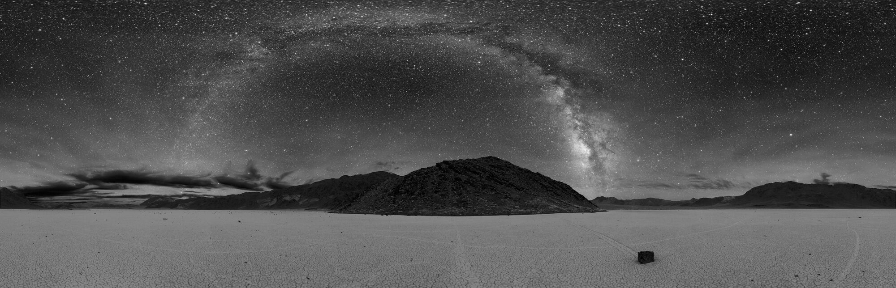
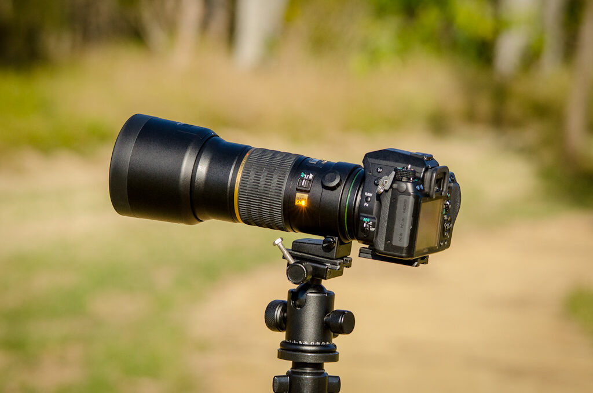
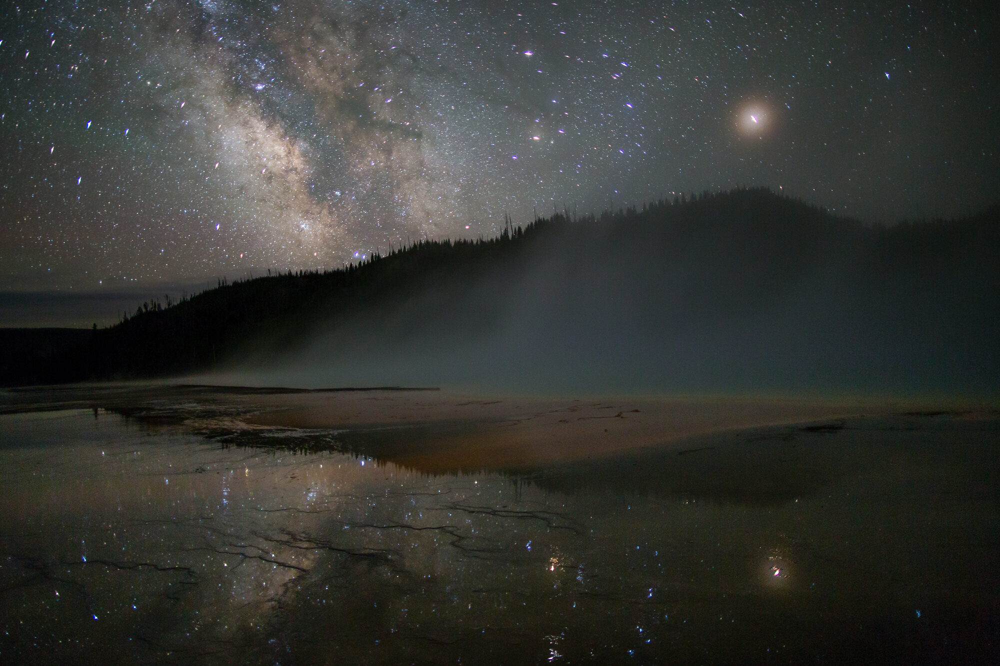
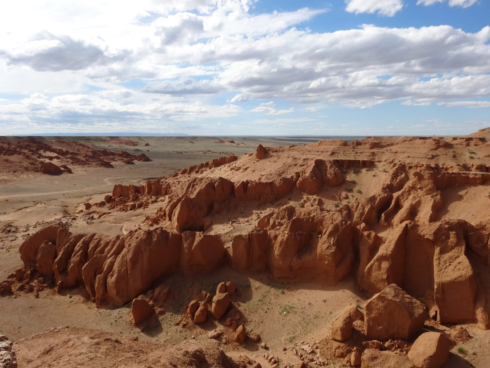
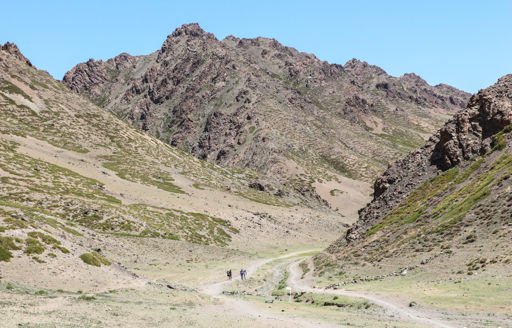
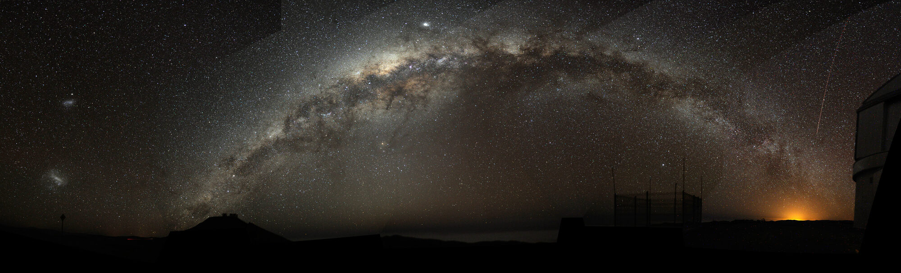
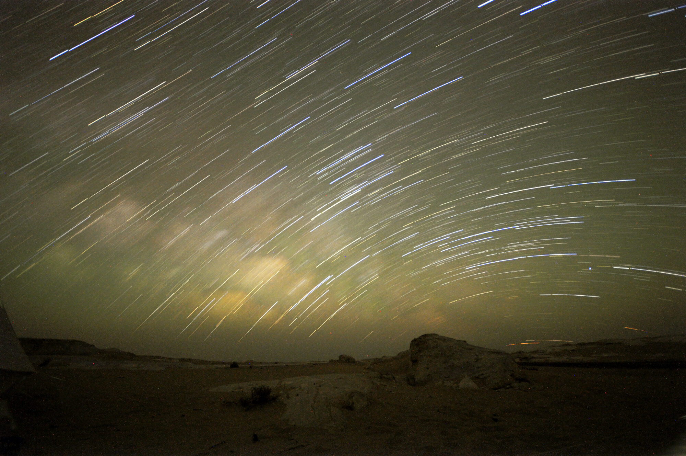
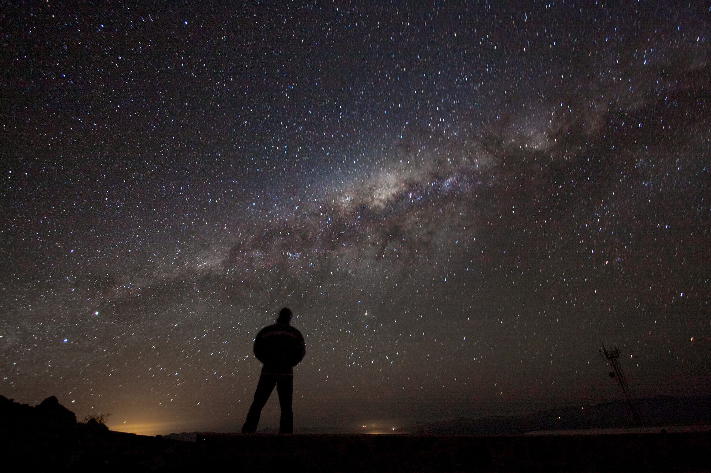

# 이 책에 대하여

## 이 책은 누구를 위한 책인가

몽골 고비로 떠나는(또는 언젠가 떠나고 싶은) **사진 초보자와, 여행 사진을 한 단계 더 잘 찍고 싶은 사람**을 위한 책입니다. 전문 장비도, 사진 전공 지식도 전제하지 않습니다. 카메라의 모드 다이얼이 낯설어도, 드론을 처음 띄워 봐도, 은하수를 한 번도 찍어 본 적 없어도 따라올 수 있도록 — 왜 그렇게 하는지의 이유부터 하나씩 풀어 설명합니다.

이 책은 저자가 실제로 다녀오는 고비 여행(2026년 8월)을 바탕으로 하지만, 특정 일정의 기록이 아니라 **누구나 따라 할 수 있는 일반 가이드**로 썼습니다. 몽골이 아니어도, 사막이 아니어도, 여기서 익힌 촬영·편집의 원리는 그대로 쓸 수 있습니다.

## 세 개의 트랙, 그리고 편집

이 책은 서로 다른 장비와 시간대를 다루는 세 트랙을, 각각 **촬영부터 편집(후보정)까지** 안내합니다.

- **1부 · 여행 사진** — **Canon R7** 같은 미러리스로 담는 낮의 여행. 눈을 뜨고 있는 모든 시간에 찍는, 가장 자주 쓰는 사진입니다. 카메라 설정·구도·빛·현장/사람, 그리고 **Lightroom Classic 보정**까지.
- **2부 · 드론 사진·영상** — **DJI Mini 5 Pro** 같은 소형 드론으로 담는 하늘의 시점. "그곳이 이렇게 생겼다"를 보여 주는 항공 사진과, 움직임으로 스케일을 전하는 **드론 영상**, 그리고 **CapCut 편집**까지.
- **3부 · 천체사진 (은하수)** — **트래킹 장비 없이** 카메라 한 대·삼각대만으로 담는 밤하늘. 준비부터 촬영, **스태킹·강조 후보정**까지.

세 트랙은 서로 다른 각도에서 같은 몽골 여행을 담는 하나의 이야기입니다. 관심 있는 파트부터 골라 읽어도 되고, 순서대로 따라와도 됩니다.

## 왜 몽골 고비인가

- **밤하늘이 세계 최상급으로 어둡습니다.** 고비는 빛공해 척도(Bortle)에서 **1~2등급** — 사실상 인공 불빛이 없는 다크스카이라, 국내 근교와는 은하수가 보이는 정도가 차원이 다릅니다.
- **지평선이 끝없이 트여 있습니다.** 낮게 뜨는 은하수 코어도, 광활한 지형도, 가리는 것 없이 온전히 담깁니다.
- **전경이 극적입니다.** 붉게 타는 절벽(바양작), 거대한 모래언덕(홍고린엘스), 협곡과 화강암 바위지대 — 낮에는 여행·드론 사진의, 밤에는 은하수 사진의 무대가 됩니다.

*예시 이미지 — 광해 없는 다크스카이에서 지평선까지 드러나는 은하수의 느낌을 보여 주는 사진입니다(흑백 파노라마). 실제 고비 사진은 아닙니다. 사진: NPS / Dan Duriscoe, 미국 데스밸리 국립공원 (Public Domain).*

## 이 책의 약속

- **거창한 장비는 필요 없습니다.** 은하수조차 망원경이나 적도의(스타트래커) 없이, 이미 가진 카메라와 삼각대로 찍습니다. 장비는 **추천만** 하며 구매를 강요하지 않습니다.

*예시 이미지 — 카메라 한 대 · 밝은 렌즈 하나 · 삼각대. 은하수는 이게 전부입니다. 사진: James Niland (CC BY 2.0).*

- **초보자 눈높이로, 이유부터.** 어떤 값을 왜 그렇게 두는지를 먼저 설명합니다. 외워서 따라 하는 게 아니라, 이해해서 응용할 수 있게.
- **촬영으로 끝나지 않습니다.** 사진의 절반은 편집에서 완성됩니다. 각 파트는 촬영 뒤 후보정(여행=Lightroom Classic, 드론 영상=CapCut, 은하수=스태킹·강조)까지 이어집니다.
- **정직하게 씁니다.** 확인된 사실만 단정하고, 확인하지 못한 것은 "미확인"으로 표기합니다. 예시 사진·영상 중 상당수는 이해를 돕기 위한 **무료 라이선스 예시**(실제 몽골 촬영지가 아님)이며, 몽골 현지 촬영본과 보정 전/후 비교는 **저자의 실제 촬영본(트립 8/13 이후)**으로 채워 나갑니다.

## 이 책이 지향하는 결과물

말보다 사진이 매력을 더 잘 전합니다. 아래는 이 책이 지향하는 장면들입니다. *(대부분 이해를 돕기 위한 무료 라이선스 예시 이미지이거나, 실제 몽골 현지(바양작·욜링암)를 낮에 찍은 참고 사진입니다 — 몽골 현지에서 은하수까지 함께 담은 사진과 보정 전/후 비교는 저자의 실제 촬영본으로 추후 채워집니다.)*

*예시 이미지 — 은하수 코어와 주변 별빛의 색·디테일을 보여 주는 사진입니다(미국 옐로스톤 국립공원). 실제 홍고린엘스 사진은 아닙니다. 사진: NPS / Neal Herbert (Public Domain).*

*바양작(Bayanzag, Flaming Cliffs) — 붉은 절벽, 주간 촬영. 밤에는 이 실루엣 위로 은하수가 뜬다. 사진: amanderson2 ([CC BY 2.0](https://creativecommons.org/licenses/by/2.0/)).*

*욜링암(Yolyn Am), 고르왕사이한 국립공원 — 협곡 입구, 주간 촬영. 사진: Bernard Gagnon (CC0 / Public Domain).*

*예시 이미지 — 지평선부터 지평선까지 이어지는 은하수 아치 파노라마입니다(칠레 아타카마 사막, 세로 파라날 ESO 천문대). 실제 몽골 촬영지는 아닙니다. 사진: Bruno Gilli / ESO (CC BY 4.0).*

*예시 이미지 — 별이 그리는 궤적(스타트레일)과 사막의 실루엣입니다(이집트 화이트 사막). 실제 몽골 촬영지는 아닙니다. 사진: Ahmed Khalil (CC BY-SA 4.0).*

*예시 이미지 — 은하수 아래 선 사람의 실루엣으로 하늘의 스케일을 보여 줍니다(칠레 라 시야 천문대). 실제 몽골 촬영지는 아닙니다. 사진: ESO / A. Fitzsimmons (CC BY 4.0).*

*(사진을 추가할 때는 웹용으로 리사이즈(최대 2000px·EXIF 제거)해 `src/images/intro/`에 넣고, 위 자리를 `` 형식으로 바꾸면 됩니다.)*

## 이미지 출처

이 페이지와 소개 페이지에 쓰인 사진은 저자가 촬영한 것이 아니며, 아래와 같이 라이선스가 확인된 무료 이미지입니다(`bayanzag.jpg`·`yolyn-am.jpg`는 실제 몽골 현지를 담은 사진이고, 나머지는 이해를 돕기 위한 예시 이미지입니다).

| 파일 | 설명 | 저작자 | 라이선스 | 출처 |
|---|---|---|---|---|
| `images/intro/milkyway-hero.jpg` | 은하수·모래언덕 (미국 그레이트샌드듄스 국립공원) | NPS / Patrick Myers | Public Domain (미 연방정부 저작물) | [Wikimedia Commons](https://commons.wikimedia.org/wiki/File:Milky_Way_over_dunes_in_Great_Sand_Dunes_National_Park,_Colorado,_United_States.jpg) |
| `images/intro/dark-sky-nightscape.jpg` | 은하수·사막 야경 흑백 파노라마 (미국 데스밸리 국립공원) | NPS / Dan Duriscoe | Public Domain (미 연방정부 저작물) | [Wikimedia Commons](https://commons.wikimedia.org/wiki/File:Deathvalleysky_nps_big.jpg) |
| `images/intro/camera-tripod.jpg` | 카메라·렌즈·삼각대 | James Niland | [CC BY 2.0](https://creativecommons.org/licenses/by/2.0/) | [Wikimedia Commons](https://commons.wikimedia.org/wiki/File:DSLR_Camera_with_Lens_on_a_Tripod_head.jpg) |
| `images/intro/gallery-milkyway-1.jpg` | 은하수 (미국 옐로스톤 국립공원) | NPS / Neal Herbert | Public Domain (미 연방정부 저작물) | [Wikimedia Commons](https://commons.wikimedia.org/wiki/File:The_Milky_Way_above_Grand_Prismatic_Spring_(33668265111).jpg) |
| `images/intro/bayanzag.jpg` | 바양작(Flaming Cliffs), 몽골 남고비 — 실제 현지 사진(주간) | amanderson2 | [CC BY 2.0](https://creativecommons.org/licenses/by/2.0/) | [Wikimedia Commons](https://commons.wikimedia.org/wiki/File:Flaming_cliffs_in_Gobi.jpg) |
| `images/intro/yolyn-am.jpg` | 욜링암(Yolyn Am), 고르왕사이한 국립공원, 몽골 — 실제 현지 사진(주간) | Bernard Gagnon | CC0 1.0 (Public Domain) | [Wikimedia Commons](https://commons.wikimedia.org/wiki/File:Yolyn_Am_01.jpg) |
| `images/intro/panorama.jpg` | 은하수 아치 파노라마 (칠레 세로 파라날, ESO 천문대) | Bruno Gilli / ESO | [CC BY 4.0](https://creativecommons.org/licenses/by/4.0/) | [Wikimedia Commons](https://commons.wikimedia.org/wiki/File:Milky_Way_Arch.jpg) |
| `images/intro/star-trails.jpg` | 스타트레일 (이집트 화이트 사막) | Ahmed Khalil | [CC BY-SA 4.0](https://creativecommons.org/licenses/by-sa/4.0/) | [Wikimedia Commons](https://commons.wikimedia.org/wiki/File:White_Desert_star_trail.jpg) |
| `images/intro/silhouette.jpg` | 은하수 아래 사람 실루엣 (칠레 라 시야 천문대, ESO) | ESO / A. Fitzsimmons | [CC BY 4.0](https://creativecommons.org/licenses/by/4.0/) | [Wikimedia Commons](https://commons.wikimedia.org/wiki/File:Admiring_the_Galaxy.jpg) |

원본은 리사이즈(최대 2000px)·EXIF 제거 후 재압축했습니다. `bayanzag.jpg`·`yolyn-am.jpg`는 실제 현지를 담은 사진이지만 저자가 직접 촬영한 것은 아니며 주간에 촬영되었습니다(은하수는 없음). 보정 전/후 비교 사진과, 몽골 현지에서 은하수까지 함께 담은 사진은 저자의 실제 촬영본으로 채우기 위해 비워 두었습니다.
