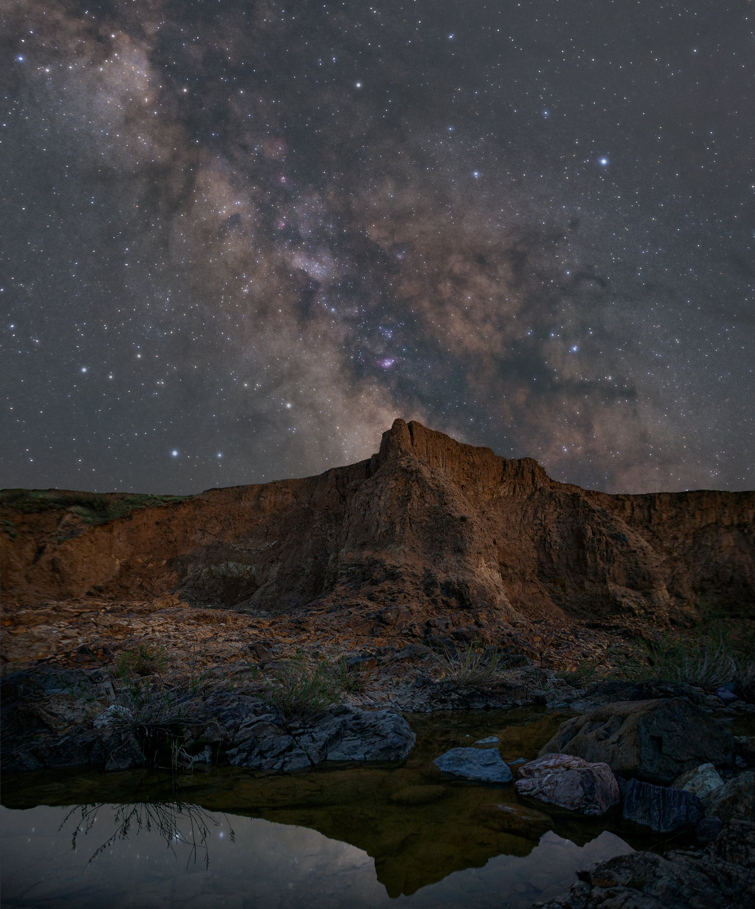

# 몽골에서 카메라로 은하수 사진 찍기 (예: Canon R7)

*예시 — 협곡 위 은하수 나이트스케이프(실제 몽골 아님 · 카자흐스탄). 사진: Astrobond · CC BY-SA 4.0 · [Wikimedia Commons](https://commons.wikimedia.org/wiki/File:The_cliffs_of_the_Oshagandy_Canyon_against_the_backdrop_of_the_Milky_Way.jpg).*

> 삼각대에 올릴 수 있는 **수동(M)·RAW가 되는 카메라**라면 어느 기종이든 은하수를 찍을 수 있습니다.
> 이 문서는 **Canon R7(APS-C) + 밝은 광각 단렌즈**를 예시로, **현장에서 바로 쓰는 빠른 카드 + 다른 카메라 대응 + 이 트립(2026-08) 타이밍**을 한 장에 모은 진입점입니다. **단계별 원리·설명은 3부 본문으로 승계**합니다(중복 서술 안 함).
>
> **다른 카메라라면 (핵심 3가지만 맞추면 됩니다)**
> - **밝은 광각 렌즈** — 초점거리가 짧고(광각) 조리개가 밝은(F2.8 이하 권장) 렌즈. 풀프레임 14~24mm, APS-C 10~16mm, m4/3 7~12mm대가 은하수용.
> - **완전 수동(M) + RAW** — 셔터·ISO·조리개·초점을 손으로 정할 수 있고 RAW로 저장되면 OK.
> - **최대 셔터는 크롭 배율로 계산** — 풀프레임 ×1.0, APS-C ×1.5~1.6, m4/3 ×2.0 ([500·NPF 룰](../3-astro/2-fundamentals/500-npf-rule.md)).

> 🔰 몽골 전에 집·근교에서 **조작·초점을 미리 연습**하세요 — [은하수 가기 전 연습](milkyway-practice.md).

---

## ⚡ 현장 빠른 카드 (한눈에)

밤에 이것만 봐도 됩니다. 값은 예시 구성(R7 + 삼양 12mm F2.0) 기준 — 다른 기종은 렌즈·크롭 배율만 대응시키세요.

| 항목 | 값 |
|------|-----|
| 렌즈 | **밝은 광각 단렌즈** (예: 삼양 12mm F2.0, 최광각·최대개방) |
| 모드 | **M(수동)** |
| 화질 | **RAW** |
| 조리개 | **f/2.0**(최대개방, 필요 시 f/2.8) |
| 셔터 | **15~20초** (넘으면 별이 흐름 — NPF/500룰) |
| ISO | **1600~6400** (노이즈 보며 조정, 3200 시작 권장) |
| 초점 | **라이브뷰 10배 확대 → 밝은 별을 수동 초점**으로 점이 될 때까지 |
| 화이트밸런스 | **3800~4000K** 수동 고정 |
| 손떨림보정(IS) | **끄기**(삼각대) |
| 릴리즈 | **2초 셀프타이머**(기본, 장비 불필요) / 외장 인터벌 릴리즈(추천 옵션) |
| 장수 | 같은 구도 **10~20장**(스태킹용) — 내장 인터벌 타이머 또는 외장 릴리즈 |

> 어두우면 → ISO ↑. 별이 선으로 흐르면 → 셔터 ↓. 흐릿하면 → 라이브뷰 확대로 초점 재확인.

---

## 🗺️ 몽골 고비 · 2026년 8월 13일 — 이 시기가 최적인 이유

- **8/13은 신월** — 출발일이 사실상 신월이라 달빛이 거의 없고, 트립 내내 어두운 하늘이 유지됩니다. *일자별 달·조도(신월·상현 검증값)는 [고비 여행 일정 · 달 캘린더](travel-itinerary.md).*
- **8월 중순은 은하 중심 최적기** — 은하수 은하중심(가장 밝은 부분)이 초저녁~한밤 **남~남서쪽** 하늘에 잘 뜹니다(위도 43~46°N).
- **세계 최상급 다크스카이** — 광공해가 거의 없어 은하수가 육안으로도 쏟아지고, 고지대·건조 사막이라 대기 투명도가 우수.
- **밤 기온 급강하 + 바람** — 방한·배터리 보온·삼각대 무게 대비. 데이터·전기가 없을 수 있어 앱 오프라인·여분 배터리 확보.
- 대략 일몰 20시 전후·천문박명 종료 21:30~22시경부터 본 촬영 — **정확한 시각·달 출몰·은하수 방향은 PhotoPills/Stellarium으로 그날·그 위치 기준 확인**(고정 시각 단정 금지).

---

## 📚 단계별 자세한 촬영법 (3부 승계)

빠른 카드로 부족하면, 각 단계의 "왜·어떻게"는 3부 본문이 정본입니다. 이 문서는 진입점일 뿐 여기서 다시 설명하지 않습니다.

| 단계 | 무엇을 | 정본(3부) |
|---|---|---|
| 장비 고르기 | 밝은 광각·M·RAW·삼각대 | [은하수 장비](../3-astro/1-gear/index.md) |
| 어디·언제 | 은하 중심 방향·고도·타이밍 | [은하수 찾기와 타이밍](../3-astro/2-fundamentals/finding-the-milkyway.md) |
| 초점 | 라이브뷰 확대 무한초점·테이프 고정 | [초점 맞추기](../3-astro/2-fundamentals/focusing.md) |
| 노출값 | M·f값·셔터·ISO·WB | [밤 노출](../3-astro/2-fundamentals/night-exposure.md) |
| 최대 셔터 | 별이 점으로 남는 한계 | [500·NPF 룰](../3-astro/2-fundamentals/500-npf-rule.md) |
| 현장 순서 | 흔들림 방지·인터벌·다크프레임 | [현장 촬영 워크플로](../3-astro/2-fundamentals/field-workflow.md) |
| 후보정 | RAW 현상·색·노이즈 | [RAW 현상](../3-astro/5-postprocessing/raw-develop.md) · [은하수 강조](../3-astro/5-postprocessing/enhance-milkyway.md) |
| 스태킹 | 여러 장 겹쳐 노이즈↓ | [스태킹](../3-astro/5-postprocessing/stacking.md) |

---

## 장비 대응표 (예시 구성 기준 — 다른 기종은 "역할"에 맞춰)

| 역할 | 예시(이 문서 기준) | 다른 기종 대응 / 필수·추천 |
|------|------|-----------|
| 본체 | Canon R7 (APS-C, 크롭 1.6배) | **수동 M·RAW 되는 카메라면 무엇이든** (필수) |
| 주력 렌즈 | 삼양 12mm F2.0 (환산 ≈19mm) | **밝은 광각 단렌즈**(F2.8 이하) — FF 14~24mm / APS-C 10~16mm / m4/3 7~12mm (필수) |
| 보조 렌즈 | RF 50mm F1.8 | 표준~망원 단렌즈 — 별 클로즈업용 (선택) |
| 삼각대 | 튼튼한 카메라용 | 동일 (필수). 세우기·수평은 [종합 장비 추천](gear-picks.md) |
| 배터리 | 여분 2~3개(밤·저온·장노출) | 동일 (필수) |
| 흔들림 방지 | 셀프타이머 + 내장 인터벌 타이머 | 대부분 카메라 내장 (기본·장비 불필요) |
| 외장 릴리즈 | 인터벌 타이머 릴리즈(예: SMDV T805) | 기종별 리모트 단자 케이블(R7=RS-60E3/E3·2.5mm) — **추천 옵션**(벌브·스타트레일) |

- **계획 앱**: PhotoPills(방향·시각·달)·Stellarium(밤하늘 시뮬레이션).
- **후보정·스태킹 SW**: Lightroom + Sequator(Win·무료)/Starry Landscape Stacker(mac·유료) 등 — 도구 목록·플랫폼·가격은 [소프트웨어 참고](../3-astro/7-references/software-references.md)를 정본으로.

---

### 한 장으로 요약

> **RAW·M모드·IS OFF → 밝은 광각 f/2.0 → 라이브뷰 10배로 별 수동 초점 잡고 테이프 고정 → 삼각대 + 신월·남서쪽 하늘 → 15초·ISO 3200 전후로 테스트 → 셀프타이머+내장 인터벌 타이머(또는 외장 릴리즈)로 같은 구도 15~20장 → Sequator/SLS로 스태킹 후 Lightroom에서 색·노이즈 정리.**
