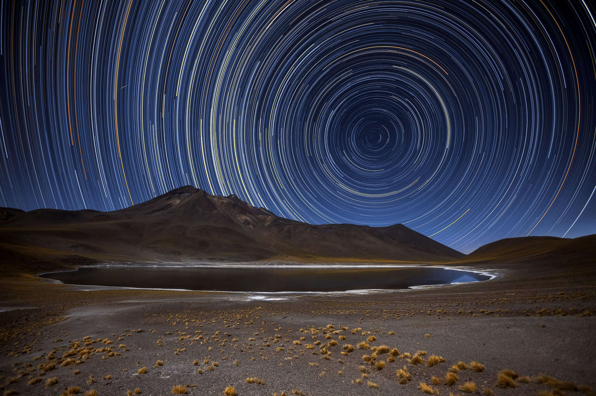

# 몽골에서 카메라로 스타트레일(별궤적) 찍기 (예: Canon R7)

*예시 — 북극성 중심의 원형 별궤적(실제 몽골 아님). 사진: A. Duro/ESO · CC BY 4.0 · [Wikimedia Commons](https://commons.wikimedia.org/wiki/File:All_In_A_Spin_Star_trail.jpg).*

> 지구 자전(15°/시간)으로, 카메라를 고정해 오래 담으면 별이 **긴 궤적**을 그립니다. 북쪽 하늘을 향하면 **동심원**이 됩니다.
> 이 문서는 **Canon R7(APS-C) + 밝은 광각 단렌즈**를 예시로, **빠른 카드 + 다른 카메라 대응 + 이 트립(2026-08) 타이밍**을 모은 진입점입니다. **촬영·합성의 단계별 원리는 3부 [스타트레일 촬영·합성](../3-astro/6-bonus/star-trails.md)이 정본**이라 여기서 다시 설명하지 않습니다.
>
> **다른 카메라라면 (핵심 3가지)**
> - **밝은 광각 렌즈** — FF 14~24mm / APS-C 10~16mm / m4/3 7~12mm대(스타트레일은 은하수만큼 초대구경이 필수는 아님).
> - **완전 수동(M) + RAW + 연속 촬영 수단**(내장 인터벌 타이머 또는 외장 릴리즈).
> - **장노출 노이즈 감소(Long Exposure NR)를 끌 수 있어야** 함 — 궤적 끊김 방지의 핵심.

> 🔰 몽골 전에 집·근교에서 **워크플로를 미리 연습**하세요 — [스타트레일 가기 전 연습](star-trail-practice.md).

---

## ⚡ 스타트레일 빠른 카드 (한눈에)

> 예시 구성(R7 + 삼양 12mm F2.0) 기준. 다른 기종은 렌즈·크롭·메뉴만 대응.

| 항목 | 값 |
|------|-----|
| 방법 | **여러 장 연속 촬영 → 컴퓨터에서 합성(스택)** 권장 / (대안) 벌브 단일 장노출 |
| 모드 | **M(수동)** · **RAW**(또는 대용량이면 JPEG) |
| 조리개 | **f/2.8~4**(살짝 조여 별 선명·하늘 밝아짐 억제) |
| 셔터 | **한 장 20~30초** |
| ISO | **400~800**(낮게 — 오래 쌓이므로) |
| 장노출 NR | **반드시 끄기(OFF)** — 켜면 궤적이 끊김 |
| IS(손떨림보정) | **끄기**(삼각대) |
| 초점 | **라이브뷰 확대 → 무한(∞) 수동**, 잠그기 |
| 간격 | **0에 가깝게(최소)** — 벌어지면 궤적 끊김 |
| 연속 | 내장 **인터벌 타이머** 또는 외장 릴리즈로 **수십~수백 장** |
| 전원 | **더미배터리/AC 또는 여분 배터리 다수** (수십 분~수 시간) |
| 시간 | 최소 15분, 원형에 가깝게는 **1시간 이상** |

> 예: 30초 × 120장 ≈ 1시간. 합성은 무료 **StarStaX의 라이튼(Lighten) 블렌드**로.

---

## 🗺️ 몽골 고비 · 2026년 8월 13일 — 이 시기의 특성

- **8/13은 신월** — 트립 내내 밤이 최대로 어둡습니다. *일자별 달·조도(신월·상현 검증값)는 [고비 여행 일정 · 달 캘린더](travel-itinerary.md).*
- **어두운 하늘의 양면** — 궤적에 별이 아주 많이 남습니다(장점). 다만 달빛이 없어 **전경(지형)은 어둡게** 나오니, **블루아워(해 진 직후)에 전경을 밝게 한 컷** 미리 찍어 합성하거나 약한 손전등 라이트페인팅을 쓰세요.
- **북극성 고도 ≈ 44°** — 위도 43~46°N이라 동심원의 중심(북극성)이 북쪽 지평선 위 약 44°. 북쪽 하늘에 여유를 두고 구도를 잡습니다. *은하수(남쪽 저고도)와 반대 방향이니 같은 밤엔 방향·시간대를 나눠 계획.*
- **밤 기온 급강하 + 바람 + 오프그리드** — 수십 분~수 시간 촬영이라 **방한·전원 확보·삼각대 무게**가 특히 중요. 앱 오프라인·전원 미리 확보.

---

## 📚 단계별 자세한 촬영·합성 (3부 승계)

빠른 카드로 부족하면, 각 단계의 "왜·어떻게"는 3부 본문이 정본입니다.

| 단계 | 무엇을 | 정본(3부) |
|---|---|---|
| 전체 원리·방향·시작값·합성 | 북극성 여부·궤적 모양·NR OFF·StarStaX | [스타트레일 촬영·합성](../3-astro/6-bonus/star-trails.md) |
| 초점 | 라이브뷰 확대 무한초점·테이프 고정 | [초점 맞추기](../3-astro/2-fundamentals/focusing.md) |
| 노출·WB 고정 | M·수동 WB | [밤 노출](../3-astro/2-fundamentals/night-exposure.md) |
| 인터벌·전원·이슬 | 연속 촬영·배터리·성에 | [현장 촬영 워크플로](../3-astro/2-fundamentals/field-workflow.md) · [필수 액세서리](../3-astro/1-gear/accessories.md) |

> **벌브(B) 단일 장노출**은 대안(고급)입니다 — ISO 100~200·조리개 조임(+필요 시 ND). 다만 열노이즈·통째 실패 위험이 커 **여러 장 합성(방법 ①)을 우선**하세요(이유는 위 정본 "왜 여러 장인가").

---

## 장비 대응표 (예시 구성 기준 — 다른 기종은 "역할"에 맞춰)

| 역할 | 예시(이 문서 기준) | 다른 기종 대응 / 필수·추천 |
|------|------|-----------|
| 본체 | Canon R7 (APS-C, 크롭 1.6배) | **수동 M·RAW·장노출 NR OFF 되는 카메라** (필수) |
| 렌즈 | 삼양 12mm F2.0 | 밝은 광각 단렌즈 — FF 14~24 / APS-C 10~16 / m4/3 7~12mm (필수) |
| 삼각대 | 튼튼한 카메라용 | 동일 (필수). 세우기·수평은 [종합 장비 추천](gear-picks.md) |
| **전원** | 더미배터리+AC / 배터리 그립 / 여분 다수 | 동일 — **장시간이라 최대 관건** |
| 연속 촬영 | 카메라 내장 인터벌 타이머 | 대부분 카메라 내장(없으면 외장 릴리즈) (기본) |
| 외장 릴리즈 | 인터벌 릴리즈(예: SMDV T805) | 기종별 리모트 단자 케이블(R7=RS-60E3/E3·2.5mm) — **추천 옵션** |

- **합성 SW**: StarStaX(무료·라이튼/갭필링) — 도구·플랫폼·가격은 [소프트웨어 참고](../3-astro/7-references/software-references.md).

---

### 한 장으로 요약

> **삼각대 고정 + 전원 확보 → 장노출 NR OFF·IS OFF → 밝을 때 무한초점 잡고 테이프 고정 → 북쪽(북극성)으로 구도 → f/2.8·20~30초·ISO 낮게 → 내장 인터벌(또는 외장 릴리즈)로 120~240장 연속 → StarStaX로 라이튼 합성 후 Lightroom 마무리.**
