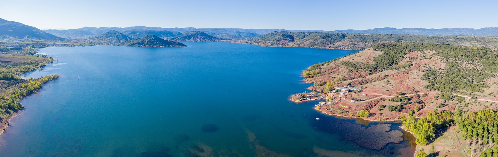

# 드론 파노라마 가기 전 연습

*공중에서 여러 장을 자동 촬영해 이어 붙인 가로형 항공 파노라마 예시(실제 몽골/국내 아님 · 프랑스 살라구 호수). 재스티칭 연습이 겨냥하는 결과물입니다. 사진: Raimond Spekking · CC BY-SA 4.0 · [Wikimedia Commons](https://commons.wikimedia.org/wiki/File:Lac_du_Salagou_-_aerial_view_-_panorama-646.jpg).*

드론 파노라마에서 실패하는 곳은 조작보다 **바람 표류·노출 편차·배터리·재스티칭**입니다 — 그리고 사진 파노라마와 결정적으로 다른 한 가지, **비행 규제**. 이걸 몽골에서 처음 하면 이음매가 어긋나거나 아예 못 날립니다.

그래서 출발 전 **합법 비행 구역에서** 드론의 자동 파노라마 모드를 미리 돌려 보고, **컴퓨터 재스티칭까지** 한 번 해보는 것이 목표입니다. 전체 촬영법은 [드론 파노라마 찍기](drone-panorama.md)로 이어집니다.

---

## ⚠️ 먼저 — 합법 비행부터

드론은 아무 데서나 날리면 안 됩니다. **연습도 반드시 합법 비행 구역에서** 하세요.

- 공항·비행장 주변, 비행금지·제한구역, 사람 위 비행은 **금지**. 야간 비행도 부적합.
- 어디가 합법인지·허가가 필요한지는 **항공안전포털·드론원스톱**에서 확인하고, 넓고 장애물·사람 없는 개활지에서.
- 규정·장소·기체 사전점검은 [합법 연습 — 규정·장소](../2-drone/practice/legal-and-place.md)·[기본 비행 연습](../2-drone/practice/basic-flight.md)으로 승계합니다.

## ⚡ 연습용 세팅 카드 (예: DJI Mini 5 Pro)

| 항목 | 값 | 왜 |
|------|-----|-----|
| 규제 | **합법 구역·주간·육안 시야(VLOS)** | 위반은 금지·위험 |
| 모드 | **180°(21장)부터** → 광각(9장) → Sphere(33장) → 수직(3장) / Free | 왜곡 적은 180°로 시작 |
| 사진 형식 | **RAW(DNG)+JPEG** | 원본 프레임 보관 → PC 재스티칭 |
| 노출 | **고정**(수동 또는 AE 잠금) | 프레임 밝기가 균일해야 이음매가 안 생김 |
| 화이트밸런스 | **수동 고정** | 자동은 프레임마다 색이 달라짐 |
| 바람 | **약할 때(주로 아침)** | 표류하면 스티칭 실패(1순위 변수) |
| 호버링 | **촬영 내내 정지 · 조종간 안 건드리기** | 밀리면 프레임이 어긋남 |
| 배터리 | **넉넉히** | Sphere(33장)는 시간이 걸려 중단=실패 |

> 밤 은하수 파노라마는 드론의 저조도·장노출 한계로 부적합합니다 — 그건 지상 카메라의 몫([사진 파노라마 연습](panorama-practice.md)).

## 어디서·언제 연습하나

- **합법 개활지** — 넓고 장애물·사람·전선이 없는 곳. (합법 여부 확인이 먼저)
- **바람 약한 아침**이 최적. 경량 드론은 바람에 약해, 다중 프레임 촬영 중 표류하면 이음매가 어긋납니다.
- **골든아워**면 빛이 고와 프레임 간 노출도 균일해집니다. 정오 고대비는 이음매가 티 나기 쉬움.

## 연습 순서

1. **사전 점검·규제 확인** — 기체·프로펠러·배터리·나침반/GPS 정상, 합법 구역·바람 확인.
2. **안전 고도에서 정지 호버링** — 높을수록 스케일↑(단 규제 고도 내). 표류하지 않는지 확인.
3. **모드별로 한 번씩** — **180°부터** 실행해 자동 촬영을 지켜봅니다(드론이 회전·틸트하며 여러 장). 촬영이 끝날 때까지 **조종간을 건드리지 말 것.** 익으면 광각·Sphere·수직도.
4. **노출·WB 고정**으로 다시 찍어, 고정했을 때 이음매가 얼마나 깨끗해지는지 비교.
5. **집에서 재스티칭** — 앱 자동 스티칭 JPEG과, 원본 **DNG를 Lightroom "사진 병합 → 파노라마"**(또는 PTGui/Hugin)로 재스티칭한 결과를 비교. 재스티칭이 화질·이음매가 나은 것을 눈으로 확인하는 것이 연습의 핵심.

## 연습 후 점검 (이게 진짜 목적)

- **이음매가 어긋났나?** → 촬영 중 바람에 표류했거나 노출이 프레임마다 달랐다. **바람 약할 때·노출 고정.**
- **중간에 멈췄나?** → 배터리 부족(특히 Sphere 33장). 넉넉히 충전.
- **가까운 전경에 이중상/이음매?** → 너무 낮게 붙음(시차). 고도를 올린다.
- **하늘·땅 밝기 차가 심해 이음매?** → 고른 빛(골든아워)·노출 고정.
- **규제·안전은 지켰나?** → 합법 구역·주간·VLOS·사람 위 금지.

## 연습 체크리스트

- [ ] **합법 비행 구역** 확인 · 사전 점검 · 바람 확인
- [ ] RAW(DNG)+JPEG · 노출 고정 · WB 고정
- [ ] 정지 호버링 · 촬영 중 조종간 안 건드리기
- [ ] 180° → 광각 → Sphere → 수직 각 1회
- [ ] 배터리 넉넉 (Sphere는 특히)
- [ ] 집에서 **DNG 재스티칭** → 앱 자동본과 비교

## 이어서

- 전체 촬영·모드·스티칭 → [드론 파노라마 찍기](drone-panorama.md)
- 드론 기본기·규정·촬영 연습 → [2부 · 가기 전 연습(드론)](../2-drone/practice/index.md)
- 지상 사진 파노라마 연습 → [파노라마 가기 전 연습](panorama-practice.md)
- 골든아워에 사진·드론 순서 → [일출·일몰 — 시간대별 사진·드론 촬영 순서](golden-hour-photo-drone.md)
