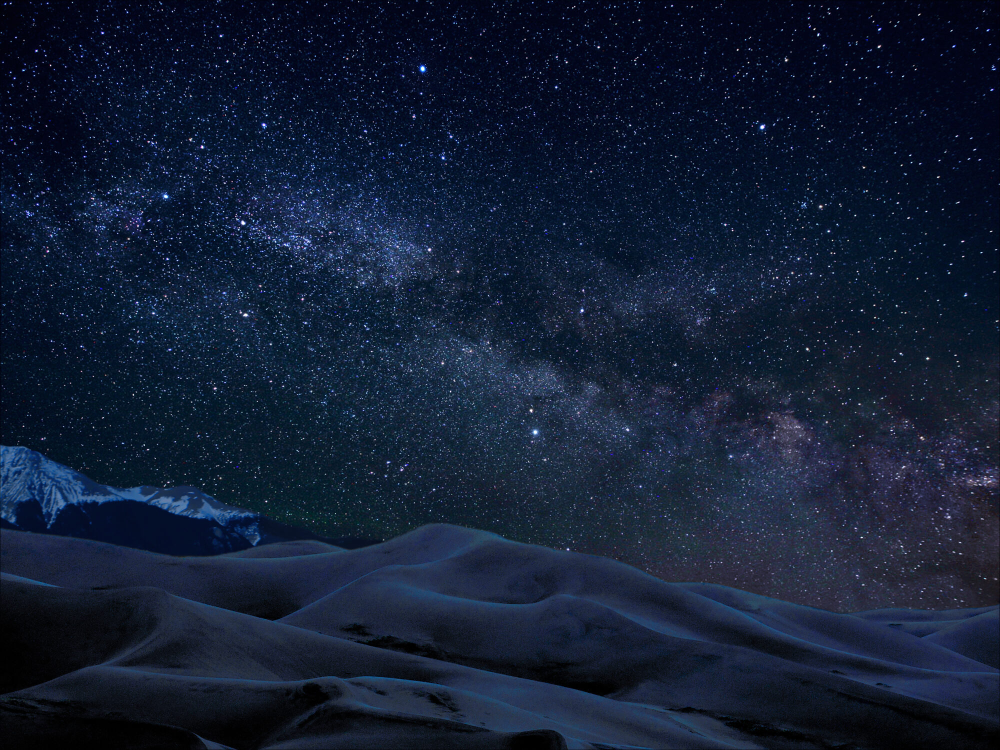

# 몽골 사진 가이드

*두 발로 걸으며 두 눈에 담는 고비의 풍경과 사람들, 드론으로 내려다본 지형, 그리고 카메라 한 대·삼각대만으로 담는 밤하늘 — 몽골이 보여 주는 세 개의 풍경.*

도시의 불빛에서 멀어질수록 세상은 조용해지고, 마침내 고비에 닿으면 사방이 지평선뿐입니다. 낮에는 붉은 절벽과 산맥처럼 늘어선 모래언덕이 눈앞을 가득 채우고, 해가 지면 하늘에는 은하수가 강물처럼 쏟아집니다. 이 앞에 서면 누구나 카메라를 듭니다. 그리고 누구나 같은 생각을 합니다 — *"이 광경을, 본 그대로 담을 수 있을까?"*

**담을 수 있습니다.** 이 책은 그 방법을 낮의 여행 사진, 하늘의 드론 사진·영상, 밤의 은하수 — 세 갈래로 나눠 안내합니다. 거창한 장비도, 사진 전공 지식도 필요 없습니다. 이미 가진 카메라 한 대와, 무엇을 왜 그렇게 하는지 이유부터 풀어 주는 이 책이면 충분합니다.

*예시 이미지 — 이 책이 지향하는 장면과 비슷한 사구·은하수 사진입니다. 실제 몽골 촬영지는 아닙니다. 사진: NPS / Patrick Myers, 미국 그레이트샌드듄스 국립공원 (Public Domain).*

> 📖 **[이 책에 대하여](about.md)** — 이 책이 누구를 위한 것인지, 어떻게 구성됐는지, 무엇을 약속하는지와 예시 갤러리를 먼저 볼 수 있습니다.

## 목차

<nav class="book-toc" aria-label="목차">

<a class="toc-part-title" href="1-travel/index.html">1부 · 여행 사진</a>

<a class="toc-card" href="1-travel/index.html">낮의 여행을 담다1부 개요 · 여행 사진 소개와 읽는 순서</a>
<a class="toc-card" href="1-travel/1-shooting/index.html">여행 사진 촬영Canon R7 설정 · 구도 · 빛 · 현장/사람</a>
<a class="toc-card" href="1-travel/2-sites/index.html">명소별 여행 사진고비 코스 5곳 촬영 카드</a>
<a class="toc-card" href="1-travel/3-editing/index.html">여행 사진 보정Lightroom Classic 현상·마스킹</a>
<a class="toc-card" href="1-travel/4-references/index.html">참고 자료튜토리얼 · 갤러리 · FAQ</a>

<a class="toc-part-title" href="2-drone/index.html">2부 · 드론 사진·영상</a>

<a class="toc-card" href="2-drone/index.html">하늘의 시점으로2부 개요 · 드론 사진·영상 소개</a>
<a class="toc-card" href="2-drone/1-photo/index.html">드론 사진 촬영조작 · 첫 비행 · 설정 · 항공 구도</a>
<a class="toc-card" href="2-drone/2-sites/index.html">명소별 드론 촬영고비 5곳 촬영 카드</a>
<a class="toc-card" href="2-drone/drone-postprocessing.html">드론 사진 후보정DNG 현상 · 보정</a>
<a class="toc-card" href="2-drone/3-video/index.html">드론 영상 촬영설정 · 시네마틱 무빙 7종</a>
<a class="toc-card" href="2-drone/domestic-example.html">국내 촬영 예제선운사 · 서해 바닷가 연습</a>
<a class="toc-card" href="2-drone/4-capcut/index.html">CapCut 영상 편집컷 · 색보정 · 내보내기</a>
<a class="toc-card" href="2-drone/5-references/index.html">참고 자료규제 · 사양 · 갤러리 · FAQ</a>

<a class="toc-part-title" href="3-astro/index.html">3부 · 천체사진 (은하수)</a>

<a class="toc-card" href="3-astro/index.html">쏟아지는 밤하늘로3부 개요 · 천체사진(은하수) 소개</a>
<a class="toc-card" href="3-astro/1-gear/index.html">장비 가이드카메라 · 렌즈 · 액세서리 · 체크리스트</a>
<a class="toc-card" href="3-astro/2-fundamentals/index.html">촬영 기초밤 노출 · 500/NPF · 초점 · 타이밍</a>
<a class="toc-card" href="3-astro/3-practice/index.html">가기 전 연습집·야외 연습 루틴</a>
<a class="toc-card" href="3-astro/4-sites/index.html">명소별 은하수고비 5곳 촬영 카드</a>
<a class="toc-card" href="3-astro/5-postprocessing/index.html">천체사진 보정현상 · 스태킹 · 강조</a>
<a class="toc-card" href="3-astro/6-bonus/index.html">보너스 기법파노라마 · 스타트레일 · 타임랩스</a>
<a class="toc-card" href="3-astro/7-references/index.html">참고 자료기법 · SW · RAW 샘플 · FAQ</a>

<a class="toc-part-title" href="appendix/camera-lens-picks.html">부록</a>

<a class="toc-card" href="appendix/camera-lens-picks.html">카메라 · 렌즈 추천보유·추천 목록</a>
<a class="toc-card" href="appendix/cheat-sheet.html">현장 치트시트한눈에 보는 세팅</a>
<a class="toc-card" href="appendix/checklists.html">체크리스트 모음준비·현장 점검</a>
<a class="toc-card" href="appendix/app-software.html">앱 · 소프트웨어촬영·후보정 도구</a>
<a class="toc-card" href="appendix/glossary.html">용어 사전촬영 용어 풀이</a>

</nav>

---

이 책의 **대상 독자 · 구성 · 약속**과 예시 갤러리는 **[이 책에 대하여](about.md)**에서 볼 수 있습니다. 처음이라면 **[1부 · 여행 사진](1-travel/index.md)**부터 순서대로 읽으세요.
